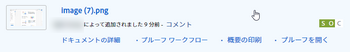

# Web サイトまたはその他の web コンテンツ用のインタラクティブなプルーフを作成する

新しいインタラクティブなプルーフを生成するか、web コンテンツ用の既存のインタラクティブのプルーフの新しいバージョンを生成できます。これには、web サイト、ストリーミングビデオやオーディオを含む広告、HTML アニメーション、インタラクティブバナーなどの他の種類のインタラクティブコンテンツが含まれます。

インタラクティブなプルーフでは、レビュー担当者は、web サイトや他の web コンテンツを、通常通りにナビゲートおよび操作できます。

>[!IMPORTANT]
>
>レビュー担当者は、web サイトまたはインタラクティブコンテンツにアクセスできることを確認してください。インターネット上でもアクセスできる場合に限り、プルーフプロセスでアクセスできます。

## アクセス要件

+++ 展開すると、この記事の機能のアクセス要件が表示されます。

<table style="table-layout:auto"> 
 <col> 
 <col> 
 <tbody> 
  <tr> 
   <td role="rowheader">Adobe Workfront パッケージ</td> 
   <td> 
任意
 </td> 
  </tr> 
  <tr> 
   <td role="rowheader">Adobe Workfront プラン</td> 
   <td> 
   
標準

   
作業またはプラン
</td> 
  </tr> 
  <tr> 
   <td role="rowheader">プルーフ権限プロファイル </td> 
   <td>マネージャー以上</td> 
  </tr> 
  <tr> 
   <td role="rowheader">アクセスレベル設定</td> 
   <td> 
ドキュメントへのアクセスを編集
 </td> 
  </tr> 
 </tbody> 
</table>

詳しくは、[Workfront ドキュメントのアクセス要件](/help/quicksilver/administration-and-setup/add-users/access-levels-and-object-permissions/access-level-requirements-in-documentation.md)を参照してください。

+++

## Web サイトまたはその他の web コンテンツ用のインタラクティブなプルーフを作成する

1. 新しい web サイトのプルーフまたは既存の web サイトの新しいバージョンを作成するプロジェクト、タスクまたはイシューに移動します。
1. 左側のパネルで「**ドキュメント**」をクリックします。
1. （条件付き）新しいプルーフを作成する場合は、「**新規追加**」をクリックし、表示されるメニューで「**プルーフ**」をクリックします。

1. （条件付き）既存プルーフの新しいバージョンを作成する場合、**新規プルーフ**&#x200B;ページが表示されます。

   1. 新しいバージョンを作成する URL プルーフの上にポインタを合わせて、そのバージョンを囲む薄い青色の背景をクリックして選択します。

      

   1. **新規追加**&#x200B;ドロップダウンで、**バージョン**／**プルーフ**&#x200B;をクリックします。

1. 「**ファイルを追加**」セクションで、プルーフする web サイトの URL を入力し、**Enter** キーを押します。このプロセスを繰り返して、プルーフする複数の web サイトを追加できます。

   

   >[!NOTE]
   >
   > URL は 1,000 文字未満にする必要があります。

1. 追加した URL をクリックします。

   

1. （オプション）Web サイトの URL から別の名前にプルーフの名前を変更する場合は、「**プルーフ名**」を入力します。
1. 「**インタラクティブ**」を選択し、「**完了**」をクリックします。

   >[!NOTE]
   >
   >既存の URL プルーフに新しいバージョンを追加する場合、元のプルーフまたは以前のバージョンに設定されたオプションは、このバージョンでも維持されます。

1. 「**プルーフを作成**」をクリックして、レビュープロセスを行わずにシンプルなプルーフを作成します。\
   または\
   高度なプルーフの設定を続行します。

   * [基本ワークフローを使用した高度なプルーフの作成](../../../review-and-approve-work/proofing/creating-proofs-within-workfront/configure-basic-proof-workflow.md)
   * [自動ワークフローを使用した高度なプルーフの作成](../../../review-and-approve-work/proofing/creating-proofs-within-workfront/create-automated-proof-workflow.md)
