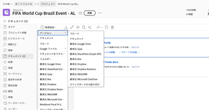

# プルーフの新しいバージョンの作成

個々の作業のいくつものバージョンや改訂にわたってフィードバックを管理することは、大きな課題となります。Workfront では、プルーフの複数のバージョンを作成および比較できるので、このプロセスが簡単になります。

プルーフの新しいバージョンを作成する際は、次の情報を考慮します。

* ユーザーに、あるバージョンを表示する権限を与えることができますが、別のバージョンを表示する権限を与えることはできません。反対に、ユーザーと新しいバージョンを共有した場合、戻って以前のバージョンへのアクセス権を明示的にユーザーに付与しない限り、そのユーザーは以前のバージョンを表示できません。
* プルーフの新しいバージョンを作成するには、そのプルーフの編集権限が必要です。

  プルーフの編集権限を持つユーザー情報について詳しくは、[Workfront Proof でのプルーフの役割の管理](../../../workfront-proof/wp-work-proofsfiles/share-proofs-and-files/manage-proof-roles.md)および [Workfront Proof のプルーフ権限プロファイル](../../../workfront-proof/wp-acct-admin/account-settings/proof-perm-profiles-in-wp.md)を参照してください。

  プルーフのバージョンの共有について詳しくは、[Workfront Proof のプルーフの共有](../../../workfront-proof/wp-work-proofsfiles/share-proofs-and-files/share-proof.md)を参照してください。

>[!IMPORTANT]
>
>Adobe Workfront 内でプルーフを作成した場合は、そのプルーフ用に新しく作成したバージョンも Workfront 内で作成する必要があります。Workfront 内で作成されたプルーフの場合、Workfront Proof で新しいバージョンのプルーフを作成することはできません。

## アクセス要件

この記事の手順を実行するには、次のアクセス権が必要です。

<table style="table-layout:auto"> 
 <col> 
 <col> 
 <tbody> 
  <tr> 
   <td role="rowheader">Adobe Workfront プラン*</td> 
   <td> 
現在のプラン：Pro 以上
 
または
 
従来のプラン：Select または Premium
 
様々な計画でのプルーフのアクセスについて詳しくは、<a href="/help/quicksilver/administration-and-setup/manage-workfront/configure-proofing/access-to-proofing-functionality.md" class="MCXref xref">Workfront のプルーフ機能へのアクセス</a>を参照してください。
 </td> 
  </tr> 
  <tr> 
   <td role="rowheader">Adobe Workfront ライセンス*</td> 
   <td> 
現在のプラン：ワークまたはプラン
 
従来のプラン：任意（ユーザーのプルーフ機能が有効になっている必要があります）
 </td> 
  </tr> 
  <tr> 
   <td role="rowheader">プルーフ権限プロファイル </td> 
   <td>マネージャー以上</td> 
  </tr> 
  <tr> 
   <td role="rowheader">アクセスレベル設定*</td> 
   <td> 
ドキュメントへのアクセスを編集
 
追加のアクセス権のリクエストについて詳しくは、<a href="../../../workfront-basics/grant-and-request-access-to-objects/request-access.md" class="MCXref xref">オブジェクトへのアクセス権のリクエスト</a>を参照してください。
 </td> 
  </tr> 
 </tbody> 
</table>

&#42;ご利用のプラン、役割またはプルーフ権限プロファイルを確認するには、Workfront 管理者または Workfront Proof 管理者にお問い合わせください。

## Workfront でのプルーフの新しいバージョンの作成

Workfront で新しいプルーフバージョンをアップロードするには、いくつかの方法があります。デフォルトのプルーフの設定は、選択した方法に応じて、以前のバージョンから継承する場合と継承しない場合があります。

* **ドキュメントのアップロード中に自動的にプルーフを作成する**：デフォルトのプルーフの設定は引き継がれません。ユーザープロファイルでこの設定を有効にしている場合、新しいバージョンをドラッグ＆ドロップしても、デフォルトのプルーフの設定は有効になりません。
* **プルーフを作成／簡略**：デフォルトのプルーフの設定は引き継がれません。新しいプルーフバージョンを作成する場合に簡略を選択した場合、デフォルトのプルーフの設定は以前のバージョンから引き継がれません。
* **新規追加／バージョン／プルーフ**：デフォルトのプルーフの設定は、以前のバージョンから引き継がれます。
* **プルーフを作成／詳細**：デフォルトのプルーフの設定は、以前のバージョンから引き継がれます。

  <table>
  <tbody>
  <tr>
  <td>ドキュメントのアップロード中に自動的にプルーフを作成する</td>
  <td>デフォルトのプルーフの設定は引き継がれません。ユーザープロファイルでこの設定を有効にしている場合、新しいバージョンをドラッグ＆ドロップしても、デフォルトのプルーフの設定は有効になりません。</td>
  </tr>
  <tr>
  <td>プルーフを作成／簡略</td>
  <td>デフォルトのプルーフの設定は引き継がれません。新しいプルーフバージョンを作成する場合に簡略を選択した場合、デフォルトのプルーフの設定は以前のバージョンから引き継がれません。</td>
  </tr>
  <tr>
  <td>新規追加／バージョン／プルーフ</td>
  <td>デフォルトのプルーフの設定は、以前のバージョンから引き継がれます。</td>
  </tr>
  <tr>
  <td>プルーフを作成／詳細</td>
  <td>デフォルトのプルーフの設定は、以前のバージョンから引き継がれます。</td>
  </tr>
  </tbody>
  </table>

プルーフの新しいバージョンを作成するには、次の手順に従います。

1. プルーフを含むドキュメントのリストを開きます。
1. コンピューターのファイルシステムから、新しいファイルをプルーフの上にドラッグ&amp;ドロップします。

   または

   プルーフがリストされる行を選択し、**新規追加**／**バージョン**&#x200B;をクリックして、新しいバージョンのプルーフの追加に使用するオプションをクリックします。

   

## プルーフビューアからのプルーフの新しいバージョンの作成（Workfront Proof のみ）

スタンドアロンの Workfront Proof を使用している場合は、単一のファイルまたは web キャプチャを含む新しいバージョンのプルーフを作成できます。 

>[!NOTE]
>
>アカウントがエンタープライズプラン上にあり、複数のファイルや web キャプチャをアップロードした場合、それらは自動的に 1 つの新しいバージョンに結合されます。詳しくは、[複数ページのプルーフの作成](../../../review-and-approve-work/proofing/creating-proofs-within-workfront/create-multi-page-proof.md)を参照してください。

Workfront Proof で新しいバージョンのプルーフを作成するには、次の手順に従います。

1. プルーフを開きます。
1. 左上隅にある&#x200B;**バージョン**&#x200B;ドロップダウンメニューで、表示されるボックスで「**+ 新しいバージョン**」をクリックします。

   表示される&#x200B;**新しいプルーフバージョン**&#x200B;ページで、以前のバージョンのすべてのレビュアー（役割やメール通知の設定を含む）を確認できます。既存のレビュアーの役割や通知を簡単に編集したり、このページの新しいバージョンから既存のレビュアーを削除したりできます。

1. **ファイルを追加**&#x200B;の下で、コンピューターからプルーフの新しいバージョンとしてドラッグ&amp;ドロップするか、または「**参照**」をクリックして必要なファイルを選択することで、ファイルをアップロードします。バージョンの「**プルーフ名**」を入力するか、またはこのボックスを空白のままにして、同じファイル名の末尾にバージョン番号を追加します。

   または

   URL を入力して、プルーフの新しいバージョンとして web ページを取り込みます。

   >[!NOTE]
   >
   >ドラッグ&amp;ドロップは、HTML5 を完全にサポートするブラウザーでのみ使用できます。これには、Internet Explorer 7～9 および Safari は含まれません。

1. **ワークフロー**&#x200B;で、次のいずれかの変更を加えて、このバージョンのプルーフのレビュアーを指定します。

   以前のバージョンのレビュアーは、追加したレビュアーに置き換えられます。

   * バージョンの&#x200B;**所有者**&#x200B;をアカウント内の別のユーザーに変更します。\
     所有者権限について詳しくは、[Workfront Proof のプルーフ権限プロファイル](../../../workfront-proof/wp-acct-admin/account-settings/proof-perm-profiles-in-wp.md)を参照してください。

   * **連絡先名またはメールアドレスを入力して受信者ボックスを追加**&#x200B;を使用して、バージョンにレビュアーを追加します。受信者ごとに、**プルーフの役割**&#x200B;と&#x200B;**メールアラート**&#x200B;のタイプを指定できます。

     プルーフへのグループの追加について詳しくは、[プルーフにグループを追加](../../../workfront-proof/wp-mnguserscontacts/groups/add-groups.md)を参照してください。役割について詳しくは、[Workfront Proof でプルーフの役割を管理](../../../workfront-proof/wp-work-proofsfiles/share-proofs-and-files/manage-proof-roles.md)を参照してください。

     >[!NOTE]
     >
     >プルーフの作成者または所有者が[プルーフによるメール](../../../workfront-proof/wp-emailsntfctns/proof-notifications-and-reminders/proof-made-email.md)を（個人設定において）デフォルトで無効にしている場合、新しいプルーフページの「メールで担当者に通知」ボックスがオンになっていても、作成済みのプルーフまたは新しいプルーフに関するメールは受信されません。メール通知について詳しくは、[Workfront Proof でのメール通知の設定](../../../workfront-proof/wp-emailsntfctns/email-alerts/config-email-notification-settings-wp.md)を参照してください。また、[プルーフによるメール](../../../workfront-proof/wp-emailsntfctns/proof-notifications-and-reminders/proof-made-email.md)および[新しいプルーフメール](../../../workfront-proof/wp-emailsntfctns/proof-notifications-and-reminders/new-proof-email.md)も参照してください。

   * バージョンのプルーフの期限を設定します。
   * レビュアーの名前の上にポインタを合わせると、以前のバージョンでレビュアーが行った決定が表示されます。

1. **メール通知**&#x200B;で、次のいずれかの操作を行います。

   * 新しいバージョンをレビュアーに通知するかどうかを指定します。\
     選択した内容が、プルーフ詳細ページの「アクティビティ」セクションに記録されます。詳しくは、[Workfront Proof でプルーフの詳細を管理](../../../workfront-proof/wp-work-proofsfiles/manage-your-work/manage-proof-details.md)を参照してください。

   * カスタムの件名とメッセージを追加します。

1. 「**組織**」セクションで、次のいずれかの操作を行います。

   * プルーフに 1 つ以上のタグを適用します。詳しくは、[Workfront Proof でのタグの作成と管理](../../../workfront-proof/wp-work-proofsfiles/organize-your-work/create-and-manage-tags.md)を参照してください。\
     タグも以前のバージョンのプルーフから継承されます。新しいバージョンに新しいタグを追加すると、以前のバージョンもタグ付けされます。

   * フォルダーにバージョンを追加します。詳しくは、[Workfront Proof でフォルダーを管理](../../../workfront-proof/wp-work-proofsfiles/organize-your-work/manage-folders.md)を参照してください。フォルダーは以前のバージョンのプルーフからコピーされます。別のフォルダーを選択すると、プルーフ全体（すべてのバージョン）が移動されます。

   * 請求管理者および管理者は、「設定」タブでアカウント全体にわたってフォルダーフィールドを必須に設定することができます。詳細情報を参照してください。

1. プルーフの設定で、次のいずれかの変更を行います。

   * プルーフへのログインを要求する
   * プルーフには電子サインを要求する（エンタープライズプランのみ）
   * すべての決定が完了したらプルーフをロックする
   * 元のファイルのダウンロードを許可またはブロックする
   * パブリック共有設定を行い、プルーフをパブリック共有する
   * プルーフに登録\
     このセクションで選択した内容は、プルーフの詳細ページに表示されます（一部のフィールドは編集できます）。詳しくは、[Workfront Proof でプルーフの詳細を管理](../../../workfront-proof/wp-work-proofsfiles/manage-your-work/manage-proof-details.md)を参照してください。

<!--
<h2 data-mc-conditions="QuicksilverOrClassic.Draft mode">Create a new version of a proof from the proofing viewer</h2>
-->

<!--

To create a new version from the proofing viewer

-->

<!--
<ol data-mc-conditions="QuicksilverOrClassic.Draft mode">
<li value="1">Open the proof.</li>
<li value="2"> 
Click the <strong>Version</strong> drop-down menu in the upper-left corner, then click <strong>+ New version</strong> in the box that appears.
 
On the <strong>New proof version of</strong> page that appears, you can see all the reviewers from the previous version, including their roles and email notification settings. You can easily edit the roles and notifications of existing reviewers or remove existing reviewers from the new version on this page.
 </li>
<li value="3"> 
Under <strong>Add files</strong>, upload a file as a new version of the proof by dragging and dropping from your computer or by clicking <strong>browse</strong> and selecting the file you want. You can type a&nbsp;<strong>Proof name</strong>&nbsp;for the version or leave this box blank to&nbsp;use the same filename with a version number added on the end.
 
Or 
 
Capture a web page as a new version of the proof by typing a URL
 <note type="note">
Drag and drop is available only with browsers that fully support HTML5. This excludes Internet Explorer 7 through 9 and Safari.
 
</note> </li>
<li value="4"> 
Under <strong>Workflow</strong>, make any of the following changes to specify the reviewers for this version of the proof.
 
Reviewers from the previous version are replaced by the reviewers you add.

<ul>
<li>Change the <strong>Owner</strong> of the version to another user in your account. For information about owner permissions, see <a href="../../../workfront-proof/wp-acct-admin/account-settings/proof-perm-profiles-in-wp.md" class="MCXref xref">Proof Permissions Profiles in Workfront Proof</a>.</li>
<li> 
Using the <strong>Type contact name or email address to add a recipient box</strong>, add reviewers to the version. You can specify a <strong>Proof role</strong> and an <strong>Email alerts</strong> type for each recipient.
 
For information about adding groups to the proof, see&nbsp;<a href="../../../workfront-proof/wp-mnguserscontacts/groups/add-groups.md" class="MCXref xref">Add Groups to a Proof</a>.&nbsp;For information about roles, see <a href="../../../workfront-proof/wp-work-proofsfiles/share-proofs-and-files/manage-proof-roles.md" class="MCXref xref">Manage Proof Roles in Workfront Proof</a>.
 <note type="note">
If the creator or owner of&nbsp;&nbsp;the proof has
<a href="../../../workfront-proof/wp-emailsntfctns/proof-notifications-and-reminders/proof-made-email.md" class="MCXref xref">The Proof Made email</a> disabled by default (in their personal settings), they won't receive any Proof made or New proof emails even if the Notify people by email box is checked on the New proof page. For information about email notifications, see
<a href="../../../workfront-proof/wp-emailsntfctns/email-alerts/config-email-notification-settings-wp.md" class="MCXref xref">Configure email notification settings in Workfront Proof</a>.&nbsp;See also
<a href="../../../workfront-proof/wp-emailsntfctns/proof-notifications-and-reminders/proof-made-email.md" class="MCXref xref">The Proof Made email</a> and
<a href="../../../workfront-proof/wp-emailsntfctns/proof-notifications-and-reminders/new-proof-email.md" class="MCXref xref">New proof email</a>.
 
</note> </li>
<li>Set a proof deadline for the version.</li>
<li>Hover over a reviewer's name to see any decisions he or she made on a previous version.</li>
</ul> </li>
<li value="5">Under <strong>Email notification</strong>, do any of the following:
<ul>
<li>Specify whether you want to notify the reviewers of the new version. Your selection will be logged in the Proof activity section on the Proof details page.</li>
<li>Add a custom subject and message.</li>
</ul></li>
<li value="6">Under Proof settings, make any of the changes below:
<ul>
<li>Require login on the proof</li>
<li>Require electronic signatures on the proof (Enterprise plan only)</li>
<li>Lock the proof when all decisions are made</li>
<li>Allow or block download of original file</li>
<li>Public sharing of the proof,&nbsp;including public sharing settings</li>
<li>Subscription to the proof The selections made in this section will be shown in the Proof details page.</li>
</ul></li>
</ol>
-->

## 新しいバージョンのメッセージについて

プルーフの以前のバージョンにカスタムの件名／メッセージが含まれていた場合は、デフォルトで新しいバージョンページに表示されます。実行できる操作：

* 件名とメッセージを編集します。
* 「メールで担当者に通知」ボックスの選択を解除します。これで、レビュー対象の新しいバージョンがあることを通知するメールがレビュアーに送信されなくなります。

  >[!NOTE]
  >
  >個人設定に保存されているデフォルトのカスタム件名／メッセージの影響は受けません。

個人設定にデフォルトの件名とメッセージが保存されている場合は、新しいバージョンページにデフォルトで表示されるメッセージに影響します。

* 標準のメール（例えば、カスタム件名／メッセージがないメール）を使用してプルーフの以前のバージョンについてメールでレビュアーに通知することを選択した場合は、デフォルトのカスタム件名／メッセージ（個人設定）が新しいバージョンページに表示されます。その後、カスタムの件名とメッセージを編集したり、「メールで担当者に通知」ボックスの選択を解除したりできます（レビュー対象の新しいバージョンがあることを通知するメールがレビュアーに送信されなくなります）。
* 以前のバージョンのプルーフについてレビュアーにメールで通知しないことを選択した場合（例えば、標準のメールまたはカスタムメールを使用しない場合）、デフォルトでは新しいバージョンページにメッセージが表示されません。新しいバージョンをレビュアーに通知するには、メッセージを送信リンクをクリックします。これで、（個人設定に従って）デフォルトのカスタム件名／メッセージが表示されるようになります。必要に応じて、カスタム件名とメッセージを編集できます。

個人設定にデフォルトの件名およびメッセージが保存されていない場合は、新しいバージョンページに次の情報が表示されます。

* 標準のメール（例えば、カスタム件名／メッセージがないメール）を使用してプルーフの以前のバージョンについてメールでレビュアーに通知することを選択した場合は、デフォルトで新しいバージョンページにおいて「メールで通知」オプションが選択されます。カスタムメッセージを追加するには、リンクをクリックします。
* 以前のバージョンのプルーフについてレビュアーにメールで通知しないことを選択した場合（例えば、標準のメールまたはカスタムメールを使用しない場合）、デフォルトでは新しいバージョンページにメッセージが表示されません。新しいバージョンをレビュアーに通知するには、メッセージを送信リンクをクリックします。次に、カスタムメッセージを追加リンクをクリックして、カスタム件名とメッセージを追加できます。
