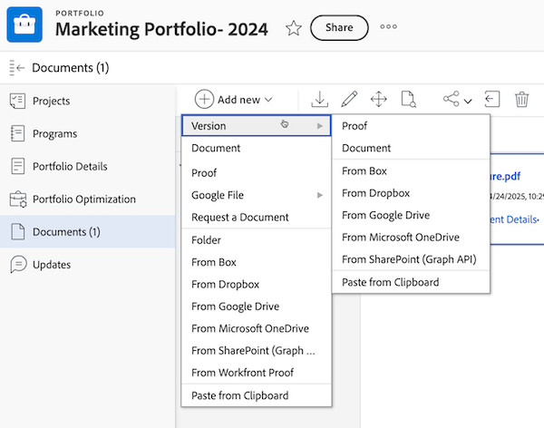
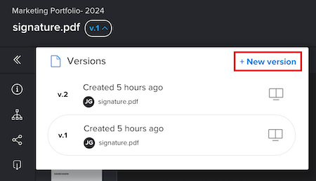

# プルーフの新しいバージョンの作成

<!-- Audited: 4/2025 -->

作業の複数のバージョンやリビジョンをまたいでフィードバックを管理することは、容易なことではありません。 Adobe Workfrontでは、複数のバージョンのプルーフを作成して比較できるため、このプロセスを簡素化できます。

プルーフの新しいバージョンを作成する際には、次の情報を考慮してください。

* ユーザーに、あるバージョンを表示する権限を与えることができますが、別のバージョンを表示する権限を与えることはできません。 逆に、後続のバージョンをユーザーと共有する場合、そのユーザーは以前のバージョンに戻ってアクセス権を付与しない限り、以前のバージョンを表示できません。
* 新しいバージョンを作成するには、プルーフの編集権限が必要です。

  詳しくは、[Workfront Proofでのプルーフの役割の管理](../../../workfront-proof/wp-work-proofsfiles/share-proofs-and-files/manage-proof-roles.md)および[Workfront Proofでのプルーフの権限プロファイル ](../../../workfront-proof/wp-acct-admin/account-settings/proof-perm-profiles-in-wp.md)を参照してください。

  プルーフのバージョンの共有について詳しくは、[Workfront Proof のプルーフの共有](../../../workfront-proof/wp-work-proofsfiles/share-proofs-and-files/share-proof.md)を参照してください。

>[!IMPORTANT]
>
>Adobe Workfrontでプルーフが作成された場合、そのプルーフの新しいバージョンもWorkfrontで作成する必要があります。 プルーフがWorkfrontで作成された場合、Workfront Proof内でプルーフの新しいバージョンを作成することはできません。

## アクセス要件

+++ 展開すると、この記事の機能のアクセス要件が表示されます。

<table style="table-layout:auto"> 
 <col> 
 <col> 
 <tbody> 
  <tr> 
   <td role="rowheader">Adobe Workfront パッケージ</td> 
   <td> 
任意
 </td> 
  </tr> 
  <tr> 
   <td role="rowheader">Adobe Workfront プラン</td> 
   <td> 
標準
 
   
作業または計画

   </td> 
  </tr> 
  <tr> 
   <td role="rowheader">プルーフ権限プロファイル </td> 
   <td>マネージャー以上</td> 
  </tr> 
  <tr> 
   <td role="rowheader">アクセスレベル設定</td> 
   <td> 
ドキュメントへのアクセスを編集
 </td> 
  </tr> 
 </tbody> 
</table>

詳しくは、[Workfront ドキュメントのアクセス要件](/help/quicksilver/administration-and-setup/add-users/access-levels-and-object-permissions/access-level-requirements-in-documentation.md)を参照してください。

+++

## Workfrontで新しいプルーフバージョンを作成する

Workfront で新しいプルーフバージョンをアップロードするには、いくつかの方法があります。 デフォルトのプルーフ設定は、選択した方法に応じて、以前のバージョンから引き継ぐことができます。

* **ドキュメントをアップロードする際にプルーフを自動的に生成**: ユーザープロファイルでこの設定を有効にしている場合、新しいバージョンをドラッグ&amp;ドロップしてもデフォルトのプルーフ設定は引き継がれません。
* **プルーフを作成/単純**：このオプションを選択した場合、デフォルトのプルーフ設定は以前のバージョンから引き継がれません。
* **新規/バージョン/プルーフ**&#x200B;を追加：このオプションを選択した場合、デフォルトのプルーフ設定は以前のバージョンから引き継がれます。
* **プルーフを作成/詳細**：このオプションを選択すると、デフォルトのプルーフ設定が以前のバージョンから引き継がれます。

プルーフの新しいバージョンを作成するには、次の手順に従います。

1. プルーフを含むドキュメントのリストを開きます。
1. コンピューターのファイルシステムから、新しいファイルをプルーフの上にドラッグ&amp;ドロップします。

   または

   プルーフがリストされる行を選択し、**新規追加**／**バージョン**&#x200B;をクリックして、新しいバージョンのプルーフの追加に使用するオプションをクリックします。

   

## プルーフビューアから新しいプルーフバージョンを作成する（Workfront Proofのみ）

スタンドアロンの Workfront Proof を使用している場合は、単一のファイルまたは web キャプチャを含む新しいバージョンのプルーフを作成できます。 

>[!NOTE]
>
>アカウントがエンタープライズプラン上にあり、複数のファイルや web キャプチャをアップロードした場合、それらは自動的に 1 つの新しいバージョンに結合されます。 詳しくは、[複数ページのプルーフの作成](../../../review-and-approve-work/proofing/creating-proofs-within-workfront/create-multi-page-proof.md)を参照してください。

Workfront Proof で新しいバージョンのプルーフを作成するには、次の手順に従います。

1. プルーフを開きます。
1. 左上隅の「**バージョン**」ドロップダウンメニューをクリックし、表示されるボックスで「**+新しいバージョン**」をクリックします。 新しいプルーフバージョンページが開きます。

   

1. 「**ファイルを追加**」セクションで、コンピューターからファイルをドラッグ&amp;ドロップするか、**参照**&#x200B;をクリックしてファイルを選択して、新しいプルーフ バージョンとしてファイルをアップロードします。

   または

   URLを入力して、プルーフの新しいバージョンとしてweb ページをキャプチャします。

   >[!NOTE]
   >
   >ドラッグ&amp;ドロップは、HTML5 を完全にサポートするブラウザーでのみ使用できます。 これには、Internet Explorer 7～9 および Safari は含まれません。

1. （オプション）プルーフのタイトルを選択し、バージョンの新しい&#x200B;**プルーフ名**&#x200B;を入力します。

1. **ワークフロー** セクションで、次のいずれかの変更を行って、このプルーフ バージョンのレビュー担当者を追加します（これにより、以前のバージョンのレビュー担当者が置き換えられます）。

   * （オプション）バージョンの&#x200B;**所有者**&#x200B;をアカウント内の別のユーザーに変更します。

     詳しくは、[Workfront Proofのプルーフ権限プロファイル ](../../../workfront-proof/wp-acct-admin/account-settings/proof-perm-profiles-in-wp.md)を参照してください。

   * （オプション） **タイプの連絡先名または電子メールアドレスを使用して、受信者** ボックスを追加し、バージョンにレビュー担当者を追加します。 次に、各受信者に対して&#x200B;**プルーフの役割**&#x200B;および&#x200B;**電子メールアラート** タイプを選択できます。

     詳しくは、[ プルーフにグループを追加](../../../workfront-proof/wp-mnguserscontacts/groups/add-groups.md)および[Workfront Proofでのプルーフ ロールの管理](../../../workfront-proof/wp-work-proofsfiles/share-proofs-and-files/manage-proof-roles.md)を参照してください。

     >[!NOTE]
     >
     >プルーフの作成者または所有者が、個人設定でプルーフ作成済み電子メールをデフォルトで無効にしている場合、このプルーフに関する&#x200B;**受信者への通知** ボックスが「新しいプルーフ」ページでオンになっている場合でも、プルーフ作成済み電子メールまたは新しいプルーフ電子メールは受信されません。 詳しくは、[Workfront Proof](../../../workfront-proof/wp-emailsntfctns/email-alerts/config-email-notification-settings-wp.md)でのメール通知の設定、[ プルーフ作成メール ](../../../workfront-proof/wp-emailsntfctns/proof-notifications-and-reminders/proof-made-email.md)および[新しいプルーフ メール ](../../../workfront-proof/wp-emailsntfctns/proof-notifications-and-reminders/new-proof-email.md)を参照してください。

   * （オプション）プルーフの期限を設定します。

   * （オプションおよび条件付き）新しいプライマリ意思決定者を「**プライマリ決定権限を**&#x200B;に転送」ドロップダウンで選択します。

   * （オプション）新しい主要な意思決定者としてユーザーを設定するオプションを削除するには、**このステージに対して1つの決定のみを必要とする** ボックスを選択します。

1. 「**メール通知**」セクションで、次のいずれかの設定を選択します。

   * （オプション） **このプルーフについて受信者に通知**：新しいバージョンをレビュー担当者に通知するには、このオプションを選択します。 選択内容は、**プルーフの詳細** ページの&#x200B;**アクティビティ** セクションに記録されます。 詳しくは、[Workfront Proof でプルーフの詳細を管理](../../../workfront-proof/wp-work-proofsfiles/manage-your-work/manage-proof-details.md)を参照してください。

   * （条件付きとオプション） **カスタム件名とメッセージを追加**：このオプションを選択して、カスタム件名とメッセージをメール通知に追加します。

1. **組織** セクションで、次のいずれかの設定を選択します。

   * プルーフに 1 つ以上のタグを適用します。 詳しくは、[Workfront Proof でのタグの作成と管理](../../../workfront-proof/wp-work-proofsfiles/organize-your-work/create-and-manage-tags.md)を参照してください。

   * フォルダーにバージョンを追加します。 フォルダーは以前のバージョンのプルーフからコピーされます。 別のフォルダーを選択すると、すべてのバージョンを含むプルーフ全体が移動されます。 詳しくは、[Workfront Proofのフォルダーの管理](../../../workfront-proof/wp-work-proofsfiles/organize-your-work/manage-folders.md)を参照してください。

   * 請求管理者と管理者は、**設定** タブで、アカウント全体でフォルダーフィールドを必須にすることができます。

1. 「**プルーフ設定**」セクションで、次のいずれかの設定を選択します。

   * プルーフを表示するには、ユーザーがログインする必要があります。
   * プルーフに電子サインが必要（エンタープライズプランのみ）。
   * すべての決定が行われたときにプルーフをロックします。
   * 元のファイルのダウンロードを許可します。
   * プルーフの公開を許可します。
   * プルーフの購読を許可します。

     このセクションで行われた選択は、**プルーフの詳細** ページに表示されます（一部のフィールドを編集できます）。 詳しくは、[Workfront Proof でプルーフの詳細を管理](../../../workfront-proof/wp-work-proofsfiles/manage-your-work/manage-proof-details.md)を参照してください。

<!--
<h2 data-mc-conditions="QuicksilverOrClassic.Draft mode">Create a new version of a proof from the proofing viewer</h2>
-->

<!--

To create a new version from the proofing viewer

-->

<!--
<ol data-mc-conditions="QuicksilverOrClassic.Draft mode">
<li value="1">Open the proof.</li>
<li value="2"> 
Click the <strong>Version</strong> drop-down menu in the upper-left corner, then click <strong>+ New version</strong> in the box that appears.
 
On the <strong>New proof version of</strong> page that appears, you can see all the reviewers from the previous version, including their roles and email notification settings. You can easily edit the roles and notifications of existing reviewers or remove existing reviewers from the new version on this page.
 </li>
<li value="3"> 
Under <strong>Add files</strong>, upload a file as a new version of the proof by dragging and dropping from your computer or by clicking <strong>browse</strong> and selecting the file you want. You can type a&nbsp;<strong>Proof name</strong>&nbsp;for the version or leave this box blank to&nbsp;use the same filename with a version number added on the end.
 
Or 
 
Capture a web page as a new version of the proof by typing a URL
 <note type="note">
Drag and drop is available only with browsers that fully support HTML5. This excludes Internet Explorer 7 through 9 and Safari.
 
</note> </li>
<li value="4"> 
Under <strong>Workflow</strong>, make any of the following changes to specify the reviewers for this version of the proof.
 
Reviewers from the previous version are replaced by the reviewers you add.

<ul>
<li>Change the <strong>Owner</strong> of the version to another user in your account. For information about owner permissions, see <a href="../../../workfront-proof/wp-acct-admin/account-settings/proof-perm-profiles-in-wp.md" class="MCXref xref">Proof Permissions Profiles in Workfront Proof</a>.</li>
<li> 
Using the <strong>Type contact name or email address to add a recipient box</strong>, add reviewers to the version. You can specify a <strong>Proof role</strong> and an <strong>Email alerts</strong> type for each recipient.
 
For information about adding groups to the proof, see&nbsp;<a href="../../../workfront-proof/wp-mnguserscontacts/groups/add-groups.md" class="MCXref xref">Add Groups to a Proof</a>.&nbsp;For information about roles, see <a href="../../../workfront-proof/wp-work-proofsfiles/share-proofs-and-files/manage-proof-roles.md" class="MCXref xref">Manage Proof Roles in Workfront Proof</a>.
 <note type="note">
If the creator or owner of&nbsp;&nbsp;the proof has
<a href="../../../workfront-proof/wp-emailsntfctns/proof-notifications-and-reminders/proof-made-email.md" class="MCXref xref">The Proof Made email</a> disabled by default (in their personal settings), they won't receive any Proof made or New proof emails even if the Notify people by email box is checked on the New proof page. For information about email notifications, see
<a href="../../../workfront-proof/wp-emailsntfctns/email-alerts/config-email-notification-settings-wp.md" class="MCXref xref">Configure email notification settings in Workfront Proof</a>.&nbsp;See also
<a href="../../../workfront-proof/wp-emailsntfctns/proof-notifications-and-reminders/proof-made-email.md" class="MCXref xref">The Proof Made email</a> and
<a href="../../../workfront-proof/wp-emailsntfctns/proof-notifications-and-reminders/new-proof-email.md" class="MCXref xref">New proof email</a>.
 
</note> </li>
<li>Set a proof deadline for the version.</li>
<li>Hover over a reviewer's name to see any decisions he or she made on a previous version.</li>
</ul> </li>
<li value="5">Under <strong>Email notification</strong>, do any of the following:
<ul>
<li>Specify whether you want to notify the reviewers of the new version. Your selection will be logged in the Proof activity section on the Proof details page.</li>
<li>Add a custom subject and message.</li>
</ul></li>
<li value="6">Under Proof settings, make any of the changes below:
<ul>
<li>Require login on the proof</li>
<li>Require electronic signatures on the proof (Enterprise plan only)</li>
<li>Lock the proof when all decisions are made</li>
<li>Allow or block download of original file</li>
<li>Public sharing of the proof,&nbsp;including public sharing settings</li>
<li>Subscription to the proof The selections made in this section will be shown in the Proof details page.</li>
</ul></li>
</ol>
-->

## 新しいバージョンのメッセージについて

プルーフの以前のバージョンにカスタムの件名／メッセージが含まれていた場合は、デフォルトで新しいバージョンページに表示されます。 実行できる操作：

* 件名とメッセージを編集します。
* 「メールで担当者に通知」ボックスの選択を解除します。これで、レビュー対象の新しいバージョンがあることを通知するメールがレビュアーに送信されなくなります。

  >[!NOTE]
  >
  >これは、個人設定に保存されているデフォルトのカスタム件名/メッセージの影響を受けません。

個人設定にデフォルトの件名とメッセージが保存されている場合は、新しいバージョン ページにデフォルトで表示されるメッセージが決まります。

* 標準メールを使用して以前のプルーフバージョンをレビュー担当者に通知した場合（例：カスタム件名/メッセージなし）、デフォルトのカスタム件名/メッセージ（個人設定）が新しいバージョンページに表示されます。 その後、カスタムの件名とメッセージを編集したり、「メールでユーザーに通知」ボックスの選択を解除したりできます。つまり、レビュー用の新しいバージョンがレビューアーに通知されるメールは送信されません。
* 以前のプルーフバージョンについてレビュー担当者に通知しなかった場合（標準メールやカスタムメールがない場合など）、新しいバージョンページにはデフォルトでメッセージが含まれません。 新しいバージョンをレビュアーに通知するには、メッセージを送信リンクをクリックします。これで、（個人設定に従って）デフォルトのカスタム件名／メッセージが表示されるようになります。 その後、必要に応じてカスタムの件名とメッセージを編集できます。

個人設定にデフォルトの件名およびメッセージが保存されていない場合は、新しいバージョンページに次の情報が表示されます。

* 標準の電子メールを使用して以前のプルーフバージョンについてレビュー担当者に通知した場合（カスタムの件名やメッセージがない場合など）、「新しいバージョン」ページで「メールでユーザーに通知」オプションがデフォルトで選択されます。 カスタムメッセージを追加するには、リンクをクリックします。
* 以前のプルーフバージョンについてレビュー担当者に通知しなかった場合（標準メールやカスタムメールなど）、新しいバージョンページにはデフォルトでメッセージは含まれません。 新しいバージョンをレビュアーに通知するには、メッセージを送信リンクをクリックします。 次に、カスタムメッセージを追加リンクをクリックして、カスタム件名とメッセージを追加できます。
