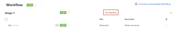

# 既存の基本プルーフの締め切りを設定

基本プルーフの作成後に、1 回だけ締め切りを設定することができます。

## アクセス要件

+++ 展開すると、この記事の機能のアクセス要件が表示されます。

<table style="table-layout:auto"> 
 <col> 
 <col> 
 <tbody> 
  <tr> 
   <td role="rowheader">Adobe Workfront パッケージ</td> 
   <td> 
任意
 </td> 
  </tr> 
  <tr> 
   <td role="rowheader">Adobe Workfront プラン</td> 
   <td> 
   
標準

   
作業または計画

    </td> 
  </tr> 
  <tr> 
   <td role="rowheader">プルーフ権限プロファイル </td> 
   <td>マネージャー以上</td> 
  </tr> 
  <tr> 
   <td role="rowheader">プルーフの役割</td> 
   <td>作成者またはマネージャー</td> 
  </tr> 
  <tr> 
   <td role="rowheader">アクセスレベル設定</td> 
   <td> 
ドキュメントへのアクセスを編集
</td> 
  </tr> 
 </tbody> 
</table>

詳しくは、[Workfront ドキュメントのアクセス要件](/help/quicksilver/administration-and-setup/add-users/access-levels-and-object-permissions/access-level-requirements-in-documentation.md)を参照してください。

+++

## 既存の基本プルーフの締め切りを設定

1. ドキュメントを含むプロジェクト、タスクまたはイシューに移動し、「**ドキュメント**」を選択します。
1. 必要なプルーフを見つけます。
1. 「**プルーフワークフロー**」をクリックします。
1. **ワークフロー**&#x200B;エリアで、「**締め切りはありません**」を選択します。

   

1. 日付を選択し、時間を指定して、画面の任意の場所をクリックします。
1. 新しい期日をレビュアーに通知する場合に選択します。
