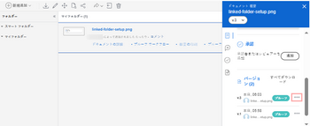

# 配達確認のバージョンをダウンロード

配達確認の 1 つのバージョンまたはすべてのバージョンをダウンロードできます。

## アクセス要件

この記事の手順を実行するには、次のアクセス権が必要です。

<table style="table-layout:auto"> 
 <col> 
 <col> 
 <tbody> 
  <tr> 
   <td role="rowheader">Adobe Workfront plan*</td> 
   <td> 
現在のプラン：Pro 以上
 
または
 
レガシープラン：選択またはプレミアム
 
様々なプランでのアクセスの検証について詳しくは、 <a href="/help/quicksilver/administration-and-setup/manage-workfront/configure-proofing/access-to-proofing-functionality.md" class="MCXref xref">Workfrontの校正機能へのアクセス</a>.
 </td> 
  </tr> 
  <tr> 
   <td role="rowheader">Adobe Workfront license*</td> 
   <td> 
現在のプラン：作業または計画
 
レガシープラン：任意（ユーザーの校正が有効になっている必要があります）
 </td> 
  </tr> 
  <tr> 
   <td role="rowheader">プルーフ権限プロファイル </td> 
   <td>マネージャ以降</td> 
  </tr> 
  <tr> 
   <td role="rowheader">アクセスレベル設定*</td> 
   <td> 
ドキュメントへのアクセスを編集
 
追加のアクセス権のリクエストについて詳しくは、 <a href="../../../../workfront-basics/grant-and-request-access-to-objects/request-access.md" class="MCXref xref">オブジェクトへのアクセスのリクエスト </a>.
 </td> 
  </tr> 
 </tbody> 
</table>

&#42;保有しているプラン、役割、配達確認権限プロファイルを確認するには、WorkfrontまたはWorkfrontの配達確認管理者に問い合わせてください。

## 配達確認のバージョンを 1 つだけダウンロード

1. ドキュメントの一覧で、配達確認をクリックします。
1. 概要で、 **バージョン**、その他メニューをクリックします。  をクリックし、 **ダウンロード** 」と入力します。

   

## 配達確認のすべてのバージョンをダウンロード

1. ドキュメントの一覧で、配達確認をクリックします。
1. クリック **ドキュメントの詳細**&#x200B;を選択し、「 **すべてのバージョン** をクリックします。

1. クリック **すべてダウンロード** をクリックします。
