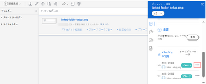

# プルーフのバージョンのダウンロード

プルーフの 1 つのバージョンまたはすべてのバージョンをダウンロードできます。

## アクセス要件

+++ 展開すると、この記事の機能のアクセス要件が表示されます。

<table style="table-layout:auto"> 
 <col> 
 <col> 
 <tbody> 
  <tr> 
   <td role="rowheader">Adobe Workfront パッケージ</td> 
   <td> 
任意
 </td> 
  </tr> 
  <tr> 
   <td role="rowheader">Adobe Workfront プラン</td> 
   <td> 
   
標準

   
作業または計画

   </td> 
  </tr> 
  <tr> 
   <td role="rowheader">プルーフ権限プロファイル </td> 
   <td>マネージャー以上</td> 
  </tr> 
  <tr> 
   <td role="rowheader">アクセスレベル設定</td> 
   <td> 
ドキュメントへのアクセスを編集
 </td> 
  </tr> 
 </tbody> 
</table>

詳しくは、[Workfront ドキュメントのアクセス要件](/help/quicksilver/administration-and-setup/add-users/access-levels-and-object-permissions/access-level-requirements-in-documentation.md)を参照してください。

+++

## 1 つだけのプルーフのバージョンのダウンロード

1. ドキュメントのリストで、プルーフをクリックします。
1. 概要の&#x200B;**バージョン**&#x200B;で、バージョンの右側にあるその他のメニューをクリックし、表示されるドロップダウンリストの&#x200B;**ダウンロード**&#x200B;をクリックします。

   

## プルーフのすべてのバージョンをダウンロードする

1. ドキュメントのリストで、プルーフをクリックします。
1. **ドキュメントの詳細**&#x200B;をクリックし、次に左側のパネルで&#x200B;**すべてのバージョン**&#x200B;を選択します。

1. リストの最上部の「**すべてをダウンロード**」をクリックします。
