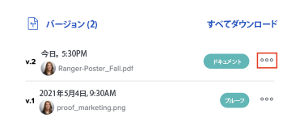

# プルーフのバージョンの表示

プルーフの過去のバージョンを表示できます。

## アクセス要件

+++ 展開すると、この記事の機能のアクセス要件が表示されます。

<table style="table-layout:auto"> 
 <col> 
 <col> 
 <tbody> 
  <tr> 
   <td role="rowheader">Adobe Workfront パッケージ</td> 
   <td> 
任意
 </td> 
  </tr> 
  <tr> 
   <td role="rowheader">Adobe Workfront プラン</td> 
   <td> 
   
標準

   
作業または計画

   </td> 
  </tr> 
  <tr> 
   <td role="rowheader">プルーフ権限プロファイル </td> 
   <td>マネージャー以上</td> 
  </tr> 
  <tr> 
   <td role="rowheader">アクセスレベル設定</td> 
   <td> 
ドキュメントへのアクセスを編集
 </td> 
  </tr> 
 </tbody> 
</table>

詳しくは、[Workfront ドキュメントのアクセス要件](/help/quicksilver/administration-and-setup/add-users/access-levels-and-object-permissions/access-level-requirements-in-documentation.md)を参照してください。

+++

## プルーフのすべてのバージョンのリストを表示

1. ドキュメントリストに移動し、プルーフを選択します。
1. 「概要」で、「**すべてのバージョン**」セクションまでスクロールします。 ここで、プルーフのすべてのバージョンを表示できます。

   

## プルーフの前回のバージョンのプレビュー

プレビューできないファイル（XLSX や DOC など）がダウンロードされます。

1. ドキュメントリストに移動し、プルーフを選択します。
1. 「概要」で「**バージョン**」までスクロールし、**その他**&#x200B;メニューをクリックして、「**プレビュー**」を選択します。

   のバージョンの確認

## プルーフの前回のバージョンを表示

Workfront でドキュメントへの表示アクセス権を持つユーザーは誰でも、プルーフ済みドキュメントの過去のバージョンを表示できます。 ユーザーがプルーフ用ライセンスを持つ必要はありません。

1. ドキュメントを含むプロジェクト、タスクまたはイシューに移動し、「**ドキュメント**」を選択します。
1. 必要なプルーフを見つけます。
1. 「概要」で「**バージョン**」までスクロールし、**その他**&#x200B;メニューから「**プルーフを開く**」を選択します。

   のバージョンの確認
