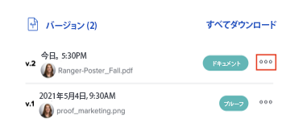
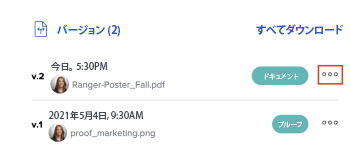

# 配達確認のバージョンを表示

配達確認の過去のバージョンを表示できます。

## アクセス要件

この記事の手順を実行するには、次のアクセス権が必要です。

<table style="table-layout:auto"> 
 <col> 
 <col> 
 <tbody> 
  <tr> 
   <td role="rowheader">Adobe Workfront plan*</td> 
   <td> 
現在のプラン：Pro 以上
 
または
 
レガシープラン：選択またはプレミアム
 
様々なプランでのアクセスの検証について詳しくは、 <a href="/help/quicksilver/administration-and-setup/manage-workfront/configure-proofing/access-to-proofing-functionality.md" class="MCXref xref">Workfrontの校正機能へのアクセス</a>.
 </td> 
  </tr> 
  <tr> 
   <td role="rowheader">Adobe Workfront license*</td> 
   <td> 
現在のプラン：作業または計画
 
レガシープラン：任意（ユーザーの校正が有効になっている必要があります）
 </td> 
  </tr> 
  <tr> 
   <td role="rowheader">プルーフ権限プロファイル </td> 
   <td>マネージャ以降</td> 
  </tr> 
  <tr> 
   <td role="rowheader">アクセスレベル設定*</td> 
   <td> 
ドキュメントへのアクセスを編集
 
追加のアクセス権のリクエストについて詳しくは、 <a href="../../../../workfront-basics/grant-and-request-access-to-objects/request-access.md" class="MCXref xref">オブジェクトへのアクセスのリクエスト </a>.
 </td> 
  </tr> 
 </tbody> 
</table>

&#42;保有しているプラン、役割、配達確認権限プロファイルを確認するには、WorkfrontまたはWorkfrontの配達確認管理者に問い合わせてください。

## すべての配達確認バージョンのリストを表示

1. 「ドキュメント」リストに移動し、配達確認を選択します。
1. 「概要」で、「 **すべてのバージョン** 」セクションに入力します。 ここで、配達確認のすべてのバージョンを表示できます。

   

## 以前の配達確認バージョンのプレビュー

プレビューできないファイル（XLSX や DOC など）がダウンロードされます。

1. ドキュメントリストに移動し、配達確認を選択します。
1. 「概要」で、「 **バージョン**、 **詳細** メニューから、 **プレビュー**.

   

## 以前の配達確認バージョンを表示

Workfrontでドキュメントへの表示アクセス権を持つユーザーは誰でも、配達確認済みドキュメントの過去のバージョンを表示できます。 ユーザーに校正ライセンスがある必要はありません。

1. ドキュメントを含むプロジェクト、タスクまたはイシューに移動し、「 」を選択します。 **ドキュメント**.
1. 必要な配達確認を見つけます。
1. 「概要」で、「 **バージョン**、 **詳細** メニューから、 **配達確認を開く**.

   
