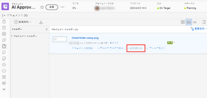
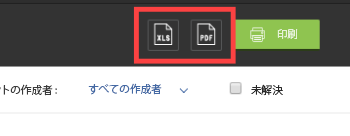

# Adobe Workfront内での配達確認の概要の印刷

配達確認の概要を印刷したり、PDFとして保存したり、Adobe Reader向けに最適化された XLS ファイルまたはPDFファイルとして書き出したりできます。

## アクセス要件

この記事の手順を実行するには、次のアクセス権が必要です。

<table style="table-layout:auto"> 
 <col> 
 <col> 
 <tbody> 
  <tr> 
   <td role="rowheader">Adobe Workfront plan*</td> 
   <td> 
現在のプラン：Pro 以上
 
または
 
レガシープラン：選択またはプレミアム
 
様々なプランでのアクセスの検証について詳しくは、 <a href="/help/quicksilver/administration-and-setup/manage-workfront/configure-proofing/access-to-proofing-functionality.md" class="MCXref xref">Workfrontの校正機能へのアクセス</a>.
 </td> 
  </tr> 
  <tr> 
   <td role="rowheader">Adobe Workfront license*</td> 
   <td> 
現在のプラン：作業または計画
 
レガシープラン：任意（ユーザーの校正が有効になっている必要があります）
 </td> 
  </tr> 
  <tr> 
   <td role="rowheader">プルーフ権限プロファイル </td> 
   <td>マネージャ以降</td> 
  </tr> 
  <tr> 
   <td role="rowheader">アクセスレベル設定*</td> 
   <td> 
ドキュメントへのアクセスを編集
 
注意：まだアクセス権がない場合は、Workfront管理者に、アクセスレベルに追加の制限を設定しているかどうかを問い合わせてください。 Workfront管理者がアクセスレベルを変更する方法について詳しくは、 <a href="../../../administration-and-setup/add-users/configure-and-grant-access/create-modify-access-levels.md" class="MCXref xref">カスタムアクセスレベルの作成または変更</a>.
 </td> 
  </tr> 
 </tbody> 
</table>

&#42;保有しているプラン、役割、配達確認権限プロファイルを確認するには、WorkfrontまたはWorkfrontの配達確認管理者に問い合わせてください。

## 配達確認の概要を印刷するか、配達確認ファイルとしてPDF

配達確認の概要は、ドキュメントリストから直接印刷できます。

>[!NOTE]
>
>複数の配達確認の概要をドキュメントリストから同時に印刷することはできません。

1. 配達確認を含むドキュメントのリストから、ドキュメントを含む行の上にマウスポインターを置いて、 **印刷の概要**.

   

   または

   校正ビューアで配達確認を表示しているときに、 **印刷**&#x200B;アイコン  をクリックします。 ( 左側のツールバーが表示されていない場合は、メニューアイコン  （校正ビューアの左上隅）。

1. 次のいずれかのオプションを使用します。

   <table style="table-layout:auto"> 
    <col> 
    <col> 
    <tbody> 
     <tr> 
      <td role="rowheader">表示</td> 
      <td> 
印刷する内容を指定します。
 
       <ul> 
        <li>この <strong>現在のバージョン</strong> または <strong>すべてのバージョン</strong> 証拠の</li> 
        <li>次の項目のみ <strong>コメント付きのページ</strong> または <strong>すべてのページ</strong></li> 
        <li>次の項目のみ <strong>ページサムネール</strong> （各ページの小さなレンダリング）または <strong>フルページ</strong> （配達確認の完全なレンダリング） </li> 
        
注意：印刷出力でマークアップのピン番号を確認するには、「ページ」サムネールではなく「全ページ」を選択する必要があります。 
 
       </ul> </td> 
     </tr> 
     <tr> 
      <td role="rowheader">コメントの並べ替え基準</td> 
      <td> 
（上の「ページサムネール」を選択した場合のみ使用可能）配達確認のコメントを印刷する順序を指定します。
 
       <ul> 
        <li><strong>最も古い</strong>:最初から最後までに行われたコメントから</li> 
        <li><strong>最新</strong>:最初に行った最後のコメントから</li> 
        <li><strong>ページ</strong>:ページ別、最初のページから最後のページまで、または最後のページから最初のページまで</li> 
        <li><strong>作成者</strong>:ユーザーを追加したユーザーの名前別（A ～ Z または Z ～ A から）</li> 
       </ul> 
これらのオプションは、XLS またはPDF・ファイルとしてエクスポートする出力には影響しません。
 </td> 
     </tr> 
     <tr> 
      <td role="rowheader">コメントを次の条件でフィルター</td> 
      <td> 
これらのオプションを任意に組み合わせて使用し、印刷または XLS ファイルまたはPDFファイルとして書き出す出力に特定のコメントのみを含めることができます。
 
       <ul> 
        <li>選択した作成者（デフォルト）</li> 
        <li>選択したアクション</li> 
        <li><strong>未解決</strong> ステータス</li> 
       </ul> </td> 
     </tr> 
     <tr> 
      <td role="rowheader">ワークフロー</td> 
      <td> 
（配達確認に自動ワークフローが設定されている場合にのみ使用できます）次の項目をクリック： <strong>図を表示</strong> 配達確認のステージと各ステージで行われた決定を示す図を印刷出力に含める。 表示されるダイアグラムでは、色はステージでおこなわれた決定を表します。
 
<strong>緑</strong>:承認済み
 
<strong>青</strong>:決定を保留中
 
<strong>赤</strong>:変更が必要な決定
 
<strong>グレー</strong>:まだ開始されていません
 
<strong>イエロー</strong>:承認済み、変更あり
 </td> 
     </tr> 
    </tbody> 
   </table>

1. クリック **印刷**.
1. 表示されるウィンドウの右側のパネルで、概要を印刷する場合は、 **宛先** メニュー、次に「 **詳細を表示**. 表示される一覧で、使用するプリンタをクリックし、 **印刷**.

   または

   概要をPDFファイルとして保存する場合は、 **宛先** メニュー、クリック **「名前を付けて保存」PDF**&#x200B;を選択し、「 **保存**.

## 配達確認の概要を XLS またはPDFとしてエクスポート

静的コンテンツの配達確認の概要は、XLS ファイルまたは配達確認ファイルとしてPDFできます。 配達確認の書き出しには、配達確認の内容のみが含まれます。

1. 配達確認を含むドキュメントのリストから、ドキュメントを含む行の上にマウスポインターを置いて、 **印刷の概要**.

   

1. ページの右上隅にある XLS アイコンまたはPDFアイコンをクリックします。

   

書き出したファイルの準備が整うと、ファイルをダウンロードできる電子メールが届きます。

概要をPDFファイルとして書き出すと、配達確認に対するコメントがPDFリーダーに表示されます。 コメントに複数のマークアップが関連付けられている場合、コメントはコメントリストに複数回表示されます（マークアップごとに 1 回）。
