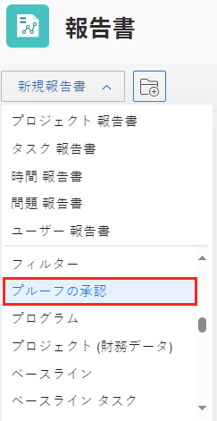

# プルーフの承認レポートを使用する

プルーフの承認レポートを使用して、環境内のプルーフに関する情報を表示できます。

## アクセス要件

以下が必要です。

<table style="table-layout:auto"> 
 <col> 
 <col> 
 <tbody> 
  <tr> 
   <td role="rowheader"> 
Workfront プラン*
 </td> 
   <td>任意</td> 
  </tr> 
  <tr> 
   <td role="rowheader"> 
Adobe Workfront ライセンスの概要*
 </td> 
   <td> 
プラン
 </td> 
  </tr> 
  <tr data-mc-conditions=""> 
   <td role="rowheader"><strong>アクセスレベル*</strong> </td> 
   <td> 
次へのアクセスを編集：
 
    <ul> 
     <li> 
レポート、ダッシュボードおよびカレンダーの作成
 </li> 
     <li> 
フィルター、ビュー、グループ化を作成
 </li> 
    </ul> 
メモ：まだアクセス権がない場合は、アクセスレベルに追加の制限が設定されていないかどうか Workfront 管理者にお問い合わせください。Workfront 管理者がアクセスレベルを変更する方法について詳しくは、<a href="../../../administration-and-setup/add-users/configure-and-grant-access/create-modify-access-levels.md" class="MCXref xref">カスタムアクセスレベルの作成または変更</a>を参照してください。
 </td> 
  </tr> 
 </tbody> 
</table>

&#42;保有するプラン、ライセンスタイプ、アクセス権を確認するには、Workfront 管理者に問い合わせてください。

## プルーフの承認レポートを使用する

1. Adobe Workfront の右上にある&#x200B;**メインメニュー**&#x200B;アイコン（）をクリックし、次に「**レポート**」をクリックします。
1. 「**新規レポート**」をクリックしてスクロールし、「**プルーフの承認**」を選択します。

   

1. （オプション）その他のフィールドを追加します。
1. 「**保存して閉じる**」をクリックします。

## その他のフィールド

以下のフィールドをプルーフの承認レポートに追加できます。

* **決定日**：承認者がプルーフに対して決定を行う日付が表示されます。この日付は、プルーフの「サマリーを印刷」でも確認できます。
* **承認者ステージ**：現在のステージ情報が表示されます。
* **ワークフローテンプレート**：プルーフに添付されているワークフローテンプレートが表示されます。テンプレートが添付されていない場合、列は空白になります。
* **決定待ち**：以下に該当する場合、最新バージョンで決定が下されていないことを示す「true」が表示されます。

   * プルーフがアーカイブされていない
   * 承認者がいるステージがアクティブになっている
   * プルーフが承認待ち

* **プルーフの期限**：プルーフの期限が表示されます。このフィールドに値を入力するには、すべてのステージに期限を割り当てる必要があります。このフィールドには、直近にアクティベートされたステージの期限が表示されます。

 
