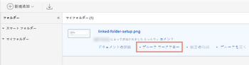
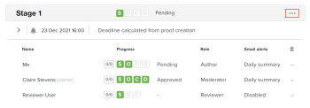

# 配達確認のレビュー担当者に電子メールメッセージを送信

レビューおよび承認プロセス中に、配達確認の 1 人またはすべてのレビュー担当者にメッセージを送信できます。 メッセージを使用すると、レビュー担当者に配達確認のレビューを完了するよう促したり、配達確認に関連する他の情報を提供したりすることが簡単にできます。

一般的なリマインダーの電子メールを送信するか、特定のステージに関連付けられた 1 人またはすべてのユーザーにカスタマイズされたメッセージを送信するかを選択できます。

## アクセス要件

この記事の手順を実行するには、次のアクセス権が必要です。

<table style="table-layout:auto"> 
 <col> 
 <col> 
 <tbody> 
  <tr> 
   <td role="rowheader">Adobe Workfront plan*</td> 
   <td> 
現在のプラン：Pro 以上
 
または
 
レガシープラン：選択またはプレミアム
 
様々なプランでのアクセスの検証について詳しくは、 <a href="/help/quicksilver/administration-and-setup/manage-workfront/configure-proofing/access-to-proofing-functionality.md" class="MCXref xref">Workfrontの校正機能へのアクセス</a>.
 </td> 
  </tr> 
  <tr> 
   <td role="rowheader">Adobe Workfront license*</td> 
   <td> 
現在のプラン：作業または計画
 
レガシープラン：任意（ユーザーの校正が有効になっている必要があります）
 </td> 
  </tr> 
  <tr> 
   <td role="rowheader">プルーフ権限プロファイル </td> 
   <td>マネージャ以降</td> 
  </tr> 
  <tr> 
   <td role="rowheader">配達確認の役割</td> 
   <td>作成者またはモデレーター</td> 
  </tr> 
  <tr> 
   <td role="rowheader">アクセスレベル設定*</td> 
   <td> 
ドキュメントへのアクセスを編集
 
注意：まだアクセス権がない場合は、Workfront管理者に、アクセスレベルに追加の制限を設定しているかどうかを問い合わせてください。 Workfront管理者がアクセスレベルを変更する方法について詳しくは、 <a href="../../../administration-and-setup/add-users/configure-and-grant-access/create-modify-access-levels.md" class="MCXref xref">カスタムアクセスレベルの作成または変更</a>.
 </td> 
  </tr> 
 </tbody> 
</table>

&#42;保有しているプラン、役割、配達確認権限プロファイルを確認するには、WorkfrontまたはWorkfrontの配達確認管理者に問い合わせてください。

## 配達確認でユーザーに電子メールメッセージを送信

1. メッセージを送信するユーザーが含まれる配達確認のドキュメントを検索します。
1. ドキュメントにカーソルを合わせ、 **校正ワークフロー**.

   

1. ステージ上のすべてのユーザーにメッセージを送信するには、 **詳細** ステージ上のメニューで、 **すべてのメッセージ**.

   

1. 個々のユーザーにメッセージを送信するには、 **詳細** メニューをクリックし、 **メッセージ**.

   

1. 内 **メッセージの詳細** セクションで、次の情報を指定します。

   <table style="table-layout:auto"> 
    <col> 
    <col> 
    <tbody> 
     <tr> 
      <td role="rowheader">メールで担当者に通知</td> 
      <td>このオプションの選択を解除することはできません。 すべてのユーザーが電子メールでメッセージを受信します。</td> 
     </tr> 
     <tr> 
      <td role="rowheader">カスタムメッセージを破棄</td> 
      <td> 
クリック <strong>カスタムメッセージを破棄</strong> デフォルトの e メールコンテンツのみを含める場合。
 
デフォルトのリマインダー電子メールには、次の情報が含まれます。
 
       <ul> 
        <li>配達確認への個人リンク 配達確認画像のサムネール </li> 
        <li>次の配達確認の詳細：配達確認の名前、バージョン番号、フォルダー名（該当する場合）、レビュー担当者と配達確認の進行状況のリスト。</li> 
       </ul> </td> 
     </tr> 
     <tr> 
      <td role="rowheader">件名</td> 
      <td>メッセージの件名を入力します。</td> 
     </tr> 
     <tr> 
      <td role="rowheader">メッセージ</td> 
      <td>メッセージの内容を入力します。</td> 
     </tr> 
    </tbody> 
   </table>

1. クリック **送信。**
