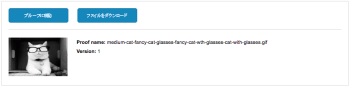

# Adobe Workfront内での配達確認の共有

ドキュメントを共有するか、配達確認にユーザーを追加することで、Adobe Workfront内で配達確認済みドキュメントを共有できます。

配達確認を共有する場合は、この記事で説明するように、受信者はドキュメントと配達確認に同じアクセス権を持ちます。 さらに、受信者に配達確認の承認をリクエストできます。

>[!TIP]
>
>また、校正ビューア内から配達確認を共有することもできます。 手順については、 [校正ビューアから配達確認を共有](../../../review-and-approve-work/proofing/reviewing-proofs-within-workfront/review-a-proof/share-a-proof-in-proofing-viewer.md).

## アクセス要件

この記事の手順を実行するには、次のアクセス権が必要です。

<table style="table-layout:auto"> 
 <col> 
 <col> 
 <tbody> 
  <tr> 
   <td role="rowheader">Adobe Workfront plan*</td> 
   <td> 
現在のプラン：Pro 以上
 
または
 
レガシープラン：選択またはプレミアム
 
様々なプランでのアクセスの検証について詳しくは、 <a href="/help/quicksilver/administration-and-setup/manage-workfront/configure-proofing/access-to-proofing-functionality.md" class="MCXref xref">Workfrontの校正機能へのアクセス</a>.
 </td> 
  </tr> 
  <tr> 
   <td role="rowheader">Adobe Workfront license*</td> 
   <td> 
現在のプラン：作業または計画
 
レガシープラン：任意（ユーザーの校正が有効になっている必要があります）
 </td> 
  </tr> 
  <tr> 
   <td role="rowheader">プルーフ権限プロファイル </td> 
   <td>マネージャ以降</td> 
  </tr> 
  <tr> 
   <td role="rowheader">プルーフの役割</td> 
   <td>作成者またはモデレーター</td> 
  </tr> 
  <tr> 
   <td role="rowheader">アクセスレベル設定*</td> 
   <td> 
ドキュメントへのアクセスを編集
 
追加のアクセス権のリクエストについて詳しくは、 <a href="../../../workfront-basics/grant-and-request-access-to-objects/request-access.md" class="MCXref xref">オブジェクトへのアクセスのリクエスト </a>.
 </td> 
  </tr> 
 </tbody> 
</table>

&#42;保有しているプラン、役割、配達確認権限プロファイルを確認するには、WorkfrontまたはWorkfrontの配達確認管理者に問い合わせてください。

## 配達確認リンクを共有

配達確認リンクを共有すると、Workfrontユーザーに対してアクセス権を表示できます。 ユーザーは、配達確認に対してコメントを付け、Workfrontのログイン資格情報を使用して、配達確認の E メール通知を購読できます。 校正対象外のユーザーは、電子メールアドレスと表示名を使用してコメントや購読をおこなうことができます。

>[!IMPORTANT]
>
>「公開 URL または埋め込みコードを使用した配達確認の共有を許可」設定を有効にする必要があります。

1. ユーザーと共有する配達確認を含むドキュメントを選択します。

   1 つのドキュメントのみを選択できます。 複数のドキュメントのリンクを同時に共有することはできません。

1. クリック **共有** > **配達確認リンク**.
1. 内 **配達確認リンク** 表示されるボックスで、次のいずれかの操作を行います。

   * リンクをクリップボードにコピーするには、 **リンクをコピー**.

     チャットや電子メールアプリケーションなど、サードパーティのツールを介してリンクを配布できるようになりました。

   * Adobe Workfrontから直接リンクを電子メールで送信するには、以下の手順を実行します。

      1. 内 **または、次へのメールリンク：** 「 」フィールドで、入力を開始し、受信者の名前を選択します。 または、共有する外部ユーザーの電子メールアドレスを指定します。

         >[!NOTE]
         >
         >配達確認を共有する際にエイリアス E メールが表示される場合は、対応するエイリアス E メールが存在する場合は、元の E メールを入力して新しいゲストユーザーを作成しないでください。

      1. 次のオプションから選択します。

         <table style="table-layout:auto">
          <col>
          <col>
          <tbody>
           <tr>
            <td role="rowheader">公開リンクを送信</td>
            <td>
電子メール通知に、使用している校正ビューア内の配達確認にユーザーを導くボタンを含め、表示アクセス権を付与します。

If <strong>パブリック URL または埋め込みコードで配達確認に登録</strong> 「 」をオフにすると、ユーザーはWorkfrontのログイン資格情報を使用してログインし、配達確認にコメントを追加できます。 このオプションをオンにすると、電子メールアドレスと名前（パスワードは不要）を入力したユーザーは誰でも署名し、配達確認にコメントを追加できます。
</td>
           </tr>
           <tr>
            <td role="rowheader">ダウンロードリンクを送信</td>
            <td>ダウンロードページにユーザーを導くボタンが電子メール通知に含まれ、ファイルの詳細、ファイル名、ファイルサイズを、インラインで表示されたファイルと共に提供します。 ユーザーは、ダウンロードページの「ダウンロード」リンクをクリックして、ファイルをダウンロードできます。</td>
           </tr>
           <tr>
            <td role="rowheader">カスタムメッセージを追加</td>
            <td>電子メール通知のカスタム件名と本文を指定できます。</td>
           </tr>
          </tbody>
         </table>

      1. クリック **送信**.

         受信者には、配達確認と、含めるように選択したボタンに関する情報が記載された E メール通知が届きます。

         

## 配達確認にユーザーを追加

配達確認に対する編集権限を持っている場合は、任意のWorkfrontユーザーを配達確認に追加できます。 配達確認に複数のステージがある場合、ユーザーを個々のステージに追加します

>[!WARNING]
>
>この記事で説明する方法に加えて、既存の配達確認の「更新」タブからコメントにタグ付けして、配達確認にユーザーを追加できます。 ただし、この方法で配達確認に追加されたユーザーは、配達確認のワークフローに追加された後で再度タグ付けされない限り、E メール通知を受け取りません。
>
>そのため、ユーザーをコメントでタグ付けするのではなく、以下に示すいずれかの方法で配達確認に追加することをお勧めします。
>

>[!NOTE]
>
>従来のWorkfrontプランを使用し、ユーザーに対して校正を有効または無効にできる場合は、次の点に注意してください。
>
>* 受信者は、配達確認を確認するために、検証を有効にする必要はありません。
>* 自動ワークフローを有効にし、Workfrontで校正を有効にしていないユーザーを配達確認に追加すると、自動ワークフロー内に新しいステージが作成されます。 追加するユーザーが、配達確認を初めて表示したときに、自動的にこの新しいステージに追加されます。 ( 詳しくは、 [自動ワークフローの概要](../../../review-and-approve-work/proofing/proofing-overview/automated-workflow.md).)
>

### 「ドキュメント」タブから既存の配達確認にユーザーを追加する

1. ユーザーを追加する配達確認を含むドキュメントを選択します。
1. 配達確認に自動ワークフロー（ステージ）がない場合は、 **詳細** 「ステージ 1」セクションの右上隅にあるアイコンをクリックし、 **共有** 」と入力します。

   または

   配達確認に自動ワークフローが含まれている場合は、 **詳細** レビュー担当者を追加するステージの右上隅にあるアイコンをクリックし、 **共有** 」と入力します。

1. 内 **このバージョンを共有** 下に表示されるボックス **共有**&#x200B;で、配達確認を共有するユーザーの名前または電子メールアドレスを入力し、ドロップダウンリストに表示されたら名前をクリックします。

1. （オプション）この手順を繰り返して、配達確認に複数のユーザーを追加します。
1. （オプション）レビュー担当者の期限を設定します。
1. （オプション）次を確認します。 **メールで担当者に通知** 「 」が選択されているのは、配達確認に追加したことをレビュー担当者に知らせる場合です。
1. （オプション） **カスタムメッセージを追加** を電子メールに送信します。
1. すべてのレビュー担当者を追加したら、 **共有**.

### 校正ビューアから既存の配達確認にユーザーを追加する

Web 校正ビューアおよびデスクトップ校正ビューアで配達確認を確認する際に、配達確認にユーザーを追加できます。

詳しくは、 [ユーザーを追加して配達確認を共有](../../../review-and-approve-work/proofing/reviewing-proofs-within-workfront/review-a-proof/share-a-proof-in-proofing-viewer.md#sharing-with-individual-users) 記事内 [校正ビューアから配達確認を共有](../../../review-and-approve-work/proofing/reviewing-proofs-within-workfront/review-a-proof/share-a-proof-in-proofing-viewer.md)

## 校正承認に関するレポート

Workfront内で共有されている校正の承認に関するレポートを作成できます。 このレポートは、システム内で以下の配達確認の承認情報を提供します。

* 承認用に送信されたドキュメント
* 承認者の名前
* 配達確認のバージョン
* プルーフ
* 配達確認の作成日

この承認にアクセスするには、オブジェクトに基づくレポートを作成する際に、 [カスタムレポートの作成](../../../reports-and-dashboards/reports/creating-and-managing-reports/create-custom-report.md).

配達確認の承認オブジェクトレポートについて詳しくは、 [オブジェクトのレポート](../../../workfront-basics/navigate-workfront/workfront-navigation/understand-objects.md#reporting-on-objects) セクション [Adobe Workfrontのオブジェクトについて](../../../workfront-basics/navigate-workfront/workfront-navigation/understand-objects.md)

## 共有配達確認を承認

ユーザーが配達確認に追加し、自動ワークフローを使用して承認者の役割またはレビュー担当者と承認者の役割を許可すると、承認リクエストが「ホーム」または「作業」領域の「承認」タブに表示されます。 その後、配達確認を表示し、配達確認に関する承認をWorkfrontから直接決定できます。

「自分の作業」領域から承認に関する決定を行う方法について詳しくは、 [ホームエリアから作業を承認](../../../review-and-approve-work/manage-approvals/approving-work.md#approving-work-from-the-home-area) または [作業の承認](../../../review-and-approve-work/manage-approvals/approving-work.md#approving-work-from-the-my-work-area) in [作業の承認](../../../review-and-approve-work/manage-approvals/approving-work.md).
