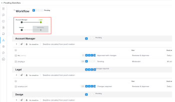

# プルーフの自動ワークフローステージの表示

自動ワークフローで設定されたプルーフの進行状況を簡単に追跡できます。プルーフのステージで既に実行された作業を表示、変更、追加、開始およびロックできます。

自動ワークフローのプルーフにステージおよびユーザーを追加する方法について詳しくは、[プルーフの自動ワークフローにステージとユーザーを追加](../../../review-and-approve-work/proofing/managing-proofs-within-workfront/add-stages-users-to-automated-workflow-proof.md)を参照してください。

## アクセス要件

この記事の手順を実行するには、次のアクセス権が必要です。

<table style="table-layout:auto"> 
 <col> 
 <col> 
 <tbody> 
  <tr> 
   <td role="rowheader">Adobe Workfront プラン*</td> 
   <td> 
現在のプラン：Pro 以上
 
または
 
従来のプラン：Select または Premium
 
様々なプランでのプルーフ機能へのアクセスについて詳しくは、<a href="/help/quicksilver/administration-and-setup/manage-workfront/configure-proofing/access-to-proofing-functionality.md" class="MCXref xref">Workfront のプルーフ機能へのアクセス</a>を参照してください。
 </td> 
  </tr> 
  <tr> 
   <td role="rowheader">Adobe Workfront ライセンス*</td> 
   <td> 
現在のプラン：ワークまたはプラン
 
従来のプラン：任意（ユーザーのプルーフ機能が有効になっている必要があります）
 </td> 
  </tr> 
  <tr> 
   <td role="rowheader">プルーフ権限プロファイル </td> 
   <td>マネージャー以上</td> 
  </tr> 
  <tr> 
   <td role="rowheader">アクセスレベル設定*</td> 
   <td> 
ドキュメントへのアクセスを編集
 
追加のアクセス権のリクエストについて詳しくは、<a href="../../../workfront-basics/grant-and-request-access-to-objects/request-access.md" class="MCXref xref">オブジェクトへのアクセス権のリクエスト</a>を参照してください。
 </td> 
  </tr> 
 </tbody> 
</table>

&#42;ご利用のプラン、役割またはプルーフ権限プロファイルを確認するには、Workfront または Workfront Proof 管理者にお問い合わせください。

## 自動ワークフローダイアグラムを表示

1. ドキュメントを含むドキュメントリストで、ドキュメントを含む行にポインタを合わせ、「**プルーフワークフロー**」をクリックします。

   自動ワークフローのダイアグラムが、ワークフローのタイトルの直下に表示されます。

   ダイアグラムのステージを示すマークは次のとおりです。

    アクティブなステージ

    非アクティブなステージ\
    プライベートステージ

    ロックされたステージ

   ステージ間の線は、ステージ間の依存関係を表します。非アクティブなステージにつながる線は、ステージがアクティブになるまで点線で示されます。

   ダイアグラム内のステージにポインタを合わせて、その進行状況を表示できます。ステージがアクティブでなく、ステージの編集権限を持っている場合は、ステージをアクティブ化ボタン  を使用してステージを開始することができます。ステージがアクティブで、ステージの編集権限を持っている場合は、そのステージをロックできます。進捗バー（S、O、C、D）について詳しくは、[Workfront Proof でのプルーフの進行状況とステータスの表示](../../../workfront-proof/wp-work-proofsfiles/manage-your-work/view-progress-and-status-of-proof.md)を参照してください。

## ステージを表示

1. ドキュメントを含むドキュメントリストで、ドキュメントを含む行にポインタを合わせ、「**プルーフワークフロー**」をクリックします。
1. ダイアグラムで、表示するステージをクリックします。

   

1. ステージの詳細を展開するには、名前の下の横向き矢印をクリックします。

   

## すべてのステージを表示

自動ワークフローのすべてのステージを表示するには、次の操作を行います。

1. ページ上部のビューを変更ボタン 、「**すべてのステージを表示**」の順にクリックします。

   自動ワークフローのすべてのステージがセクションに表示されますが、詳細は非表示になっています。

1. ステージの詳細を展開するには、名前の下の横向き矢印をクリックします。

## すべてのステージの詳細を表示

自動ワークフローのすべてのステージの詳細を展開して表示するには：

1. ページ上部のビューを変更ボタン  をクリックし、「**すべてのステージの詳細を表示**」をクリックします。
1. ステージの詳細を表示するには、名前の下の下向き矢印をクリックします。
