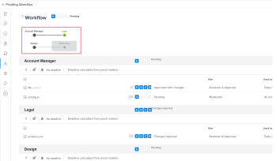
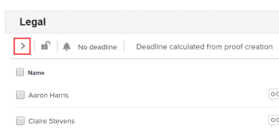

# プルーフの自動ワークフローステージの表示

自動ワークフローで設定されたプルーフの進行状況を簡単に追跡できます。 プルーフのステージで既に実行された作業を表示、変更、追加、開始およびロックできます。

自動ワークフローのプルーフにステージおよびユーザーを追加する方法について詳しくは、[プルーフの自動ワークフローにステージとユーザーを追加](../../../review-and-approve-work/proofing/managing-proofs-within-workfront/add-stages-users-to-automated-workflow-proof.md)を参照してください。

## アクセス要件

+++ 展開すると、この記事の機能のアクセス要件が表示されます。

<table style="table-layout:auto"> 
 <col> 
 <col> 
 <tbody> 
  <tr> 
   <td role="rowheader">Adobe Workfront パッケージ</td> 
   <td>
   
任意

   </td> 
  </tr> 
  <tr> 
   <td role="rowheader">Adobe Workfront プラン</td> 
   <td>
   
標準

   
作業または計画

   </td> 
  </tr> 
  <tr> 
   <td role="rowheader">プルーフ権限プロファイル </td> 
   <td>マネージャー以上</td> 
  </tr> 
  <tr> 
   <td role="rowheader">アクセスレベル設定</td> 
   <td> 
ドキュメントへのアクセスを編集
</td> 
  </tr> 
 </tbody> 
</table>

&#42;ご利用のプラン、役割またはプルーフ権限プロファイルを確認するには、Workfront または Workfront Proof 管理者にお問い合わせください。

+++

## 自動ワークフローダイアグラムを表示

1. ドキュメントを含むドキュメントリストで、ドキュメントを含む行にポインタを合わせ、「**プルーフワークフロー**」をクリックします。

   自動ワークフローのダイアグラムが、ワークフローのタイトルの直下に表示されます。

   ダイアグラムのステージを示すマークは次のとおりです。

    アクティブなステージ

    非アクティブなステージ\
    プライベートステージ

    ロックされたステージ

   ステージ間の線は、ステージ間の依存関係を表します。 非アクティブなステージにつながる線は、ステージがアクティブになるまで点線で示されます。

   ダイアグラム内のステージにポインタを合わせて、その進行状況を表示できます。 ステージがアクティブではなく、ステージで編集権限がある場合は、「ステージをアクティブ化」ボタン をクリックしてステージを開始できます。 ステージがアクティブで、ステージの編集権限を持っている場合は、そのステージをロックできます。 進行状況バー（S、O、C、D）について詳しくは、[Workfront Proofでのプルーフの進行状況とステータスの表示](../../../workfront-proof/wp-work-proofsfiles/manage-your-work/view-progress-and-status-of-proof.md)を参照してください。

## ステージを表示

1. ドキュメントを含むドキュメントリストで、ドキュメントを含む行にポインタを合わせ、「**プルーフワークフロー**」をクリックします。
1. ダイアグラムで、表示するステージをクリックします。

   

1. ステージの詳細を展開するには、名前の下の横向き矢印をクリックします。

   

## すべてのステージを表示

自動ワークフローのすべてのステージを表示するには、次の操作を行います。

1. ページ の上部にある「ビューを変更」ボタンをクリックし、**すべてのステージを表示**&#x200B;をクリックします。

   自動ワークフローのすべてのステージがセクションに表示されますが、詳細は非表示になっています。

1. ステージの詳細を展開するには、名前の下の横向き矢印をクリックします。

## すべてのステージの詳細を表示

自動ワークフローのすべてのステージの詳細を展開して表示するには：

1. ページ の上部にある「ビューを変更」ボタンをクリックし、**すべてのステージを詳細に表示**&#x200B;をクリックします。
1. ステージの詳細を表示するには、名前の下の下向き矢印をクリックします。
