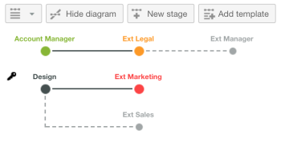

# 自動ワークフローの概要

自動ワークフローを使用すると、一連の順次レビューステージまたは並行レビューステージを作成し、これらのステージ間の依存関係を確立し、特定のユーザーに対する表示を制限できます。 レビュープロセスに相互に依存するステージがある場合、自動ワークフローはステージを自動的に進め、途中で関連するレビュー担当者と承認者に通知します。 自動ワークフローの設定について詳しくは、 [自動ワークフローを使用した高度な配達確認の作成](../../../review-and-approve-work/proofing/creating-proofs-within-workfront/create-automated-proof-workflow.md).

**例：**  自動ワークフローは、次のような複雑な配達確認のレビュープロセスを管理するのに役立ちます。

* 異なるグループまたはレビュー担当者が、特定の順序でコンテンツをレビューする必要がある場合
* コンテンツをレビューする際のユーザーのアクティビティ間に依存関係がある場合
* 同じ人々のグループがコンテンツを定期的にレビューする場合
* レビュー担当者がコンテンツを閲覧する期間を制御する場合
* 一部のレビューアクティビティを非公開にする場合

## ステージ

自動ワークフローの各ステージで、ステージの期限、ステージのロック、ステージの意思決定者としてのレビュー担当者、ステージ上のレビュー担当者のコメントを特定の人だけが表示できるプライバシー設定などの設定を指定できます。

ステージは、配達確認の作成時、期限に達した際、特定の日時、または親ステージでの決定時に、手動でアクティブ化することができます。

ステージは、手動でロックできます。また、次のステージが開始するタイミングや、すべての決定がステージでおこなわれるタイミングもロックできます。 ステージをロックしないように選択することもできます。

ステージの主な意思決定者を指定できます。 この人の決定は、ステージに対する他のすべての決定を不要にします。

同様に、1 つのステージに対する決定でのみ必要とするように選択できます。 これをおこなうと、受信者のいずれかがステージで決定した後で、ステージのレビュープロセスが完了とマークされます。

レビュープロセスの開始時にコンテンツをレビューする招待状をすべてのレビュー担当者に通知したり、ステージがアクティブになったときにのみ各レビュー担当者に通知したりできます。

## プライベートステージ

デフォルトでは、すべてのステージでレビュー担当者が残したコメントは、コンテンツをレビューし、レビュープロセスに関する電子メール通知とコメントの概要を受け取るすべてのユーザーに表示されます。

特定のレビュー担当者グループが他のレビュー担当者のコメントを表示できないようにする場合は、プライベートステージを作成できます。

プライベートステージは、これらのステージに追加されたレビュー担当者のみが表示されます。 また、配達確認の編集権限を持つユーザーや、組織のAdobe Workfrontアカウントで作成されたすべての項目に対する編集権限を持つユーザー（スーパーバイザー以上、または他のユーザーの情報の編集が有効なカスタムプロファイルを持つユーザー）にも表示されます。

プライベートステージ参加者が追加したコメントは、電子メール通知や、表示権限を持たないユーザーが要求した配達確認コメントの概要には含まれません。

## ワークフロー図

ワークフローダイアグラムは、配達確認のレビュープロセスを視覚的に表したものです。 配達確認の詳細を作成または表示する際に、ステージの順序とステージ間の依存関係が表示されます。 非公開のステージは、キー記号付きで表示されます。

ライブ配達確認では、ステージの依存関係は、非アクティブなステージに対しては破線のグレー線、アクティブなステージに対しては実線の黒線で表示されます。 承認プロセスが指定された期限内に完了した場合、ステージは緑色で表示されます。 締め切りに近づく段階はオレンジ色で表示され、締め切りを過ぎた段階は赤で表示されます。

## 自動ワークフローテンプレート

組織が複数の配達確認に対して同じレビュープロセスを使用している場合、Workfront管理者は、自動ワークフローテンプレートを作成して、配達確認の作成をはるかに簡単にすることができます。 配達確認を設定する際に、自動ワークフローテンプレートを選択して、そのテンプレートのステージとレビュー担当者を配達確認に追加できます。 配達確認の作成前と作成後に、必要に応じて、配達確認に適用するテンプレートを変更できます。

Workfrontの管理者は、会社のニーズに応じて、無制限の数のテンプレートを作成できます。

テンプレートの作成、使用、管理について詳しくは、Workfront管理者にお問い合わせください。
