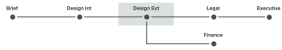
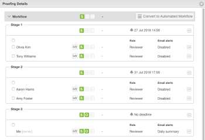

# 自動ワークフローステージの概要

プルーフステージは、様々なユーザーがプルーフをレビューする期間のセグメントです。 プルーフが次のステージに移ると、Adobe Workfront はレビアューに対し、作業するタイミングを伝えるよう通知します。

ステージは、次の 2 つの異なる状況で発生します。

* [自動ワークフローでのプルーフの作成](#create-a-proof-with-an-automated-workflow)
* [プルーフでの異なるレビュアーへの期限の割り当て](#assign-deadlines-for-different-reviewers-on-a-proof)

## 自動ワークフローでのプルーフの作成 {#create-a-proof-with-an-automated-workflow}

プルーフに自動ワークフローを追加する場合は、発生するレビュー作業のステージを設定します。

自動ワークフローを使用してプルーフのステージを設定すると、以下が可能になります。

* ステージを連続的にまたは同時に実行するように設定できます。
* 一部のステージは、前のステージが完了した後にのみアクティブになるように設定できます。
* 一部のステージを非公開にすることができます。 これは例えば、クライアントと共有する前にプルーフをレビューし、結果のコメントをクライアントに見せたくない代理店にとって便利です。

自動ワークフローを使用してプルーフのステージを作成する手順について詳しくは、[自動ワークフローを使用した高度なプルーフの作成](../../../review-and-approve-work/proofing/creating-proofs-within-workfront/create-automated-proof-workflow.md)を参照してください。

>[!NOTE]
>
>どのステージにも含まれておらず、ドキュメントへのアクセス権を持つユーザーがプルーフを開くと、システムは *Workfront* という名前のステージを作成します。
>
>プルーフを開いたユーザーには、設定／レビューと承認／ドキュメントプルーフを開く非受信者の役割で指定された役割が割り当てられます。

## プルーフでの異なるレビュアーへの期限の割り当て {#assign-deadlines-for-different-reviewers-on-a-proof}

プルーフのレビュアーに異なるプルーフ期限を割り当てると、システムによってそれぞれの期限のステージが作成され、対応するステージの期限ごとにレビュアーがグループ化されます。 

**例：**&#x200B;例えば、4 人のレビュアーを含むプルーフを作成する場合は、以下のようになります。

* レビュー担当者のOliviaとTonyの場合、今から数日後の14:00の期限を指定します。
* AaronとAmyの場合、数日後の17:00の期限を指定します。
* 自分自身には期限を指定しません。

システムは、以下の 3 つのレビュアーの「グループ」ごとにステージを作成します。

別のレビュアーとプルーフを共有し、期限を指定しない場合、Workfront は期限がないステージ 3 にユーザーを追加します。 
