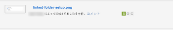
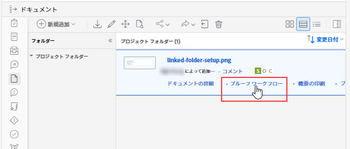

# プルーフの進行状況とステータスの概要

ドキュメントエリアから、レビュープロセスでのプルーフの進行状況に関する情報を表示したり、プルーフの決定ステータスの全体的な概要を確認したりできます。

## プルーフの進行状況の概要

プルーフの進行状況は、プルーフを受信者に送信してから受信者がプルーフに関して決定を下すまでの、完了したプルーフ作業を示します。プルーフ名の横に、進行状況アイコン（S、O、C および D）が表示され、プルーフの進行状況に関する情報が示されます。

<table style="table-layout:auto"> 
 <col> 
 <col> 
 <thead> 
  <tr> 
   <td> 
<strong>進行状況アイコン</strong> 
 </td> 
   <td> 
<strong>説明</strong> 
 </td> 
  </tr> 
 </thead> 
 <tbody> 
  <tr> 
   <td> 
  
 
<strong>送信済み</strong> 
 </td> 
   <td> 
割り当てられた受信者にプルーフが送信されました。
 </td> 
  </tr> 
  <tr> 
   <td> 
<strong></strong> 
 
<strong>開封済み</strong> 
 </td> 
   <td> 
割り当てられたすべての受信者が、プルーフつまりプルーフの詳細ページを開きます。
 </td> 
  </tr> 
  <tr> 
   <td> 
<strong></strong> 
 
<strong>コメントあり</strong> 
 </td> 
   <td> 
割り当てられたすべての受信者が、プルーフに対して 1 つ以上のコメントを作成します。
 
プルーフにレビュアーが割り当てられていない場合は、進捗バーに「<strong>C</strong>」アイコンが表示されません。
 </td> 
  </tr> 
  <tr> 
   <td> 
  
 
<strong>決定あり</strong> 
 </td> 
   <td> 
割り当てられたすべての承認者がプルーフに関して決定を行います。ただし、プルーフ作成者が 1 つの決定のみが必要であると指定している場合を除きます。
 
プルーフの承認者（意思決定者）が指定されていない場合、進捗バーに「<strong>D</strong>」アイコンが表示されません。
 </td> 
  </tr> 
 </tbody> 
</table>

進行状況アイコンが次の色で表示されて、プルーフの進行状況に関する特定の情報を示すことがあります。

* **緑**：完了。
* **白**：未完了。
* **オレンジ**：未完了で、期限は 24 時間以内です。
* **赤**：未完了で、期限を過ぎています。

<!--
<h3 data-mc-conditions="QuicksilverOrClassic.Draft mode">Levels of proof progress</h3>
-->

<!--

Workfront Proof uses the progress icons to track a proof's progress at each of the following levels:

-->

<!--
  <li data-mc-conditions="QuicksilverOrClassic.Draft mode">For each reviewer, based on that person's activity on the proof.&nbsp;</li>
  -->

<!--
  <li data-mc-conditions="QuicksilverOrClassic.Draft mode">For each stage, based on the progress the reviewer on the stage who is most behind in the proofing process.&nbsp;To learn more about stages, see <a href="../../../review-and-approve-work/proofing/proofing-overview/stages.md" class="MCXref xref">Automated Workflow Stages overview</a>.</li>
  -->

<!--
  <li data-mc-conditions="QuicksilverOrClassic.Draft mode">For the proof, based on the progress of the stage (group of reviewers) who is the most behind in the proofing process.</li>
  -->

<!--

For an example of how Workfront Proof determines progress using the reviewer or stage that is most behind,&nbsp;suppose three reviewers on a proof need to make a&nbsp;decision. If two of them have made their&nbsp;decision&nbsp;but the third has not, the progress bar for the proof does not show&nbsp;the D in green because of the outstanding&nbsp;decision.

-->

<!--

If the Primary Decision Maker setting is selected on a proof and the primary decision maker submits a decision, the D in the proof progress bar turns&nbsp;green for all reviewers because no other decisions are required.

-->

<!--

Similarly, if the Only One Decision Required setting is selected on a proof and any reviewer submits a decision, the D in the proof progress bar turns&nbsp;green for all reviewers because no other decisions are required.

-->

## プルーフのステータスの概要

プルーフのステータスには、プルーフに必要な決定のステータスが表示されます。プルーフのステータスは、「最悪のケース」の参加者によって決まります。例えば、プルーフに関して 3 つの決定があるとします。2 つのステータスは&#x200B;**承認**&#x200B;で、1 つのステータスは&#x200B;**却下**&#x200B;です。**却下**&#x200B;という「最悪のケース」の決定は他の決定を無効にし、プルーフの全体的なステータスは&#x200B;**却下**&#x200B;として表示されます。

標準のステータスオプションは次のとおりです。

* 保留中
* 承認済み
* 変更後承認
* 変更が必要です
* 無関係

アカウントでカスタムの決定が設定されている場合、ステータスオプションはカスタムの決定設定を反映します。

<!--
<h2 data-mc-conditions="QuicksilverOrClassic.Draft mode">Viewing proof progress and status</h2>
-->

<!--

 You can view the progress and status of proofs for individual documents. 

-->

<!--
  <li data-mc-conditions="QuicksilverOrClassic.Draft mode"><a href="#view-proof-progress-and-status-for-a-document" class="MCXref xref">View proof progress and status&nbsp;for a document</a> </li>
  -->

<!--
  <li data-mc-conditions="QuicksilverOrClassic.Draft mode"><a href="#view-proof-approval-information-in-home" class="MCXref xref">View proof approval information&nbsp;in Home</a> </li>
  -->

<!--
<h3 data-mc-conditions="QuicksilverOrClassic.Draft mode" id="view-proof-progress-and-status-for-a-document">View proof progress and status&nbsp;for a document</h3>
-->

<!--
   <li value="1" data-mc-conditions="QuicksilverOrClassic.Draft mode">If a proof has not already been generated for the document in Adobe Workfront, generate it, as described in the articles.</li>
   -->

<!--
   <li value="2" data-mc-conditions="QuicksilverOrClassic.Draft mode">In the Documents area, under the proof's name, click <strong>Proof Details</strong>.</li>
   -->

<!--
   <li value="3" data-mc-conditions="QuicksilverOrClassic.Draft mode">In the <strong>Proofing Details</strong> box that appears, the proof's progress for each stage, then click <strong>Done</strong>.</li>
   -->

<!--
   
Under the proof's name, click <strong>Proofing Workflow</strong>.

   -->

<!--
   
 
   
   -->
<!--
   <MadCap:conditionalText data-mc-conditions="QuicksilverOrClassic.Draft mode">
   These screenshots will need to change with new terminology ("Review Workflow" for this one?)
   </MadCap:conditionalText>
     

   -->

<!--
   
In the Workflow information that appears, scroll down to see the proof's progress for each stage:

   -->

<!--
   
  

   -->

<!--
<h3 data-mc-conditions="QuicksilverOrClassic.Draft mode" id="view-proof-approval-information-in-home">View proof approval information&nbsp;in Home</h3>
-->

<!--

You can view information about proofs that you have submitted for approval. Proof approval information is displayed in the Home area only while the proof is pending approval.&nbsp;For information about how to view information about proof approvals in the Home area, see&nbsp;<a href="../../../review-and-approve-work/manage-approvals/view-approvals.md" class="MCXref xref">View approvals </a>.

-->
