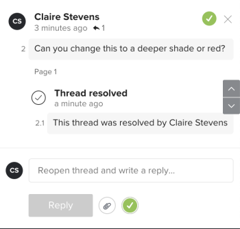

# プルーフのコメントの解決

コメントに対処したら、コメントに解決済みのマークを付けることができます。 自分または他のレビュアーが解決したコメントを、再度開くことができます。

## アクセス要件

+++ 展開すると、この記事の機能のアクセス要件が表示されます。

<table style="table-layout:auto"> 
 <col> 
 <col> 
 <tbody> 
  <tr> 
   <td role="rowheader">Adobe Workfront パッケージ</td> 
   <td> 
任意
 </td> 
  </tr> 
  <tr> 
   <td role="rowheader">Adobe Workfront プラン</td> 
   <td> 
任意
</td> 
  </tr> 
  <tr> 
   <td role="rowheader">プルーフ権限プロファイル</td> 
   <td>マネージャー以上</td> 
  </tr> 
  <tr> 
   <td role="rowheader">プルーフの役割</td> 
   <td>作成者またはモデレーター</td> 
  </tr> 
  <tr> 
   <td role="rowheader">アクセスレベル設定</td> 
   <td> 
ドキュメントへのアクセスを編集
 </td> 
  </tr> 
 </tbody> 
</table>

詳しくは、[Workfront ドキュメントのアクセス要件](/help/quicksilver/administration-and-setup/add-users/access-levels-and-object-permissions/access-level-requirements-in-documentation.md)を参照してください。

+++

## コメントの解決

1. ドキュメントを含むプロジェクト、タスクまたはイシューに移動し、「**ドキュメント**」を選択します。
1. 必要なプルーフを見つけて、「**プルーフを開く**」をクリックします。

1. （条件付き）コメントエリアが開いていない場合は、右上隅にある「**コメントを表示**」をクリックします。
1. コメントを選択します。
1. コメントの右下隅にあるチェックマークアイコンをクリックします。 コメントの左上隅に緑のチェックマークが表示され、「スレッドが解決済みにされました」というラベルとメッセージがその下に表示されます。 コメントを送信したユーザーに、コメントが解決されたことを知らせるメール通知が届きます。

   

## 解決されたコメントを再度開く

1. 当該ドキュメントを含んだプロジェクト、タスクまたはイシューに移動し、「**ドキュメント**」を選択します。
1. 必要なプルーフを見つけて、「**プルーフを開く**」をクリックします。

1. （条件付き）コメントエリアが開いていない場合は、右上隅にある「**コメントを表示**」をクリックします。
1. コメントを選択します。
1. コメントの右下隅（「**返信**」ボタンの右側）にある緑色のチェックマークアイコンをクリックします。 コメントの左上隅のチェックマークが消え、「スレッドが再度開かれました」のラベルとメッセージがその下に表示されます。 コメントを送信したユーザーに、コメントが再度開かれたことを知らせるメール通知が届きます。

   
