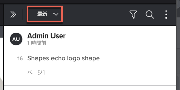

# プルーフのコメントの検索、フィルタリングおよび並べ替え

プルーフのコメントを検索、フィルタリングおよび並べ替えによって、コンテンツに関するフィードバックを容易にナビゲートできます。

## アクセス要件

この記事の手順を実行するには、次のアクセス権が必要です。

<table style="table-layout:auto"> 
 <col> 
 <col> 
 <tbody> 
  <tr> 
   <td role="rowheader">Adobe Workfront プラン*</td> 
   <td> 
現在のプラン：Pro 以上
 
または
 
従来のプラン：Select または Premium
 
様々なプランでのプルーフ機能へのアクセスについて詳しくは、<a href="/help/quicksilver/administration-and-setup/manage-workfront/configure-proofing/access-to-proofing-functionality.md" class="MCXref xref">Workfront のプルーフ機能へのアクセス</a>を参照してください。
 </td> 
  </tr> 
  <tr> 
   <td role="rowheader">Adobe Workfront ライセンス*</td> 
   <td> 
現在のプラン：ワークまたはプラン
 
従来のプラン：任意（ユーザーのプルーフ機能が有効になっている必要があります）
 </td> 
  </tr> 
  <tr> 
   <td role="rowheader">プルーフ権限プロファイル </td> 
   <td>マネージャー以上</td> 
  </tr> 
  <tr> 
   <td role="rowheader">アクセスレベル設定*</td> 
   <td> 
ドキュメントへのアクセスを編集
 
追加のアクセス権のリクエストについて詳しくは、<a href="../../../../workfront-basics/grant-and-request-access-to-objects/request-access.md" class="MCXref xref">オブジェクトへのアクセス権のリクエスト</a>を参照してください。
 </td> 
  </tr> 
 </tbody> 
</table>

&#42;保有しているプラン、役割、またはプルーフ権限プロファイルを確認するには、Workfront または Workfront プルーフの管理者に問い合わせてください。

## コメントリストの検索

コメントリストで、コメントに含まれるテキスト、コメント番号またはコメントを作成したユーザーを検索できます。

1. ドキュメントを含むプロジェクト、タスクまたはイシューに移動し、「**ドキュメント**」を選択します。
1. 必要なプルーフを見つけて、「**プルーフを開く**」をクリックします。

1. （条件付き）コメントエリアが開いていない場合は、右上隅にある「**コメントを表示**」をクリックします。
1. **検索**&#x200B;アイコンをクリックして検索ボックスを表示します。

1. 次のいずれかを入力します。

   * 検索するテキスト。コメントリストは、入力した最初の文字から、入力に応じてフィルタリングされます。
   * 表示するコメントの数。
   * コメントを作成したユーザー。

1. （オプション）コメントをクリックして、プルーフの関連エリアにコメントを結ぶ線を表示します。
1. 検索が終了し、すべてのコメントを表示する場合は、検索ボックスの最後にある「X」をクリックします。

## コメントリストのフィルタリング

ユーザー、アクション、未読ステータスなどのフィルターパラメーターを定義することで、表示するコメントをフィルタリングできます。

1. コメントをフィルタリングするプルーフを開きます。
1. （条件付き）コメントエリアが開いていない場合は、右上隅にある「**コメントを表示**」をクリックします。
1. コメントエリアで、**フィルター**&#x200B;アイコンをクリックします。

   

1. 以下に表示される&#x200B;**フィルター**&#x200B;アイコンを使用して、次のいずれかの条件でコメントをフィルタリングします。

   <table style="table-layout:auto"> 
    <col> 
    <col> 
    <tbody> 
     <tr> 
      <td role="rowheader"><strong>作成者</strong> </td> 
      <td>指定したユーザーによるコメントとコメントの返信のみを表示します。 </td> 
     </tr> 
     <tr> 
      <td role="rowheader"><strong>アクション</strong> </td> 
      <td>選択したアクションに一致するコメントのみを表示します。アクションはありません。アクションはシステムで有効にする必要があります。詳細情報は、以下を参照してください。<!--
        &nbsp;
       --></td> 
     </tr> 
     <tr> 
      <td role="rowheader"><strong>一般的なフィルターオプション</strong> </td> 
      <td> 
       <ul> 
        <li><strong>未解決</strong>：まだ回答されていないコメントのみを表示します。</li> 
        <li><strong>未読</strong>：まだ読んでいないコメントのみを表示します。</li> 
        <li><strong>添付ファイルあり</strong>：添付ファイルを含むコメント、または添付ファイルを含む返信のコメントのみを表示します。</li> 
        <li><strong>現在のページのみ</strong>：現在表示中のページからのコメントのみを表示します。コメントリストは、表示ページを変更すると更新されます。静的プルーフとインタラクティブプルーフのみに使用できます。</li> 
       </ul> </td> 
     </tr> 
    </tbody> 
   </table>

1. 「**適用**」をクリックするか&#x200B;**フィルター**&#x200B;アイコンをクリックして、フィルター条件が適用されたコメントリストを表示します。フィルターアイコンの表示に、フィルターが適用されていることを示す青い点が付きます。

1. フィルター処理が完了し、すべてのコメントを表示する場合は、**フィルター**&#x200B;アイコンをクリックし、**リセット**&#x200B;アイコンをクリックしたあと、**フィルター**&#x200B;アイコンを再度クリックします。

## コメントリストを並べ替え

コメントリストを並べ替えると、選択した並べ替えオプションは、使用しているプルーフビューアでプルーフを次回開いたときに記憶されています。

1. コメントを並べ替えるプルーフを開きます。
1. コメントエリアが開いていない場合は、右上隅の「**コメントを表示**」をクリックします。

1. 並べ替えメニューをクリックして開きます。
1. 

1. 次のいずれかの並べ替えオプションを選択します。

   <table style="table-layout:auto"> 
    <col> 
    <col> 
    <col> 
    <tbody> 
     <tr> 
      <td role="rowheader">最新</td> 
      <td>最新のコメントがコメントリストの先頭に表示されます。</td> 
      <td>すべてのプルーフに使用可能</td> 
     </tr> 
     <tr> 
      <td role="rowheader">最も古い</td> 
      <td>最も古いコメントがコメントリストの先頭に表示されます。これがデフォルトです。 </td> 
      <td>すべてのプルーフに使用可能</td> 
     </tr> 
     <tr> 
      <td role="rowheader">クリエイター A-Z</td> 
      <td>コメントを作成したユーザー別にグループ化されたコメントが、アルファベット順に表示されます。</td> 
      <td>すべてのプルーフに使用可能</td> 
     </tr> 
     <tr> 
      <td role="rowheader">クリエイター Z-A</td> 
      <td>コメントを作成したユーザー別にグループ化されたコメントが、アルファベットの逆順に表示されます。</td> 
      <td>すべてのプルーフに使用可能</td> 
     </tr> 
     <tr> 
      <td role="rowheader">ページ（降順、昇順）</td> 
      <td>ページ番号やビデオのタイムラインに関連して表示される順にコメントが表示されます。 </td> 
      <td>静的プルーフにのみ使用可能</td> 
     </tr> 
     <tr> 
      <td role="rowheader">タイムスタンプ（降順）</td> 
      <td>ビデオのタイムラインに関連して表示される順にコメントが表示されます。タイムラインの後の方で付けられたコメントが先に表示されます。 </td> 
      <td>ビデオプルーフにのみ使用可能。
</td> 
     </tr> 
     <tr> 
      <td role="rowheader">タイムスタンプ（昇順）</td> 
      <td>ビデオのタイムラインに関連して表示される順にコメントが表示されます。タイムラインの早期に付けられたコメントが先に表示されます。 </td> 
      <td>ビデオプルーフにのみ使用可能。
</td> 
     </tr> 
     <tr> 
      <td role="rowheader">デバイス（昇順）</td> 
      <td>コメント作成時に選択したデバイスの順にコメントが表示されます。作成時の解像度が低いコメントが先に表示されます。</td> 
      <td>インタラクティブプルーフにのみ使用可能。</td> 
     </tr> 
     <tr> 
      <td role="rowheader">デバイス（降順）</td> 
      <td> 
（インタラクティブプルーフにのみ使用可能。）コメントの作成時に選択した解像度の順にコメントが表示されます。作成時の解像度が高いコメントが先に表示されます。
 
インタラクティブプルーフの解像度の変更については、<a href="../../../../review-and-approve-work/proofing/reviewing-proofs-within-workfront/review-a-proof/view-interactive-content-as-it-appears-in-device.md" class="MCXref xref">プルーフビューアでのインタラクティブプルーフの解像度の変更</a>を参照してください。
 </td> 
      <td>インタラクティブプルーフにのみ使用可能。</td> 
     </tr> 
    </tbody> 
   </table>
