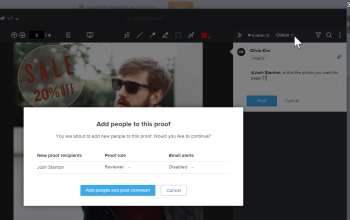

# プルーフを共有するようユーザーにタグを付ける

プルーフビューアーでプルーフにコメントを付ける際に、他のユーザーにタグを付けて、コメントにメールで注意を引き、プルーフのワークフローに追加することができます。

プルーフに対するコメントでユーザーにタグ付けする場合、タグ付けできるユーザーは、個々のユーザー権限や組織のメンバーシップなど、様々な要因によって異なる場合があります。

* プルーフの作成者、所有者または特定の権限が有効になっている場合は、プルーフワークフローの外部でユーザーをタグ付けし、プルーフをユーザーと共有できます。
* 外部ユーザーとしてプルーフに追加され、異なるプルーフアカウントを持つ別の環境のメンバーである場合、元の環境からのユーザーのみにタグ付けできます。<!--For more information, see [Proofing collaboration limitations with people outside of your organization](../../../../review-and-approve-work/proofing/tips-tricks-and-troubleshooting/collaboration-with-members-outside-of-your-organization.md)-->

## アクセス要件 {#access-requirements}

+++ 展開すると、この記事の機能のアクセス要件が表示されます。

<table style="table-layout:auto"> 
 <col> 
 <col> 
 <tbody> 
  <tr> 
   <td role="rowheader">Adobe Workfront パッケージ</td> 
   <td>
任意
 </td> 
  </tr> 
  <tr> 
   <td role="rowheader">Adobe Workfront プラン</td> 
   <td> 
任意

   </td> 
  </tr> 
  <tr data-mc-conditions=""> 
   <td role="rowheader">プルーフの役割</td> 
   <td>作成者、モデレーター</td> 
  </tr> 
  <tr data-mc-conditions=""> 
   <td role="rowheader">プルーフ権限プロファイル</td> 
   <td>スーパーバイザーまたは管理者</td> 
  </tr> 
  <tr data-mc-conditions=""> 
   <td role="rowheader">アクセスレベル設定</td> 
   <td> 
ドキュメントへのアクセスを編集
</td> 
  </tr> 
 </tbody> 
</table>

詳しくは、[Workfront ドキュメントのアクセス要件](/help/quicksilver/administration-and-setup/add-users/access-levels-and-object-permissions/access-level-requirements-in-documentation.md)を参照してください。

+++

## プルーフを共有するようユーザーにタグを付ける

上記の[アクセス要件](#access-requirements)セクションで概説されているプルーフ権限プロファイルまたはプルーフ役割を持つユーザーは、デフォルトで、プルーフを共有するようユーザーにタグを付けることができます。 また、プルーフの所有者または作成者の場合、プルーフ権限プロファイルまたはプルーフ役割に関係なく、ユーザーにプルーフを共有するようタグを付けることもできます。 プルーフの作成時に、プルーフ権限プロファイルまたはプルーフ役割の低いユーザーに対して、プルーフを共有するようにユーザーにタグ付けできます。 詳しくは、[基本ワークフローを使用した詳細なプルーフの作成](../../../../review-and-approve-work/proofing/creating-proofs-within-workfront/configure-basic-proof-workflow.md)記事中の、[ワークフローの設定とレビュアーの追加](../../../../review-and-approve-work/proofing/creating-proofs-within-workfront/configure-basic-proof-workflow.md#configur)の節を参照してください。

>[!NOTE]
>
>次のいずれかに該当する場合にのみ、外部の共同作業者のメールアドレスを使用してタグ付けできます。
>
>* 組織の Workfront アカウントのユーザーが、以前に共同作業者のメールアドレスをプルーフに追加済みである。
>* 共同作業者は、このメールアドレスを使用して、組織の Workfront アカウントで以前にプルーフを登録したことがある。

誰かにタグを付け、コメントでプルーフを共有するには、次の手順を実行します。

1. プルーフにコメントする際は、アットマーク（@）の後にユーザーの名前またはメールアドレスを入力します。 入力を開始すると、使用可能な名前がドロップダウンリストに表示されます。
1. ドロップダウンリストに表示されたら、その人物の名前を選択します。

   >[!TIP]
   >
   >他のユーザーを選択せずにドロップダウンリストを閉じたい場合は、**Esc** キーを押すか、リストの外側の任意の場所をクリックします。

1. コメントにタグを付ける他のユーザーに対して、手順 1～2 を繰り返します。
1. コメントを終了し、「**投稿**」をクリックします。
1. （条件付き）プルーフにまだ追加されていない人にタグを付けた場合は、表示されるボックスに一覧表示される各ユーザーの&#x200B;**プルーフの役割**&#x200B;および&#x200B;**メールアラート**&#x200B;設定を指定し、「**担当者の追加とコメントの投稿**」をクリックします。

   

   プルーフについて詳しくは、次を参照してください。 プルーフメールアラートについて詳しくは、この記事の[Workfront Proof でのメール通知の設定](../../../../workfront-proof/wp-emailsntfctns/email-alerts/config-email-notification-settings-wp.md)の節を参照してください。

   プルーフに自動ワークフローが含まれている場合、タグ付けしたユーザーが現在のステージに追加されます。 詳しくは、[自動ワークフローの概要](../../../../review-and-approve-work/proofing/proofing-overview/automated-workflow.md)を参照してください。

   タグ付けするユーザーは、使用しているプルーフメールのアラート設定に関係なく、プルーフのコメントに関する通知メールを受け取ります。

   * ユーザーが日別の概要または時間別の概要メールを受け取った場合、Workfront は通知を個別に送信し、プルーフのコメントに関する情報を概要メールに含めます。
   * ユーザーがすべてのアクティビティに関するアラートを受け取った場合、またはユーザーのコメントに対する返信に関するアラートを受け取った場合は、それらのコメントおよび返信に関する通知がその通知に置き換えられます。

プルーフにユーザーを追加するその他の方法について詳しくは、[Adobe Workfront 内でプルーフを共有](../../../../review-and-approve-work/proofing/managing-proofs-within-workfront/share-a-proof-in-workfront.md)を参照してください。
