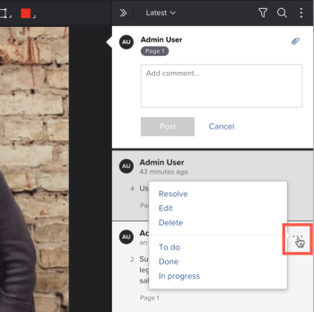

# プルーフのコメントに対するアクションの使用

アクションを使用して、プルーフの各コメントスレッドで何が必要かを追跡できます。アクションとは、Adobe Workfront 管理者がシステムで組織に合わせて設定する、「To do」、「完了」または「進行中」などの単語またはフレーズです。レビュアーは、コメントにアクションを追加して、行われた内容やコメントに対して必要な操作に関する情報を提供できます。

Workfront 管理者によるアクションの有効化と設定の方法について詳しくは、次を参照してください。

## アクセス要件

この記事の手順を実行するには、次のアクセス権が必要です。

<table style="table-layout:auto"> 
 <col> 
 <col> 
 <tbody> 
  <tr> 
   <td role="rowheader">Adobe Workfront プラン*</td> 
   <td> 
現在のプラン：Pro 以上
 
または
 
従来のプラン：Select または Premium
 
様々なプランでのプルーフ機能へのアクセスについて詳しくは、<a href="/help/quicksilver/administration-and-setup/manage-workfront/configure-proofing/access-to-proofing-functionality.md" class="MCXref xref">Workfront のプルーフ機能へのアクセス</a>を参照してください。
 </td> 
  </tr> 
  <tr> 
   <td role="rowheader">Adobe Workfront ライセンス*</td> 
   <td> 
現在のプラン：ワークまたはプラン
 
従来のプラン：任意（ユーザーのプルーフ機能が有効になっている必要があります）
 </td> 
  </tr> 
  <tr> 
   <td role="rowheader">プルーフ権限プロファイル </td> 
   <td>マネージャー以上</td> 
  </tr> 
  <tr> 
   <td role="rowheader">プルーフの役割</td> 
   <td>作成者またはモデレーター</td> 
  </tr> 
  <tr> 
   <td role="rowheader">アクセスレベル設定*</td> 
   <td> 
ドキュメントへのアクセスを編集
 
追加のアクセス権のリクエストについて詳しくは、<a href="../../../../workfront-basics/grant-and-request-access-to-objects/request-access.md" class="MCXref xref">オブジェクトへのアクセス権のリクエスト</a>を参照してください。
 </td> 
  </tr> 
 </tbody> 
</table>

&#42;保有しているプラン、役割、またはプルーフ権限プロファイルを確認するには、Workfront または Workfront プルーフの管理者に問い合わせてください。

## コメントに対するアクションの使用

プルーフビューアーで既存のコメントにアクションを適用するには、次の手順を実行します。

1. ドキュメントを含むプロジェクト、タスクまたはイシューに移動し、「**ドキュメント**」を選択します。
1. 必要なプルーフを見つけて、「**プルーフを開く**」をクリックします。

1. 次のいずれかの操作を行います。

   * コメントの右下隅にあるフラグアイコンをクリックし、ドロップダウンメニューで目的のアクションをクリックします。

     

   * **その他**&#x200B;アイコン（コメント上の 3 つの水平ドット）をクリックし、表示されるドロップダウンメニューの下部のセクションで目的のアクションをクリックします。

     

1. （オプション）変更する場合は、次のいずれかを実行できます。

   * フラグアイコンまたは&#x200B;**その他**&#x200B;アイコンを再度クリックし、「**アクションを削除**」をクリックします。

   * 別のアクションを適用するには、手順 1 を繰り返します。

>[!TIP]
>
>特定のアクションでコメントをフィルタリングできます。詳しくは、[プルーフのコメント検索、フィルタリングおよび並べ替え](../../../../review-and-approve-work/proofing/reviewing-proofs-within-workfront/comment-on-a-proof/search-filter-sort-comments.md)を参照してください。
