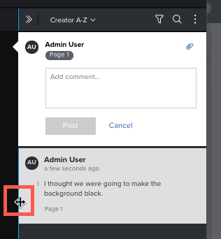
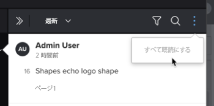

# 配達確認コメントを表示して返信します

他のレビュー担当者が行った配達確認のコメントを表示し、そのコメントに返信できます。

## アクセス要件

この記事の手順を実行するには、次のアクセス権が必要です。

<table style="table-layout:auto"> 
 <col> 
 <col> 
 <tbody> 
  <tr> 
   <td role="rowheader">Adobe Workfront plan*</td> 
   <td> 
現在のプラン：Pro 以上
 
または
 
レガシープラン：選択またはプレミアム
 
様々なプランでのアクセスの検証について詳しくは、 <a href="/help/quicksilver/administration-and-setup/manage-workfront/configure-proofing/access-to-proofing-functionality.md" class="MCXref xref">Workfrontの校正機能へのアクセス</a>.
 </td> 
  </tr> 
  <tr> 
   <td role="rowheader">Adobe Workfront license*</td> 
   <td> 
現在のプラン：作業または計画
 
レガシープラン：任意（ユーザーの校正が有効になっている必要があります）
 </td> 
  </tr> 
  <tr> 
   <td role="rowheader">プルーフ権限プロファイル </td> 
   <td>マネージャ以降</td> 
  </tr> 
  <tr> 
   <td role="rowheader">アクセスレベル設定*</td> 
   <td> 
ドキュメントへのアクセスを編集
 
追加のアクセス権のリクエストについて詳しくは、 <a href="../../../../workfront-basics/grant-and-request-access-to-objects/request-access.md" class="MCXref xref">オブジェクトへのアクセスのリクエスト </a>.
 </td> 
  </tr> 
 </tbody> 
</table>

&#42;保有しているプラン、役割、配達確認権限プロファイルを確認するには、WorkfrontまたはWorkfrontの配達確認管理者に問い合わせてください。

## 校正ビューアでコメントを表示

各コメントには、次の情報が表示されます。

* コメントを行ったユーザーの名前
* コメントが行われたページ番号（複数ページを含む静的配達確認）
* コメントが作成された（ビデオ配達確認での）フッテージのフレーム番号または範囲

   表示中のコメントがビデオフッテージの範囲に適用された場合は、[ 再生 ] ボタンをクリックして範囲を確認できます。

* コメントに含まれるテキスト
* コメントにアップロードされた添付ファイル

校正ビューアでコメントを表示するには：

1. ドキュメントを含むプロジェクト、タスクまたはイシューに移動し、「 」を選択します。 **ドキュメント**.
1. 必要な配達確認を見つけて、「 **配達確認を開く**.

1. （条件付き）コメント領域が開いていない場合、 **コメントを表示** をクリックします。
1. 任意のコメントをクリックすると、配達確認のコメントマークが表示されます。
1.  または
1.  ビデオ配達確認で、コメントが行われたタイムライン内のポイントの上にマウスポインターを置き、表示される番号付きのバルーンをクリックします。
1. 

1. （オプション）コメントリストのサイズを調整するには、（現在開いているコメントではなく）コメント領域の左端にマウスポインターを置き、水平方向のサイズ変更に合わせて端をドラッグします。
1. 

## 「更新」タブで配達確認のコメントを表示

Workfrontでは、校正ビューアを起動しなくても、配達確認用コメントを表示できます。

1. ドキュメントを含むプロジェクト、タスクまたはイシューに移動し、「 」を選択します。 **ドキュメント**.
1. ドキュメントを含む行をクリックし、 **概要** アイコン  をクリックします。\
   コメントは、ドキュメントの概要の「更新」セクションに表示されます。

## すべてのコメントを既読としてマーク

配達確認のレビュー担当者は、すべてのコメントを既読としてすばやくマークできます。

1. ドキュメントを含むプロジェクト、タスクまたはイシューに移動し、「 」を選択します。 **ドキュメント**.
1. 必要な配達確認を見つけて、「 **配達確認を開く**.

1. （条件付き）コメント領域が開いていない場合、 **コメントを表示** をクリックします。

1. コメントリストの上にある **詳細** アイコンをクリックし、 **すべて既読としてマーク**.

1. 

## 校正ビューアからの配達確認コメントに返信します

1. ドキュメントを含むプロジェクト、タスクまたはイシューに移動し、「 」を選択します。 **ドキュメント**.
1. 必要な配達確認を見つけて、「 **配達確認を開く**.

1. （条件付き）コメント領域が開いていない場合、 **コメントを表示** をクリックします。
1. 任意のコメントをクリックすると、配達確認のコメントマークが表示されます。

   >[!TIP]
   >
   >以下を使用： **前のコメント** および **次のコメント** ボタンを使用してコメントの前後に移動できます。

1. 返信を **返信を追加** ボックス
1. （オプション）別のレビュー担当者に返信を通知する場合は、コメントボックスに@と入力し、ユーザーの名前または電子メールアドレスを入力します。 詳しくは、 [配達確認を共有するようユーザーにタグを付けます](../../../../review-and-approve-work/proofing/reviewing-proofs-within-workfront/comment-on-a-proof/tag-users-to-share-proof.md).
1. （オプション）コメントにファイルを追加するには、次のいずれかの操作を行います。

   * ペーパークリップアイコンをクリックし、アップロードするファイルを参照して選択します。
   * コンピューター上の場所からファイルをドラッグし、コメント領域にドロップします。

1. クリック **返信**.
