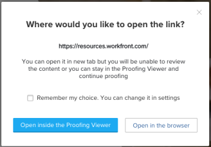

# プルーフビューア設定の指定

Web プルーフビューアーとデスクトッププルーフビューアーの両方で、次の設定を指定できます。

* コメントのマークアップとピンをプルーフに表示するかどうか。
* マークアップツールがプルーフビューアーの上部に表示されるかドロップダウンメニューに表示されるか。
* 開いているプルーフについてレビュアーが受け取るメール通知。

  <!--
  <li data-mc-conditions="QuicksilverOrClassic.Draft mode">Whether the Desktop Proofing Viewer is the default viewer for all types of proofs (static and video, as well as interactive).</li>
  -->

<!--

For comparative information about the Web Proofing Viewer and the Desktop Proofing Viewer, see <a href="../../../review-and-approve-work/proofing/proofing-overview/understand-differences-between-web-viewer.md" class="MCXref xref">Differences between the Web Proofing Viewer and the Desktop Proofing Viewer overview</a>.

-->

デスクトッププルーフビューアーに対しては、次の設定を指定できます。

* Web サイトのコンテンツ内のリンクをビューアーで開く方法。

  <!--
  <li data-mc-conditions="QuicksilverOrClassic.Draft mode">Whether the background color of the Desktop Proofing Viewer is the default near-black color or white.</li>
  -->

* 新しいブラウザータブまたはウィンドウで開くように設定されているリンクをクリックしたときの動作。
* ポップアップ（ブラウザーのキャッシュデータによってブロックされる可能性がある）などのコンテンツをビューアーに表示できるようにするには、表示中のプルーフと共に保存されている可能性のあるキャッシュデータをクリアします。

## アクセス要件

この記事の手順を実行するには、次のアクセス権が必要です。

<table style="table-layout:auto"> 
 <col> 
 <col> 
 <tbody> 
  <tr> 
   <td role="rowheader">Adobe Workfront プラン*</td> 
   <td> 
現在のプラン：Pro 以上
 
または
 
従来のプラン：Select または Premium
 
様々なプランでのプルーフ機能へのアクセスについて詳しくは、<a href="/help/quicksilver/administration-and-setup/manage-workfront/configure-proofing/access-to-proofing-functionality.md" class="MCXref xref">Workfront のプルーフ機能へのアクセス</a>を参照してください。
 </td> 
  </tr> 
  <tr> 
   <td role="rowheader">Adobe Workfront ライセンス*</td> 
   <td> 
現在のプラン：ワークまたはプラン
 
従来のプラン：任意（ユーザーのプルーフ機能が有効になっている必要があります）
 </td> 
  </tr> 
  <tr> 
   <td role="rowheader">プルーフ権限プロファイル </td> 
   <td>マネージャー以上</td> 
  </tr> 
  <tr> 
   <td role="rowheader">アクセスレベル設定*</td> 
   <td> 
ドキュメントへのアクセスを編集
 
追加のアクセス権のリクエストについて詳しくは、<a href="../../../workfront-basics/grant-and-request-access-to-objects/request-access.md" class="MCXref xref">オブジェクトへのアクセス権のリクエスト</a>を参照してください。
 </td> 
  </tr> 
 </tbody> 
</table>

&#42;保有しているプラン、役割、またはプルーフ権限プロファイルを確認するには、Workfront または Workfront プルーフの管理者に問い合わせてください。

## プルーフビューア設定の指定

プルーフビューアーの設定を指定するには：

1. 次のいずれかの方法で、Web プルーフビューアーまたはデスクトップ プルーフビューアーを開きます。

   * Adobe Workfron t内でプルーフを行う場合は、表示するプルーフを含むドキュメントリストに移動し、ドキュメントにカーソルを合わせて、「**プルーフを開く**」をクリックします。
   * Workfront Proof を使用している場合は、ダッシュボードまたは表示リストのプルーフで&#x200B;**プルーフに移動**&#x200B;アイコン  をクリックします。

1. 左側のツールバーが表示されていない場合は、web プルーフビューアーの左上隅にある&#x200B;**メニュー**&#x200B;アイコンをクリックします。

   

1. 左側のツールバーで、**設定**&#x200B;アイコン  をクリックします。

1. 次が表示されるので、いずれかを&#x200B;**設定**&#x200B;します。

   使用できる設定は、開いているプルーフの種類によって異なる場合があります。

   * **マークアップを表示**（常に web プルーフビューアーおよびデスクトッププルーフビューアーで使用可能）：レビュアーがマークアップツールを使用する際にプルーフに追加するコメントマークです。無効にした場合でも、コメントリストでコメントをクリックすると、そのコメントが表示されます。

     この設定は、開いているすべてのプルーフに影響します。

   * **ピンを表示**（常に web プルーフビューアーおよびデスクトッププルーフビューアーで使用可能）：レビュアーがマークアップツールを使用する際にプルーフに追加する番号付きのピンです。レビュアーがコメントを追加した場所と順序を示します。無効にした場合でも、コメントリストでコメントをクリックすると、そのコメントが表示されます。

     この設定は、開いているすべてのプルーフに影響します。

   * **拡張マークアップツールを使用**（常に web プルーフビューアーおよびデスクトッププルーフビューアーで使用可能）：デフォルトでは、マークアップツールのオプションはプルーフビューアーの上部に表示されます。これらを、クリックしたときにのみ開く縦並びのメニューに表示するように設定できます。

     この設定は、自身が開くすべてのプルーフに対して有効です。

   * **次に関するメール通知を受け取る**（常に web プルーフビューアーおよびデスクトッププルーフビューアーで使用可能）：以下のオプションの 1 つをクリックします。この設定は、自身が開いたプルーフにのみ影響します。詳しくは、[プルーフのコメントおよび校正判断の通知の概要](../../../review-and-approve-work/proofing/proofing-overview/notifications-proof-comments-decisions.md)を参照してください。

     <table style="table-layout:auto"> 
      <col> 
      <col> 
      <tbody> 
       <tr> 
        <td role="rowheader">すべてのアクティビティ</td> 
        <td>Workfront は、新しいコメント、返信、決定などのプルーフに関するアクティビティが発生するたびに、レビュアーにメールを送信します。 
これは、アクティビティの発生を確認できるので、プルーフプロセスを管理するユーザーにとって最適なオプションです。 

ユーザーは、自分のアクティビティに関するメール警告を受け取りません。
</td> 
       </tr> 
       <tr> 
        <td role="rowheader">自分のコメントへの返信</td> 
        <td>誰かがコメントに明示的に返信した場合にのみ、メールがレビュアーに送信されます（これには、自分のコメントに対する自分の返信は含まれません）。これは、プルーフ上の誰かが新しいコメントを作成しても、レビュアーには通知されないことを意味します。
この設定は、プルーフ上のクライアントに推奨されます。これにより、プルーフ上の他のコメントは通知されず、自分のコメントに対する返信のみが通知されます。

このメール通知設定を使用しているレビュアーには、他の新しいコメントは通知されませんが、プルーフビューアでプルーフ上のすべてのコメントを表示できます。

コメントについて詳しくは、<a href="../../../review-and-approve-work/proofing/reviewing-proofs-within-workfront/comment-on-a-proof/view-proof-comments.md" class="MCXref xref">プルーフのコメントの表示と返信</a>を参照してください。
</td> 
       </tr> 
       <tr> 
        <td role="rowheader">決定</td> 
        <td>Workfront は、誰かが決定を下した場合にのみレビュアーにメールを送信します。
これは、承認プロセスを管理するユーザー（プロジェクトマネージャーなど）で、プルーフの進行状況を監視し、どのユーザーが決定を下したかをモニターする必要がある場合に役立ちます。

決定を送信するときにメール確認オプションを選択しない限り、自分の決定は通知されません。
</td> 
       </tr> 
       <tr> 
        <td role="rowheader">最終決定</td> 
        <td>Workfront は、プルーフの最後の承認者が決定を下したときにメールを送信します。
このアラートは、通常、実際のレビューの議論に参加する必要のない設計者によって使用されることがよくあります。最終的な決定が下されると、デザイナーに通知が届き、必要な変更に対してアクションを実行できます。

また、このアラートは、レビュープロセスが完了した場合にのみ通知を受け取る必要がある部署のリーダーに対しても役立ちます。
</td> 
       </tr> 
       <tr> 
        <td role="rowheader">毎時の概要</td> 
        <td>Workfront は毎時、レビューアに対して、1 時間ごとに発生したすべてのコメント、返信および決定の概要を記載したメールを送信します。
メールは、過去 1 時間以内に自分以外のアクティビティが発生した場合にのみ送信されます。 

このアラートは、プロジェクトの概要を確認するのに適しています。

この概要のユースケース例として、プロジェクトの概要を必要としながら、プルーフでのすべてのアクティビティについてすぐに通知される必要はない、シニアレビューアが挙げられます。
</td> 
       </tr> 
       <tr> 
        <td role="rowheader">日次の概要</td> 
        <td>Workfront は、自分以外のアクティビティがある日にのみ、すべてのコメント、返信および決定を記載した 1 つのメールを送信します。
このアラートは、1 日を通じて複数の更新で圧倒されることなく、プロジェクトの概要を確認するのに適しています。

この概要のユースケースの例として、プロジェクトの全体的な進行状況の監視を担当する部門のリーダーが挙げられます。

詳しくは、<a href="../../../review-and-approve-work/proofing/reviewing-proofs-within-workfront/manage-notifications-for-proof-comments.md" class="MCXref xref">プルーフのコメントおよび決定に関する通知の管理</a>を参照してください。
</td> 
       </tr> 
       <tr data-mc-conditions=""> 
        <td role="rowheader">メールなし</td> 
        <td>Workfront はメールアラートを送信しません。 これは、参照用としてのみプルーフに追加され、変更の通知を必要としないユーザーの役に立ちます。
システムのデフォルトは、日次の概要（「未設定」とも表示される）です。自分または自分のレビューアが他の変更を加えない場合、すべてのプルーフにこの設定が適用されます。
</td> 
       </tr> 
      </tbody> 
     </table>

     <!--   
     <li data-mc-conditions="QuicksilverOrClassic.Draft mode"> 
<strong>Use desktop app as default</strong>: By default, static and video proofs open in the Web Proofing Viewer in your web browser, and interactive proofs open in the Desktop Proofing Viewer app. This setting lets you configure the Desktop Proofing Viewer as the default viewer for all types of proofs (static and video, as well as interactive). For more information about this setting, see in the article . For comparative information about the two viewers, see <a href="../../../review-and-approve-work/proofing/proofing-overview/understand-differences-between-web-viewer.md" class="MCXref xref">Differences between the Web Proofing Viewer and the Desktop Proofing Viewer overview</a>.
 </li>   
     -->

   * **プルーフのハイパーリンクをクリックする**（デスクトッププルーフビューアーでのみ使用可能）：新しいブラウザーのタブまたはウィンドウで開くように設定されたリンクをクリックしたときに、デスクトッププルーフビューアーで行う処理を指定するオプションを選択します。

     この設定は、開いているすべてのインタラクティブプルーフに対して有効です。

     <table style="table-layout:auto"> 
      <col> 
      <col> 
      <tbody> 
       <tr> 
        <td role="rowheader">プルーフビューアー内で開く</td> 
        <td>リンクは常にデスクトッププルーフビューアー内で開き、リンクされたコンテンツをプルーフできます。 </td> 
       </tr> 
       <tr> 
        <td role="rowheader">ブラウザーで開く</td> 
        <td>リンクは常にブラウザー内で開き、プルーフビューアーでは開きません。リンクされたコンテンツのプルーフを実行できません。</td> 
       </tr> 
       <tr> 
        <td role="rowheader">毎回確認する</td> 
        <td> 
デスクトッププルーフビューアー内でリンクを開くか、ブラウザーでリンクを開くかを尋ねるメッセージが表示されます。デスクトッププルーフビューアーでリンクを開くと、リンクされたコンテンツをプルーフを実行できるようになります。ブラウザーでリンクを開くと、リンクされたコンテンツのプルーフができなくなります。
 
  
 
この設定は、自身が開いたプルーフにのみ影響します。
 </td> 
       </tr> 
      </tbody> 
     </table>

     <!--   
     <li data-mc-conditions="QuicksilverOrClassic.Draft mode"><strong>Background color</strong> (available when you open interactive content in the Desktop Proofing Viewer or Web Proofing Viewer): Change the background color of the Desktop Proofing Viewer from the default near-black color to white. This can make it easier to see interactive content that has a transparent background instead of a white background.</li>   
     -->

   * **キャッシュをクリア**：表示中のインタラクティブプルーフと共に保存される可能性のあるブラウザーキャッシュデータをクリアします。これにより、ポップアップなどのコンテンツ（ブラウザーのキャッシュデータによってブロックできる）をデスクトッププルーフビューアーに表示できます。

     クリアされるデータには、HTTP キャッシュ（次のページの更新後に再利用される画像など）と Web ストレージデータキャッシュ（ユーザーを識別する Cookie やデータなど）が含まれます。

     この設定は、自身が開いたプルーフにのみ影響します。
