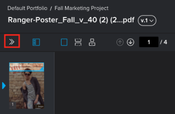

# プルーフのコメントおよび校正判断に関する通知を管理

<!-- Audited: 4/2025 -->

プルーフに関する作業を行う際に、Adobe Workfrontのユーザーであるか外部の共同作業者であるかを問わず、プルーフに関するコメントや決定を受け取るメール通知を指定できます。 詳しくは、[プルーフのコメントおよび校正判断の通知の概要](../../../review-and-approve-work/proofing/proofing-overview/notifications-proof-comments-decisions.md)を参照してください。

>[!NOTE]
>
>これらの通知は、レビュー担当者のプルーフのフローに関して受け取るメールアラートと、Workfrontで設定できるメールアラート設定とは異なります。

## アクセス要件

+++ 展開すると、この記事の機能のアクセス要件が表示されます。

<table style="table-layout:auto"> 
 <col> 
 <col> 
 <tbody> 
  <tr> 
   <td role="rowheader">Adobe Workfront パッケージ</td> 
   <td> 
任意
 </td> 
  </tr> 
  <tr> 
   <td role="rowheader">Adobe Workfront プラン</td> 
   <td> 
任意
 </td> 
  </tr> 
  <tr> 
   <td role="rowheader">プルーフの役割 </td> 
   <td>レビュアー、レビュアー、承認者、作成者、モデレーター</td> 
  </tr> 
  <tr> 
   <td role="rowheader">プルーフ権限プロファイル </td> 
   <td>マネージャー以上</td> 
  </tr> 
  <tr> 
   <td role="rowheader">アクセスレベル設定</td> 
   <td> 
ドキュメントへのアクセスを編集
 </td> 
  </tr> 
 </tbody> 
</table>

詳しくは、[Workfront ドキュメントのアクセス要件](/help/quicksilver/administration-and-setup/add-users/access-levels-and-object-permissions/access-level-requirements-in-documentation.md)を参照してください。

+++

## プルーフのコメントおよび校正判断に関する通知を管理

1. 通知を設定するプルーフを開きます。
1. 左側のツールバーが表示されない場合は、Web プルーフビューアの左上隅にある&#x200B;**メニュー** アイコンをクリックします。

   

1. 左側のツールバーで、**Settings** アイコン をクリックします。

1. 「**電子メール通知を送信**」セクションで、このプルーフの通知設定を選択します。

   <table style="table-layout:auto"> 
    <col> 
    <col> 
    <tbody> 
     <tr> 
      <td role="rowheader">すべてのアクティビティ</td> 
      <td>新しいコメント、返信、決定など、プルーフに関するアクティビティが発生するたびに、レビュー担当者に電子メールが送信されます。 
この設定は、プルーフプロセスを管理するユーザーがアクティビティを実際に確認できるため、推奨されます。 ユーザーは、自身のアクティビティ（コメント、返信、決定など）に関するメールアラートを受け取りません。
</td> 
     </tr> 
     <tr> 
      <td role="rowheader">自分のコメントへの返信</td> 
      <td>レビュー担当者に電子メールが送信されるのは、誰かが自分のコメントに直接返信した場合（自分のコメントに対する返信を除く）だけです。
この設定はクライアントに推奨されます。プルーフに対するコメントの返信のみが通知され、プルーフに対するその他のコメントは通知されませんが、プルーフビューアですべてのコメントを表示できます。

      
詳しくは、<a href="../../../review-and-approve-work/proofing/reviewing-proofs-within-workfront/comment-on-a-proof/view-proof-comments.md" class="MCXref xref"> プルーフコメントの表示と返信</a>を参照してください。
</td> 
     </tr> 
     <tr> 
      <td role="rowheader">決定</td> 
      <td>レビュー担当者が決定を下した場合にのみ、レビュー担当者に電子メールが送信されます。 
このメールアラートは、承認プロセスを管理するユーザーがプルーフの進捗状況を監視し、どのユーザーが決定したかを確認できるため、承認プロセスを管理するユーザーにとって役立ちます。 

決定を送信するときにメール確認オプションを選択しない限り、自分の決定は通知されません。
</td> 
     </tr> 
     <tr> 
      <td role="rowheader">最終決定</td> 
      <td>プルーフで最終決定が行われると、メールが送信されます。 
このアラートは、デザイナーが実際のレビューの議論に参加する必要がないので、デザイナーがよく使用します。 最終的な決定が下されると、デザイナーに通知が届き、必要な変更に対してアクションを実行できます。 
</td> 
     </tr> 
     <tr> 
      <td role="rowheader">毎時の概要</td> 
      <td>1時間ごとに、過去1時間に起こったすべてのコメント、返信、決定の要約がレビュアーに送信されます。 
メールは、過去 1 時間以内に自分以外のアクティビティが発生した場合にのみ送信されます。 他のユーザーからのアクティビティがない場合、メールは送信されません。 

このアラートは、プロジェクトの進行状況を把握するのに最適な方法です。
</td> 
     </tr> 
     <tr> 
      <td role="rowheader">日次の概要</td> 
      <td>（デフォルト設定）：すべてのコメント、返信、決定が一覧表示されたメールが毎日送信されます。 これはあなた自身の以外に活動がある日にのみ送信されます。 
このアラートは、1 日を通じて複数の更新で圧倒されることなく、プロジェクトの概要を確認するのに適しています。 
</td> 
     </tr> 
     <tr> 
      <td role="rowheader">メールなし</td> 
      <td>メールアラートは送信されません。 
この設定は、参照目的でのみプルーフに追加され、変更の通知を受ける必要がないユーザーに役立ちます。

メモ： 
このオプションは、プルーフのコメントや決定に関する電子メールアラートのみをオフにします。新しいプルーフやレイトプルーフの電子メールなど、プルーフのフローに関して受信できる電子メールアラートはオフにしません。 詳しくは、次の記事を参照してください。 

        <ul>
         <li><a href="../../../workfront-proof/wp-emailsntfctns/proof-notifications-and-reminders/new-proof-email.md" class="MCXref xref">新規プルーフメール</a></li>
         <li><a href="../../../workfront-proof/wp-emailsntfctns/proof-notifications-and-reminders/new-version-email.md" class="MCXref xref">新しいバージョンのメール</a></li>
         <li><a href="../../../workfront-proof/wp-emailsntfctns/proof-notifications-and-reminders/late-proof-email.md" class="MCXref xref">遅延プルーフメール</a></li>
         <li><a href="../../../workfront-proof/wp-emailsntfctns/proof-notifications-and-reminders/proof-made-email.md" class="MCXref xref">プルーフによるメール</a></li>
        </ul>
</td> 
     </tr> 
    </tbody> 
   </table>
