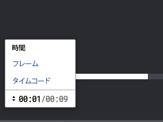

# ビデオ配達確認のタイムラインの測定単位を変更

ビデオタイムラインで使用される測定単位を調整できます。 タイムラインは、時間 (Time)、フレーム (Frame)、またはタイムコード (Timecode) で表示できます。

## アクセス要件

この記事の手順を実行するには、次のアクセス権が必要です。

<table style="table-layout:auto"> 
 <col> 
 <col> 
 <tbody> 
  <tr> 
   <td role="rowheader">Adobe Workfront plan*</td> 
   <td> 
現在のプラン：Pro 以上
 
または
 
レガシープラン：選択またはプレミアム
 
様々なプランでのアクセスの検証について詳しくは、 <a href="/help/quicksilver/administration-and-setup/manage-workfront/configure-proofing/access-to-proofing-functionality.md" class="MCXref xref">Workfrontの校正機能へのアクセス</a>.
 </td> 
  </tr> 
  <tr> 
   <td role="rowheader">Adobe Workfront license*</td> 
   <td> 
現在のプラン：作業または計画
 
レガシープラン：任意（ユーザーの校正が有効になっている必要があります）
 </td> 
  </tr> 
  <tr> 
   <td role="rowheader">プルーフ権限プロファイル </td> 
   <td>マネージャ以降</td> 
  </tr> 
  <tr> 
   <td role="rowheader">アクセスレベル設定*</td> 
   <td> 
ドキュメントへのアクセスを編集
 
追加のアクセス権のリクエストについて詳しくは、 <a href="../../../../workfront-basics/grant-and-request-access-to-objects/request-access.md" class="MCXref xref">オブジェクトへのアクセスのリクエスト </a>.
 </td> 
  </tr> 
 </tbody> 
</table>

&#42;保有しているプラン、役割、配達確認権限プロファイルを確認するには、WorkfrontまたはWorkfrontの配達確認管理者に問い合わせてください。

## タイムラインの測定単位を変更

1. ドキュメントを含むプロジェクト、タスクまたはイシューに移動し、「 」を選択します。 **ドキュメント**.
1. 必要な配達確認を見つけて、「 **配達確認を開く**.

1. 校正ビューアの左下隅で、現在の測定単位をクリックします。

   

1. 次のオプションから選択します。

   <table style="table-layout:auto"> 
    <col> 
    <col> 
    <tbody> 
     <tr> 
      <td role="rowheader">時間</td> 
      <td>ビデオタイムラインを分/秒で表示します。 このオプションはデフォルトで選択されています。</td> 
     </tr> 
     <tr> 
      <td role="rowheader">フレーム</td> 
      <td>ビデオタイムラインをフレーム単位で表示します。 校正ビューアは、元のファイルの情報を使用して、1 秒あたりのフレーム数を決定します。</td> 
     </tr> 
     <tr> 
      <td role="rowheader">タイムコード</td> 
      <td>タイムコードでビデオタイムラインを表示します。 タイムコードの数は、時間、分、秒、フレームを表します。 
Example: </b>"><b>例： </b>1 のタイムコード:48:36:18 は、ビデオが再生されるまでの 1 時間、48 分、36 秒、18 フレームを表します。
</td> 
     </tr> 
    </tbody> 
   </table>
