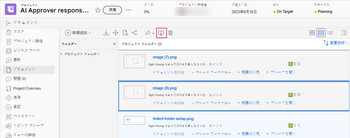

# プルーフの比較

校正ビューアを使用して、異なる 2 つの配達確認や、同じ配達確認の 2 つのバージョンを比較できます。

## アクセス要件

この記事の手順を実行するには、次のアクセス権が必要です。

<table style="table-layout:auto"> 
 <col> 
 <col> 
 <tbody> 
  <tr> 
   <td role="rowheader">Adobe Workfront plan*</td> 
   <td> 
現在のプラン：Pro 以上
 
または
 
レガシープラン：選択またはプレミアム
 
様々なプランでのアクセスの検証について詳しくは、 <a href="/help/quicksilver/administration-and-setup/manage-workfront/configure-proofing/access-to-proofing-functionality.md" class="MCXref xref">Workfrontの校正機能へのアクセス</a>.
 </td> 
  </tr> 
  <tr> 
   <td role="rowheader">Adobe Workfront license*</td> 
   <td> 
現在のプラン：レビュー
 
レガシープラン：レビュー
 </td> 
  </tr> 
  <tr> 
   <td role="rowheader">プルーフ権限プロファイル </td> 
   <td>マネージャ以降</td> 
  </tr> 
  <tr> 
   <td role="rowheader">アクセスレベル設定*</td> 
   <td> 
ドキュメントへのアクセスを編集
 
追加のアクセス権のリクエストについて詳しくは、 <a href="../../../../workfront-basics/grant-and-request-access-to-objects/request-access.md" class="MCXref xref">オブジェクトへのアクセスのリクエスト </a>.
 </td> 
  </tr> 
 </tbody> 
</table>

&#42;保有しているプラン、役割、配達確認権限プロファイルを確認するには、WorkfrontまたはWorkfrontの配達確認管理者に問い合わせてください。

## 2 つの異なる配達確認の比較

プロジェクト、タスク、イシュー、ポートフォリオの「ドキュメント」タブ内、またはメインのドキュメント領域内など、1 つのドキュメントリスト内で 2 つの配達確認を比較できます。

1. 比較する 2 つの配達確認済みドキュメントが含まれているドキュメントのリストに移動します。
1. 比較する最初のドキュメントを選択し、Command キー (Macの場合 ) または Ctrl キー（Windows の場合）を押しながら、比較する 2 番目のドキュメントを選択します。

   >[!NOTE]
   >
   >比較の対象として選択したドキュメントごとに、既に配達確認を生成している必要があります。

1. クリック **配達確認の比較**.

   <!--
   
If this button is not visible, ensure that two proofed documents are selected.

   -->

   

   両方の配達確認は、横に並べて表示されます。 各ドキュメントを比較しながらレビューできます。

   各配達確認の上にパンくずリストを個別に配置すると、配達確認に関連付けられた作業項目を表示および移動できます。

   

   2 つの配達確認を比較するために使用できるツールについて詳しくは、  [比較ツールの使用](../../../../workfront-proof/wp-work-proofsfiles/review-proofs-wpv/compare-proofs.md#using-compare-tools) in [校正ビューアで配達確認を比較](../../../../workfront-proof/wp-work-proofsfiles/review-proofs-wpv/compare-proofs.md).

## 同じ配達確認の 2 つのバージョンを比較する

同じ配達確認の 2 つのバージョンを比較する方法について詳しくは、 [配達確認のバージョンを比較](../../../../workfront-proof/wp-work-proofsfiles/review-proofs-wpv/compare-proofs.md#comparing-proof-versions) in [校正ビューアで配達確認を比較](../../../../workfront-proof/wp-work-proofsfiles/review-proofs-wpv/compare-proofs.md).
