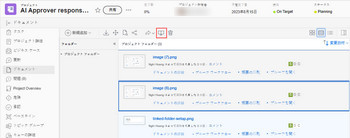

# プルーフの比較

プルーフビューアを使用して、異なる 2 つのプルーフや同じプルーフの 2 つのバージョンを比較できます。

## アクセス要件

+++ 展開すると、この記事の機能のアクセス要件が表示されます。

<table style="table-layout:auto"> 
 <col> 
 <col> 
 <tbody> 
  <tr> 
   <td role="rowheader">Adobe Workfront パッケージ</td> 
   <td> 
任意
 </td> 
  </tr> 
  <tr> 
   <td role="rowheader">Adobe Workfront プラン</td> 
   <td> 
任意
 </td> 
  </tr> 
  <tr> 
   <td role="rowheader">プルーフの役割 </td> 
   <td>レビュアー、レビュアー、承認者、作成者、モデレーター</td> 
  </tr> 
  <tr> 
   <td role="rowheader">プルーフ権限プロファイル </td> 
   <td>マネージャー以上</td> 
  </tr> 
  <tr> 
   <td role="rowheader">アクセスレベル設定</td> 
   <td> 
ドキュメントへのアクセスを編集
 </td> 
  </tr> 
 </tbody> 
</table>

詳しくは、[Workfront ドキュメントのアクセス要件](/help/quicksilver/administration-and-setup/add-users/access-levels-and-object-permissions/access-level-requirements-in-documentation.md)を参照してください。

+++

## 2 つの異なるプルーフの比較

プロジェクト、タスク、イシュー、ポートフォリオの「ドキュメント」タブ内またはメインのドキュメントエリア内など、1 つのドキュメントリスト内で 2 つのプルーフを比較できます。

1. 比較する 2 つのプルーフ済みドキュメントが含まれているドキュメントのリストに移動します。
1. 比較する最初のドキュメントを選択し、Command キー（Macの場合）または Ctrl キー（Windows の場合）を押しながら、比較する 2 番目のドキュメントを選択します。

   >[!NOTE]
   >
   >比較の対象として選択したドキュメントごとに、既にプルーフが生成されている必要があります。

1. 「**プルーフを比較**」をクリックします。

   <!--
   
If this button is not visible, ensure that two proofed documents are selected.

   -->

   

   両方のプルーフは、プルーフビューアで横に並べて表示されます。 各ドキュメントを比較しながらレビューできます。

   各プルーフの上にパンくずリストを個別に配置すると、プルーフに関連付けられた作業項目を表示および移動できます。

   

   2 つのプルーフを比較するために使用できるツールについて詳しくは、[プルーフビューアでプルーフの比較](../../../../workfront-proof/wp-work-proofsfiles/review-proofs-wpv/compare-proofs.md)の[比較ツールの使用](../../../../workfront-proof/wp-work-proofsfiles/review-proofs-wpv/compare-proofs.md#using-compare-tools)を参照してください。

## 同じプルーフの 2 つのバージョンの比較

同じプルーフの 2 つのバージョンを比較する方法について詳しくは、[プルーフビューアでのプルーフの比較](../../../../workfront-proof/wp-work-proofsfiles/review-proofs-wpv/compare-proofs.md)の[プルーフのバージョンの比較](../../../../workfront-proof/wp-work-proofsfiles/review-proofs-wpv/compare-proofs.md#comparing-proof-versions)を参照してください。
