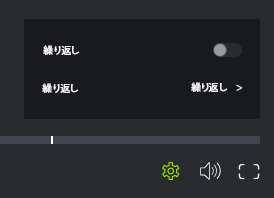

# ビデオ配達確認での再生の制御

## アクセス要件

この記事の手順を実行するには、次のアクセス権が必要です。

<table style="table-layout:auto"> 
 <col> 
 <col> 
 <tbody> 
  <tr> 
   <td role="rowheader">Adobe Workfront plan*</td> 
   <td> 
現在のプラン：Pro 以上
 
または
 
レガシープラン：選択またはプレミアム
 
様々なプランでのアクセスの検証について詳しくは、 <a href="/help/quicksilver/administration-and-setup/manage-workfront/configure-proofing/access-to-proofing-functionality.md" class="MCXref xref">Workfrontの校正機能へのアクセス</a>.
 </td> 
  </tr> 
  <tr> 
   <td role="rowheader">Adobe Workfront license*</td> 
   <td> 
現在のプラン：作業または計画
 
レガシープラン：任意（ユーザーの校正が有効になっている必要があります）
 </td> 
  </tr> 
  <tr> 
   <td role="rowheader">プルーフ権限プロファイル </td> 
   <td>マネージャ以降</td> 
  </tr> 
  <tr> 
   <td role="rowheader">アクセスレベル設定*</td> 
   <td> 
ドキュメントへのアクセスを編集
 
追加のアクセス権のリクエストについて詳しくは、 <a href="../../../../workfront-basics/grant-and-request-access-to-objects/request-access.md" class="MCXref xref">オブジェクトへのアクセスのリクエスト </a>.
 </td> 
  </tr> 
 </tbody> 
</table>

&#42;保有しているプラン、役割、配達確認権限プロファイルを確認するには、WorkfrontまたはWorkfrontの配達確認管理者に問い合わせてください。

## ビデオの再生速度を調整する

ビデオ配達確認の再生速度を調整できます。 ビデオを 1/4 の速度で 2 倍の速度で表示するよう選択できます。

1. ドキュメントを含むプロジェクト、タスクまたはイシューに移動し、「 」を選択します。 **ドキュメント**.
1. 必要な配達確認を見つけて、「 **配達確認を開く**.

1. 校正ビューアの右下隅で、 **設定** アイコン

   

1. 現在の速度をクリックし、新しい再生速度を選択します。
1. 次をクリック： **再生** ボタンをクリックして新しい速度をテストします。

## フレームごとにビデオを表示

ビデオの配達確認について詳しくは、フレームごとにビデオを手動で確認してください。

1. ドキュメントを含むプロジェクト、タスクまたはイシューに移動し、「 」を選択します。 **ドキュメント**.
1. 必要な配達確認を見つけて、「 **配達確認を開く**.

1. 校正ビューアの下部で、 **進む** および **戻る** 矢印キーを押してビデオのフレームごとに表示します。

   

## 再生ボリュームを変更

ビデオ再生のボリュームを制御できます。

1. ドキュメントを含むプロジェクト、タスクまたはイシューに移動し、「 」を選択します。 **ドキュメント**.
1. 必要な配達確認を見つけて、「 **配達確認を開く**.

1. 校正ビューアの右下隅で、 **音量** アイコンをクリックし、スライダをドラッグして新しいボリュームを選択します。

   

   または

   次をクリック： **音量** アイコン：ボリュームをミュート/ミュート解除します。
