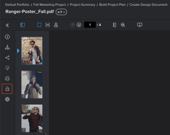

# プルーフをロック／ロック解除

レビュープロセスでは、いつでも手動でプルーフをロックおよびロック解除できます。

## アクセス要件

+++ 展開すると、この記事の機能のアクセス要件が表示されます。

<table style="table-layout:auto"> 
 <col> 
 <col> 
 <tbody> 
  <tr> 
   <td role="rowheader">Adobe Workfront パッケージ</td> 
   <td> 
任意
 </td> 
  </tr> 
  <tr> 
   <td role="rowheader">Adobe Workfront プラン</td> 
   <td> 
任意
</td> 
  </tr> 
  <tr> 
   <td role="rowheader">プルーフの役割</td> 
   <td>所有者または進行管理者</td> 
  </tr> 
  <tr> 
   <td role="rowheader">プルーフ権限プロファイル </td> 
   <td>スーパーバイザーまたは管理者</td> 
  </tr> 
 </tbody> 
</table>

詳しくは、[Workfront ドキュメントのアクセス要件](/help/quicksilver/administration-and-setup/add-users/access-levels-and-object-permissions/access-level-requirements-in-documentation.md)を参照してください。

+++

## プルーフのロック

プルーフを手動でロックして、レビュー担当者によるコメントを禁止したり、許可したりできます。 これは、プルーフステージのロックとは異なります。

プルーフをロックするには、次の手順に従います。

1. 開くプルーフが含まれているドキュメントリストに移動します。
1. ドキュメントにポインタを合わせて、表示される「**プルーフを開く**」リンクをクリックします。

   または

   ドキュメントの以前のバージョンのプルーフを開く場合は、そのバージョンの詳細アイコン をクリックし、**プルーフを開く**&#x200B;をクリックします。

   概要について詳しくは、[ドキュメントの概要](../../../../documents/managing-documents/summary-for-documents.md)を参照してください。

1. 左側のパネルで、**ロック** アイコン をクリックします。

   

## プルーフのロック解除

プルーフのロック解除は、以前のバージョンのプルーフに対するレビュアーからのコメントの追加が必要な場合に役立ちます。 （以前のバージョンは、プルーフ所有者が手動でロックを解除するまで常にロックされます）。 レビュー担当者が以前のバージョンへのコメントの追加を完了したら、再度ロックできます。 プルーフの以前のバージョンの表示については、[Web プルーフビューアでの以前のプルーフバージョンの表示](../../../../workfront-proof/wp-work-proofsfiles/review-proofs-wpv/view-previous-proof-versions.md)を参照してください。

プルーフをロック解除するには、次の手順に従います。

1. ドキュメントにポインタを合わせて、表示される「**プルーフを開く**」リンクをクリックします。

   または

   ドキュメントの以前のバージョンのプルーフを開く場合は、そのバージョンの詳細アイコン をクリックし、**プルーフを開く**&#x200B;をクリックします。

   概要について詳しくは、[ドキュメントの概要](../../../../documents/managing-documents/summary-for-documents.md)を参照してください。

1. 左側のパネルで、**ロック解除** アイコン をクリックし、**はい、ロック解除**&#x200B;をクリックします。

   
