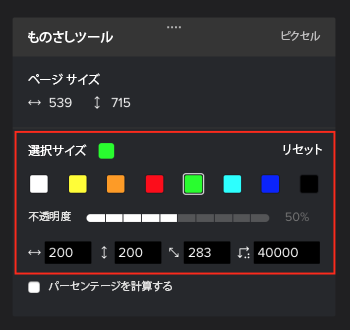
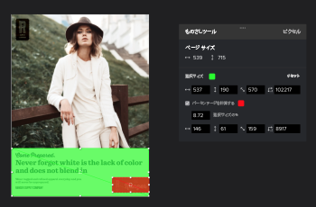

# プルーフ内のエリアを測定

プルーフ内のエリアを測定できます。

## アクセス要件

この記事の手順を実行するには、次のアクセス権が必要です。

<table style="table-layout:auto"> 
 <col> 
 <col> 
 <tbody> 
  <tr> 
   <td role="rowheader">Adobe Workfront プラン*</td> 
   <td> 
現在のプラン：Pro 以上
 
または
 
従来のプラン：Select または Premium
 
様々なプランでのプルーフ機能へのアクセスについて詳しくは、<a href="/help/quicksilver/administration-and-setup/manage-workfront/configure-proofing/access-to-proofing-functionality.md" class="MCXref xref">Workfront のプルーフ機能へのアクセス</a>を参照してください。
 </td> 
  </tr> 
  <tr> 
   <td role="rowheader">Adobe Workfront ライセンス*</td> 
   <td> 
現在のプラン：ワークまたはプラン
 
従来のプラン：任意（ユーザーのプルーフ機能が有効になっている必要があります）
 </td> 
  </tr> 
  <tr> 
   <td role="rowheader">プルーフ権限プロファイル </td> 
   <td>マネージャー以上</td> 
  </tr> 
  <tr> 
   <td role="rowheader">アクセスレベル設定*</td> 
   <td> 
ドキュメントへのアクセスを編集
 
追加のアクセス権のリクエストについて詳しくは、<a href="../../../../workfront-basics/grant-and-request-access-to-objects/request-access.md" class="MCXref xref">オブジェクトへのアクセス権のリクエスト</a>を参照してください。
 </td> 
  </tr> 
 </tbody> 
</table>

&#42;保有しているプラン、役割、またはプルーフ権限プロファイルを確認するには、Workfront または Workfront プルーフの管理者に問い合わせてください。

## プルーフ内のエリアを測定

1. ドキュメントを含むプロジェクト、タスクまたはイシューに移動し、「**ドキュメント**」を選択します。
1. 必要なプルーフを見つけて、「**プルーフを開く**」をクリックします。

1. プルーフビューアーの上にある&#x200B;**メジャー**&#x200B;アイコンをクリックします。

   

1. （オプション）色のオプションを展開するには&#x200B;**測定マークアップの色**&#x200B;をクリックし、次にプルーフで見やすいカラーと&#x200B;**不透明度**&#x200B;をクリックします。\
   

   デフォルトの測定ツールカラーは赤です。

   プルーフビューアーでは、ブラウザーキャッシュがクリアされるまで、開いたすべてのプルーフでのカラーと不透明度の選択が記憶されます。

1. （オプション）別の&#x200B;**測定単位**&#x200B;を選択します。

   >[!NOTE]
   >
   >「測定単位」オプションは、プルーフをPDFから作成した場合にのみ使用できます。

1. 測定ウィンドウを、測定する必要のあるプルーフの領域にドラッグします。

   

1. サイズを変更するには、測定ウィンドウのコーナーまたはエッジをドラッグします。
1. （オプション）測定領域を正確なサイズにする必要がある場合は、**選択サイズ**&#x200B;値を入力します。
1. （オプション）領域内の特定の割合を測定する必要がある場合は、「割合を計算」ボックスをオンにします。新規ボックスが表示され、調整することができます\
   
