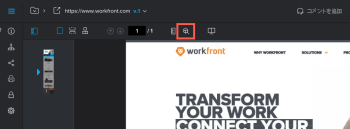

# 配達確認内のコンテンツを検索

次のタイプのドキュメントに対して作成された配達確認内のテキストをすばやく見つけることができます。

* PDF
* Office (.doc、.docx、.odt)
* 静的 Web ページ

>[!NOTE]
>
>2017 年 4 月 27 日より前に作成された配達確認は、検索できない場合があります。

## アクセス要件

この記事の手順を実行するには、次のアクセス権が必要です。

<table style="table-layout:auto"> 
 <col> 
 <col> 
 <tbody> 
  <tr> 
   <td role="rowheader">Adobe Workfront plan*</td> 
   <td> 
現在のプラン：Pro 以上
 
または
 
レガシープラン：選択またはプレミアム
 
様々なプランでのアクセスの検証について詳しくは、 <a href="/help/quicksilver/administration-and-setup/manage-workfront/configure-proofing/access-to-proofing-functionality.md" class="MCXref xref">Workfrontの校正機能へのアクセス</a>.
 </td> 
  </tr> 
  <tr> 
   <td role="rowheader">Adobe Workfront license*</td> 
   <td> 
現在のプラン：レビュー
 
レガシープラン：レビュー
 </td> 
  </tr> 
  <tr> 
   <td role="rowheader">プルーフ権限プロファイル </td> 
   <td>マネージャ以降</td> 
  </tr> 
  <tr> 
   <td role="rowheader">アクセスレベル設定*</td> 
   <td> 
ドキュメントへのアクセスを編集
 
追加のアクセス権のリクエストについて詳しくは、 <a href="../../../../workfront-basics/grant-and-request-access-to-objects/request-access.md" class="MCXref xref">オブジェクトへのアクセスのリクエスト </a>.
 </td> 
  </tr> 
 </tbody> 
</table>

&#42;保有しているプラン、役割、配達確認権限プロファイルを確認するには、WorkfrontまたはWorkfrontの配達確認管理者に問い合わせてください。

## 配達確認内のコンテンツを検索

1. 検索する配達確認を開きます。
1. 配達確認の上にあるツールバーで、 **ドキュメントを検索** アイコン

   

1. 検索するテキストの入力を開始します。

   入力中に、検索ツールでドキュメント内のテキストが強調表示されます。

   

1. 検索するテキストの入力を終了し、 **上** および **下** 矢印を使用して、配達確認内の検索結果をスキャンします。
