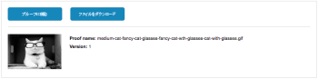

# 校正ビューアから配達確認を共有

配達確認の所有者または作成者が共有を有効にしている場合は、校正ビューアから配達確認を共有できます。

>[!IMPORTANT]
>
>「公開 URL または埋め込みコードを使用した配達確認の共有を許可」設定を有効にする必要があります。

## アクセス要件

この記事の手順を実行するには、次のアクセス権が必要です。

<table style="table-layout:auto"> 
 <col> 
 <col> 
 <tbody> 
  <tr> 
   <td role="rowheader">Adobe Workfront plan*</td> 
   <td> 
現在のプラン：Pro 以上
 
または
 
レガシープラン：選択またはプレミアム
 
様々なプランでのアクセスの検証について詳しくは、 <a href="/help/quicksilver/administration-and-setup/manage-workfront/configure-proofing/access-to-proofing-functionality.md" class="MCXref xref">Workfrontの校正機能へのアクセス</a>.
 </td> 
  </tr> 
  <tr> 
   <td role="rowheader">Adobe Workfront license*</td> 
   <td> 
現在のプラン：作業または計画
 
レガシープラン：任意（ユーザーの校正が有効になっている必要があります）
 </td> 
  </tr> 
  <tr> 
   <td role="rowheader">プルーフ権限プロファイル </td> 
   <td>マネージャ以降</td> 
  </tr> 
  <tr> 
   <td role="rowheader">アクセスレベル設定*</td> 
   <td> 
ドキュメントへのアクセスを編集
 
追加のアクセス権のリクエストについて詳しくは、 <a href="../../../../workfront-basics/grant-and-request-access-to-objects/request-access.md" class="MCXref xref">オブジェクトへのアクセスのリクエスト </a>.
 </td> 
  </tr> 
 </tbody> 
</table>

&#42;保有しているプラン、役割、配達確認権限プロファイルを確認するには、WorkfrontまたはWorkfrontの配達確認管理者に問い合わせてください。

## URL を共有

所有者が共有用に配達確認を設定している場合は、URL を使用して配達確認を共有できます。 配達確認の所有者は、いつでも共有設定を更新できます。 詳しくは、 [配達確認の設定を編集](../../../../review-and-approve-work/proofing/managing-proofs-within-workfront/edit-proof-settings.md).

1. 左のアイコンメニューが表示されない場合は、 **メニュー** アイコンをクリックします。

   

1. 校正ビューアの左のアイコンメニューで、 **共有** アイコン

   

1. 内 **配達確認を共有** 表示されるオプションは、 **共有可能なリンクを取得** が選択されている。

1.  次のいずれかの操作を行います。

   * リンクをクリップボードにコピーするには、 **リンクをコピー**.

      チャットや電子メールアプリケーションなど、サードパーティのツールを介してリンクを配布できるようになりました。

   * Adobe Workfrontから直接リンクを電子メールで送信するには、以下の手順を実行します。

      1. 内 **または、次へのメールリンク：** 「 」フィールドで、入力を開始し、受信者の名前を選択します。 または、共有する外部ユーザーの電子メールアドレスを指定します。

         >[!NOTE]
         >
         >配達確認を共有する際にエイリアス E メールが表示される場合は、対応するエイリアス E メールが存在する場合は、元の E メールを入力して新しいゲストユーザーを作成しないでください。

      1. 次のオプションから選択します。

         <table style="table-layout:auto">
          <col>
          <col>
          <tbody>
           <tr>
            <td role="rowheader">公開リンクを送信</td>
            <td>
電子メール通知に、使用している校正ビューア内の配達確認にユーザーを導くボタンを含め、表示アクセス権を付与します。

If <strong>パブリック URL または埋め込みコードで配達確認に登録</strong> 「 」をオフにすると、ユーザーはWorkfrontのログイン資格情報を使用してログインし、配達確認にコメントを追加できます。 このオプションをオンにすると、電子メールアドレスと名前（パスワードは不要）を入力したユーザーは誰でも署名し、配達確認にコメントを追加できます。
</td>
           </tr>
           <tr>
            <td role="rowheader">ダウンロードリンクを送信</td>
            <td>ダウンロードページにユーザーを導くボタンが電子メール通知に含まれ、ファイルの詳細、ファイル名、ファイルサイズを、インラインで表示されたファイルと共に提供します。 ユーザーは、ダウンロードページの「ダウンロード」リンクをクリックして、ファイルをダウンロードできます。</td>
           </tr>
           <tr>
            <td role="rowheader">カスタムメッセージを追加</td>
            <td>電子メール通知のカスタム件名と本文を指定できます。</td>
           </tr>
          </tbody>
         </table>

      1. クリック **送信**.

         受信者には、配達確認と、含めるように選択したボタンに関する情報が記載された E メール通知が届きます。

         

## 埋め込みコードの共有

配達確認の所有者が設定している場合は、埋め込みコードを使用して配達確認を共有できます。

埋め込みコードを使用して配達確認を共有するには：

1. 校正ビューアの左側にあるツールバーで、 **共有** アイコン

   

1. 内 **配達確認を共有** 表示されるオプションで、 **埋め込みコードの取得**&#x200B;を選択し、「 **コピー**.

## ユーザーを追加して配達確認を共有

次のいずれかの権限を持っている場合、配達確認を確認する際に、配達確認にユーザーを追加できます。

* スーパーバイザーまたは管理者の権限
* 管理者権限を持ち、配達確認の作成者または所有者である
* 作成者またはモデレーターの配達確認の役割を持つマネージャー権限

配達確認に自動ワークフローが含まれている場合は、ユーザーを個々のステージに追加できます。 詳しくは、 [自動ワークフローの概要](../../../../review-and-approve-work/proofing/proofing-overview/automated-workflow.md).

デフォルトでは、配達確認に追加するユーザーは次のようになります。

* 配達確認へのリンクを含む電子メール通知を受信します。
* 配達確認に関して、「ホーム」または「自分の作業」領域から承認の決定を行うことができます。詳しくは、 [作業の承認](../../../../review-and-approve-work/manage-approvals/approving-work.md).
* 配達確認を確認するために、校正を有効にする必要はありません。

自動ワークフローを有効にし、Workfrontで校正を有効にしていないユーザーを配達確認に追加すると、自動ワークフロー内に新しいステージが作成されます。 追加するユーザーが、配達確認を初めて表示したときに、自動的にこの新しいステージに追加されます。 詳しくは、 [自動ワークフローの概要](../../../../review-and-approve-work/proofing/proofing-overview/automated-workflow.md).

配達確認を個々のユーザーと共有するには：

1. 校正ビューアの左側にあるツールバーで、 **共有** アイコン

   

1. クリック **受信者を追加** をクリックします。
1. の下 **新しい配達確認受信者**&#x200B;で、配達確認を共有するユーザーの名前を入力し、ドロップダウンリストに表示されたら名前をクリックします。
1. （オプション）ユーザーの名前の右側にあるレビュー担当者のオプションを変更します。

   * **配達確認の役割**:詳しくは、 [Workfront Proof での配達確認の役割の管理](../../../../workfront-proof/wp-work-proofsfiles/share-proofs-and-files/manage-proof-roles.md).

   * **ステージ**:（配達確認に自動ワークフローが設定されている場合にのみ使用できます）。 詳しくは、  [自動ワークフローステージの概要](../../../../review-and-approve-work/proofing/proofing-overview/stages.md).

   * **E メールアラート**：次のいずれかのオプションを選択して、配達確認のアクティビティに関する通知をユーザーに送信する方法を指定します。

      <table style="table-layout:auto"> 
      <col> 
      <col> 
      <tbody> 
       <tr> 
        <td role="rowheader">すべてのアクティビティ</td> 
        <td>Workfrontは、新しいコメント、返信、決定など、配達確認に関するアクティビティが発生するたびにレビュー担当者に電子メールを送信します。 
これは、アクティビティの発生を確認できるので、校正プロセスを管理するユーザーにとって最適なオプションです。 

ユーザーは、自分のアクティビティに関する電子メールアラートを受け取りません。
</td> 
       </tr> 
       <tr> 
        <td role="rowheader">コメントに返信</td> 
        <td>メールは、誰かが自分のコメントに明示的に返信した場合（自分のコメントに対する自分の返信を除く）にのみ、レビュー担当者に送信されます。 つまり、配達確認の担当者が新しいコメントを作成した場合、レビュー担当者には通知されません。
この設定は、配達確認に関する他のコメントが通知されないように、また、自分のコメントに対する返信のみが通知されるように、配達確認のクライアントに対して推奨されます。

この電子メールアラート設定を持つレビュー担当者は、他の新しいコメントについては通知されませんが、校正ビューアでは、配達確認に関するすべてのコメントを表示できます。

コメントについて詳しくは、 <a href="../../../../review-and-approve-work/proofing/reviewing-proofs-within-workfront/comment-on-a-proof/view-proof-comments.md" class="MCXref xref">配達確認コメントを表示して返信します</a>.
</td> 
       </tr> 
       <tr> 
        <td role="rowheader">決定</td> 
        <td>Workfrontは、誰かが決定した場合にのみ、レビュー担当者に電子メールを送信します。
これは、承認プロセスを管理し、配達確認の進行状況を監視し、どのユーザーが決定したかを確認する必要がある人（プロジェクトマネージャーなど）に役立ちます。

決定を送信する際に電子メールの確認オプションを選択しない限り、自分の決定に関する通知は送信されません。
</td> 
       </tr> 
       <tr> 
        <td role="rowheader">最終決定</td> 
        <td>Workfrontは、配達確認の最後の承認者が決定したときに電子メールを送信します。
この警告は多くの場合、実際のレビューディスカッションに参加する必要がないデザイナーが使用します。 最終的な決定が下されると、デザイナーに通知が届き、必要な変更に対して対処できます。

このアラートは、レビュープロセスが完了した場合にのみ通知を受け取る必要がある部署のリーダーにも役立ちます。
</td> 
       </tr> 
       <tr> 
        <td role="rowheader">時間別サマリ</td> 
        <td>Workfrontは、1 時間ごとにレビュー担当者に電子メールを送信し、1 時間ごとに発生したすべてのコメント、返信および決定の概要を記載します。
この E メールは、過去 1 時間以内に自分自身のアクティビティが発生した場合にのみ送信されます。 

このアラートは、プロジェクトの概要を確認するのに適しています。

この概要の使用例としては、プロジェクトの概要を必要とする上級レビュー担当者が挙げられますが、配達確認のすべてのアクティビティをすぐに通知する必要はありません。
</td> 
       </tr> 
       <tr> 
        <td role="rowheader">日別サマリ</td> 
        <td>Workfrontは、自分の以外にアクティビティがある日にのみ、すべてのコメント、返信および決定を記載した 1 つの電子メールを送信します。
このアラートは、1 日を通じて複数の更新で圧倒されることなく、プロジェクトの概要を確認するのに適しています。

このサマリの使用例の 1 つに、部門のリーダーがプロジェクトの全体的な進行状況を監視する場合があります。

詳しくは、 <a href="../../../../review-and-approve-work/proofing/reviewing-proofs-within-workfront/manage-notifications-for-proof-comments.md" class="MCXref xref">配達確認コメントおよび決定に関する通知を管理</a>.
</td> 
       </tr> 
       <tr data-mc-conditions=""> 
        <td role="rowheader">メールなし</td> 
        <td>Workfrontは電子メールアラートを送信しません。 これは、参照用としてのみ配達確認に追加され、変更を通知する必要がない人に役立ちます。
システムのデフォルトは、「毎日の概要」（「未設定」とも呼ばれます）です。 自分または自分のレビュー担当者が他の変更を加えない場合、すべての配達確認にこの設定が適用されます。
</td> 
       </tr> 
      </tbody> 
     </table>

1. （オプション）前の 2 つの手順を繰り返して、複数のユーザーを配達確認に追加します。 
1. （オプション） **期限** レビュー担当者向け（配達確認に自動ワークフローがない場合にのみ使用可能）。
1. （オプション）「 」を選択します。 **新しい受信者に電子メール通知を送信する** 配達確認に追加したことを知らせるために
1. 配達確認へのユーザーの追加が完了したら、 **完了。**
