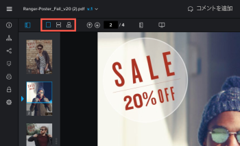
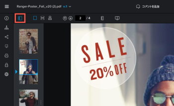

# プルーフのコンテンツを表示

## アクセス要件

この記事の手順を実行するには、次のアクセス権が必要です。

<table style="table-layout:auto"> 
 <col> 
 <col> 
 <tbody> 
  <tr> 
   <td role="rowheader">Adobe Workfront プラン*</td> 
   <td> 
現在のプラン：Pro 以上
 
または
 
従来のプラン：Select または Premium
 
様々なプランでのプルーフ機能へのアクセスについて詳しくは、<a href="/help/quicksilver/administration-and-setup/manage-workfront/configure-proofing/access-to-proofing-functionality.md" class="MCXref xref">Workfront のプルーフ機能へのアクセス</a>を参照してください。
 </td> 
  </tr> 
  <tr> 
   <td role="rowheader">Adobe Workfront ライセンス*</td> 
   <td> 
現在のプラン：ワークまたはプラン
 
従来のプラン：任意（ユーザーのプルーフ機能が有効になっている必要があります）
 </td> 
  </tr> 
  <tr> 
   <td role="rowheader">プルーフ権限プロファイル </td> 
   <td>マネージャー以上</td> 
  </tr> 
  <tr> 
   <td role="rowheader">アクセスレベル設定*</td> 
   <td> 
ドキュメントへのアクセスを編集
 
追加のアクセス権のリクエストについて詳しくは、<a href="../../../../workfront-basics/grant-and-request-access-to-objects/request-access.md" class="MCXref xref">オブジェクトへのアクセス権のリクエスト</a>を参照してください。
 </td> 
  </tr> 
 </tbody> 
</table>

&#42;保有しているプラン、役割、またはプルーフ権限プロファイルを確認するには、Workfront または Workfront プルーフの管理者に問い合わせてください。

## プルーフの表示を変更

単一ビュー、連続ビューまたは見開きビューで、複数のページを含む静的プルーフを表示できます。

1. ドキュメントを含むプロジェクト、タスクまたはイシューに移動し、「**ドキュメント**」を選択します。
1. 必要なプルーフを見つけて、「**プルーフを開く**」をクリックします。

1. プルーフビューアーの左上のエリアで、表示オプションを確認します。\
   

1. 以下のオプションのいずれかをクリックします。

   <table style="table-layout:auto"> 
    <col> 
    <col> 
    <tbody> 
     <tr> 
      <td role="rowheader">単一ビュー</td> 
      <td>一度に 1 ページのみを表示します。表示するページのサムネールをクリックするか、左向き矢印キーと右向き矢印キーを押してページ間を移動します。 </td> 
     </tr> 
     <tr> 
      <td role="rowheader">連続ビュー</td> 
      <td>すべてのページが単一の積み重ねビューで表示されます。表示するページのサムネールをクリックするか、左右の矢印キーを押して連続ビューのすべてのページを上下にスクロールします。 </td> 
     </tr> 
     <tr> 
      <td role="rowheader">見開きビュー</td> 
      <td>すべてのページが単一の見開きビュー（並べて積み重ね）で表示されます。表示するページのサムネールをクリックするか、左右の矢印キーを押してすべてのページをスクロールします。 </td> 
     </tr> 
    </tbody> 
   </table>

## サムネールを使用

サムネールパネルは、プルーフビューアーの左上に表示されます。サムネールエリアを使用して、プルーフ全体で移動できます。サムネールは、プルーフに複数のページが含まれる場合に特に便利です。

* [サムネールパネルの表示と非表示](#hide-and-display-the-thumbnails-panel)
* [サムネールビューでのズームとパン](#zoom-and-pan-in-the-thumbnail-view)

### サムネールパネルの表示と非表示 {#hide-and-display-the-thumbnails-panel}

サムネールパネルは、デフォルトで表示されます。パネルのサイズを、非表示にしたり調整したりすることができます。

1. ドキュメントを含むプロジェクト、タスクまたはイシューに移動し、「**ドキュメント**」を選択します。
1. 必要なプルーフを見つけて、「**プルーフを開く**」をクリックします。

1. プルーフビューアーの左上隅にある&#x200B;**サムネール**&#x200B;アイコンをクリックします。\
   

1. （オプション）サムネールアイコンをもう一度クリックして、サムネールパネルを表示します。

   >[!TIP]
   >
   >サムネールパネルの右端にマウスを移動して、パネルのサイズを変更できます。

### サムネールビューでのズームとパン {#zoom-and-pan-in-the-thumbnail-view}

サムネールパネルのズームエリアには、現在表示中のプルーフのエリアが表示されます。サムネールエリア内でズームを調整したり、エリアをパンしてプルーフの別の部分を表示したりすることができます。

サムネールビューでズームおよびパンするには、以下のようにします。

1. ドキュメントを含むプロジェクト、タスクまたはイシューに移動し、**ドキュメント**&#x200B;を選択します。
1. 必要なプルーフを見つけて、「**プルーフを開く**」をクリックします。

1. サムネールパネルで現在のズームエリアを確認します。\
   ズームエリアは、サムネールの端の周りに青いフレームで表示されます。

   

1. ズームエリアのサイズを調整するには、ズームエリアの右下隅をドラッグして、目的のサイズにします。
1. ズームエリアをプルーフの別の部分に移動するには、表示するプルーフの部分をカバーするまでズームエリアをドラッグします。

## プルーフを回転

プルーフは、プルーフビューアー内で回転できます。複数のページを含むプルーフを回転すると、すべてのページが同時に回転します。

1. ドキュメントを含むプロジェクト、タスクまたはイシューに移動し、「**ドキュメント**」を選択します。
1. 必要なプルーフを見つけて、「**プルーフを開く**」をクリックします。

1. プルーフビューアーの下部にある&#x200B;**回転**&#x200B;アイコンをクリックします。

   

   **回転**&#x200B;アイコンをクリックするたびにプルーフが 90 度回転します。

## プルーフのズームとパン

プルーフを表示する際に、ズーム率を調整できます。プルーフを大きなズーム率で表示する場合、「パン」オプションを使用すると、カーソルを使用してプルーフのさまざまなエリアに移動できます。

1. ドキュメントを含むプロジェクト、タスクまたはイシューに移動し、「**ドキュメント**」を選択します。
1. 必要なプルーフを見つけて、「**プルーフを開く**」をクリックします。

1. プルーフのズーム率を調整するには、次のいずれかの操作を行います。

   * **ズーム**&#x200B;アイコン、プルーフの順にクリックして高いズームレベルで表示するか、プルーフのエリアをドラッグしてそのエリアのみを表示します。

     

   * 現在のズーム率、新しいズーム率、**幅に合わせる**、**高さに合わせる**、または&#x200B;**ページに合わせる**&#x200B;をクリックします。

     

   * **プラス**&#x200B;または&#x200B;**マイナス**&#x200B;アイコンをクリックして、ズーム率を増減します。

     

1. ビデオのプルーフで特定のエリアにパンする必要がある場合は、**パン**&#x200B;アイコンをクリックし、必要に応じてプルーフをドラッグします。

   

   >[!TIP]
   >
   >ズームツールとパンツールを簡単に切り替えるには、ズームアイコンを使用してパンするときにスペースバーを押したままにします。
