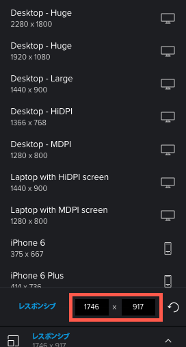

# 校正ビューアでインタラクティブな配達確認の解像度を変更

様々なデバイスでのインタラクティブな配達確認の外観をプレビューし、様々な解像度に基づいてコンテンツが表示され、応答する様子を確認できます。

## アクセス要件

この記事の手順を実行するには、次のアクセス権が必要です。

<table style="table-layout:auto"> 
 <col> 
 <col> 
 <tbody> 
  <tr> 
   <td role="rowheader">Adobe Workfront plan*</td> 
   <td> 
現在のプラン：Pro 以上
 
または
 
レガシープラン：選択またはプレミアム
 
様々なプランでのアクセスの検証について詳しくは、 <a href="/help/quicksilver/administration-and-setup/manage-workfront/configure-proofing/access-to-proofing-functionality.md" class="MCXref xref">Workfrontの校正機能へのアクセス</a>.
 </td> 
  </tr> 
  <tr> 
   <td role="rowheader">Adobe Workfront license*</td> 
   <td> 
現在のプラン：作業または計画
 
レガシープラン：任意（ユーザーの校正が有効になっている必要があります）
 </td> 
  </tr> 
  <tr> 
   <td role="rowheader">プルーフ権限プロファイル </td> 
   <td>マネージャ以降</td> 
  </tr> 
  <tr> 
   <td role="rowheader">アクセスレベル設定*</td> 
   <td> 
ドキュメントへのアクセスを編集
 
追加のアクセス権のリクエストについて詳しくは、 <a href="../../../../workfront-basics/grant-and-request-access-to-objects/request-access.md" class="MCXref xref">オブジェクトへのアクセスのリクエスト </a>.
 </td> 
  </tr> 
 </tbody> 
</table>

&#42;保有しているプラン、役割、配達確認権限プロファイルを確認するには、WorkfrontまたはWorkfrontの配達確認管理者に問い合わせてください。

## デスクトップ校正ビューアと Web 校正ビューアのデバイスと解像度の表示

Adobe Workfrontの管理者が、Desktop Proofing Viewer または ZIP ファイル内のバンドルコンテンツとして Web Proofing Viewer でインタラクティブコンテンツを確認するようにシステムを設定しています。

* デスクトップ校正ビューアでは、様々な解像度と様々なデバイスでのコンテンツの表示と応答を表示できます。 レビュー担当者が特定のデバイスを指定すると、そのデバイス上でのコンテンツの表示と、そのデバイスのユーザーインターフェイス仕様の表示が切り替わります。 例えば、あるブランドのスマートフォンの赤いボタンが、別のブランドの青い場合があります。

* Web 校正ビューアでは、様々なデバイスの解像度で表示されるインタラクティブコンテンツを表示できます。 ただし、Web 校正ビューアでは、ボタンの色など、これらのデバイスのインターフェイス仕様を使用したコンテンツはエミュレートされません。

   >[!NOTE]
   >
   >Workfrontの管理者は、この記事の「インタラクティブな配達確認用のカスタムデバイスの設定」の説明に従って、組織内のユーザー向けのカスタムデバイスを設定できます。

## プリセットのデバイスまたは解像度設定で配達確認を表示

1. 開く配達確認が含まれているドキュメントリストに移動します。
1. ドキュメントにカーソルを合わせ、 **配達確認を開く**.
1. クリック **レスポンシブ** をクリックします。

   

1. デスクトップ校正ビューアで、表示されるデバイスと解像度の一覧から目的のデバイスをクリックします。

   または

   Web 校正ビューアで、表示される解像度の一覧から目的の解像度をクリックします。

   これら 2 つのビューアの違いについて詳しくは、 [Web 校正ビューアとデスクトップ校正ビューアの違いの概要](../../../../review-and-approve-work/proofing/proofing-overview/understand-differences-between-web-viewer.md).

   インタラクティブな配達確認は、選択した解像度でレンダリングされます。

## カスタムの解像度設定で配達確認を表示

1. 開く配達確認が含まれているドキュメントリストに移動します。
1. ドキュメントにカーソルを合わせ、 **配達確認を開く**.
1. クリック **レスポンシブ** をクリックします。
1. カスタムを入力 **レスポンシブ** 解像度。

   

   または

   インタラクティブコンテンツにマウスを移動し、右下隅の青い境界線（右または下の端）を目的の解像度にドラッグします。

   

   カスタム解像度は、次の場所に表示されます。

   * 内 **解像度** パネルを使用して、ビューアの中央下部に配置できます。\
      

   * すべてのコメントレビュー担当者が配達確認に追加します。 各コメントには、レビュー担当者がコメントを作成したときに選択した画面の解像度が含まれます。
