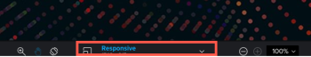

# プルーフビューアーでのインタラクティブなプルーフの解像度の変更

様々なデバイスでのインタラクティブなプルーフの外観をプレビューし、様々な解像度に基づいてコンテンツが表示され、応答する様子を確認できます。

## アクセス要件

+++ 展開すると、この記事の機能のアクセス要件が表示されます。

<table style="table-layout:auto"> 
 <col> 
 <col> 
 <tbody> 
  <tr> 
   <td role="rowheader">Adobe Workfront パッケージ</td> 
   <td> 
任意
 </td> 
  </tr> 
  <tr> 
   <td role="rowheader">Adobe Workfront プラン</td> 
   <td> 
任意
 </td> 
  </tr> 
  <tr> 
   <td role="rowheader">プルーフの役割 </td> 
   <td>レビュアー、レビュアーおよび承認者、作成者、モデレーター</td> 
  </tr> 
  <tr> 
   <td role="rowheader">プルーフ権限プロファイル </td> 
   <td>マネージャー以上</td> 
  </tr> 
  <tr> 
   <td role="rowheader">アクセスレベル設定</td> 
   <td> 
ドキュメントへのアクセスを編集
 </td> 
  </tr> 
 </tbody> 
</table>

詳しくは、[Workfront ドキュメントのアクセス要件](/help/quicksilver/administration-and-setup/add-users/access-levels-and-object-permissions/access-level-requirements-in-documentation.md)を参照してください。

+++

## デスクトッププルーフビューアーと web プルーフビューアーのデバイスと解像度の表示

Adobe Workfront 管理者は、インタラクティブなコンテンツをデスクトッププルーフビューアーで確認するか、ZIP ファイルにバンドルされたコンテンツとして web プルーフビューアーで確認できるようにシステムを設定しています。

* デスクトッププルーフビューアーでは、様々な解像度やデバイスでのコンテンツの表示と応答を確認できます。レビュアーが特定のデバイスを指定すると、そのデバイス上でのコンテンツの表示と、そのデバイスのユーザーインターフェイス仕様の表示が切り替わります。例えば、あるブランドのスマートフォンの赤いボタンが、別のブランドでは青い場合があります。

* Web プルーフビューアーでは、様々なデバイスの解像度で表示されるインタラクティブコンテンツを表示できます。ただし、web プルーフビューアーでは、ボタンの色など、これらのデバイスのインターフェイス仕様を使用したコンテンツはエミュレートされません。

  >[!NOTE]
  >
  >Workfront 管理者は、[組織のプルーフの設定](/help/quicksilver/administration-and-setup/manage-workfront/configure-proofing/configure-proofing-organization.md)の記事の[プルーフ用のカスタムデバイスの設定](/help/quicksilver/administration-and-setup/manage-workfront/configure-proofing/configure-proofing-organization.md#configure-custom-devices-for-proofs)で説明しているように、組織内のユーザーのカスタムデバイスを設定できます。

## プリセットのデバイスまたは解像度設定でプルーフを表示

1. 開くプルーフが含まれているドキュメントリストに移動します。
1. ドキュメントにポインタを合わせて、「**プルーフを開く**」をクリックします。
1. プルーフビューアーの中央下部にある「**レスポンシブ**」をクリックします。

   

1. デスクトッププルーフビューアーで、表示されるデバイスと解像度のリストから目的のデバイスをクリックします。

   または

   Web プルーフビューアーで、表示される解像度のリストから目的の解像度をクリックします。

   これら 2 つのビューアーの違いについて詳しくは、[web プルーフビューアーとデスクトッププルーフビューアーの違いの概要](../../../../review-and-approve-work/proofing/proofing-overview/understand-differences-between-web-viewer.md)を参照してください。

   インタラクティブなプルーフは、選択した解像度でレンダリングされます。

## カスタム解像度設定でプルーフを表示

1. 開くプルーフが含まれているドキュメントリストに移動します。
1. ドキュメントにポインタを合わせて、「**プルーフを開く**」をクリックします。
1. プルーフビューアーの中央下部にある「**レスポンシブ**」をクリックします。
1. カスタム&#x200B;**レスポンシブ**&#x200B;解像度を入力します。

   

   または

   インタラクティブコンテンツにポインタを合わせて、右下隅の青い境界線（右または下の端）を目的の解像度にドラッグします。

   

   カスタム解像度は、次の場所に表示されます。

   * ビューアーの中央下部にある&#x200B;**解像度**&#x200B;パネル。\
     

   * レビュアーがプルーフに追加したすべてのコメント。各コメントには、レビュアーがコメントを作成したときに選択した画面の解像度が含まれます。
