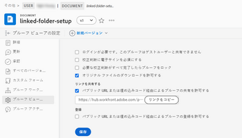

# 公開 URL を使用した配達確認の共有を無効にするか、埋め込みコードを無効にします

公開 URL と配達確認を共有する機能や、配達確認ごとに、または個々のユーザーに対して、配達確認にコードを埋め込む機能をオフにできます。

## アクセス要件

この記事の手順を実行するには、次のアクセス権が必要です。

<table style="table-layout:auto"> 
 <col> 
 <col> 
 <tbody> 
  <tr> 
   <td role="rowheader">Adobe Workfront plan*</td> 
   <td> 
現在のプラン：Pro 以上
 
または
 
レガシープラン：選択またはプレミアム
 
様々なプランでのアクセスの検証について詳しくは、 <a href="/help/quicksilver/administration-and-setup/manage-workfront/configure-proofing/access-to-proofing-functionality.md" class="MCXref xref">Workfrontの校正機能へのアクセス</a>.
 </td> 
  </tr> 
  <tr> 
   <td role="rowheader">Adobe Workfront license*</td> 
   <td> 
現在のプラン：作業または計画
 
レガシープラン：任意（ユーザーの校正が有効になっている必要があります）
 </td> 
  </tr> 
  <tr> 
   <td role="rowheader">アクセスレベル設定*</td> 
   <td> 
ドキュメントへのアクセスを編集
 
追加のアクセス権のリクエストについて詳しくは、 <a href="../../../workfront-basics/grant-and-request-access-to-objects/request-access.md" class="MCXref xref">オブジェクトへのアクセスのリクエスト </a>.
 </td> 
  </tr> 
 </tbody> 
</table>

&#42;保有しているプラン、役割、配達確認権限プロファイルを確認するには、WorkfrontまたはWorkfrontの配達確認管理者に問い合わせてください。

## 配達確認ごとに無効にする

配達確認の所有者または作成者であるか、作成者またはモデレーターの配達確認の役割が必要です。

1. 配達確認を含むプロジェクトで、「 **ドキュメント** をクリックします。
1. 配達確認の上にマウスポインターを置いて、「 」を選択します。 **ドキュメントの詳細** .
1. 左側のパネルで、 **校正ビューアの設定**、次に **公開 URL または埋め込みコードを使用した配達確認の共有を許可** チェックボックス。

   

1. 「**保存**」をクリックします。

## ユーザーごとに無効にする

Workfrontインスタンスで、個々のユーザーに対して公開の配達確認設定を無効にできます。 この変更を行うには、管理者の配達確認権限プロファイルが必要です。

1. 次をクリック： **メインメニュー** アイコン  Adobe Workfrontの右上隅で、 **校正**.
1. クリック **アカウント設定** 右上隅付近にある
1. 次をクリック： **ユーザー** 」タブをクリックし、ユーザーの名前をクリックします。
1. 内 **デフォルトの配達確認設定** セクションで、 **公開共有** チェックボックス。

   
