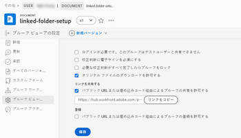
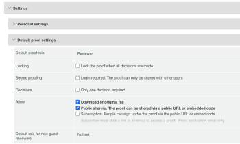

# 公開 URL または埋め込みコードでのプルーフの共有の無効化

パブリック URL でプルーフを共有する機能や、プルーフごとまたは個々のユーザーごとにプルーフにコードを埋め込む機能を無効にできます。

## プルーフごとに無効化

プルーフの所有者または作成者であるか、プルーフの役割が作者または進行管理者になっている必要があります。

1. プルーフを含んだプロジェクトで、左パネルの「**ドキュメント**」をクリックします。
1. プルーフにポインタを合わせて、「**ドキュメントの詳細**」を選択します。
1. 左パネルで「**プルーフ ビューアの設定**」をクリックして、「**パブリック URL または埋め込みコードによるプルーフの共有を許可**」チェックボックスをオフにします。

   

1. 「**保存**」をクリックします。

## ユーザーごとに無効化

Workfront インスタンスで、個々のユーザーごとにパブリックプルーフ設定を無効にできます。 この変更を行うには、管理者のプルーフ権限プロファイルが必要です。

1. Adobe Workfrontの右上隅にある&#x200B;**メインメニュー** アイコン をクリックし、**プルーフ**&#x200B;をクリックします。
1. 右上隅付近にある「**アカウント設定**」をクリックします。
1. 「**ユーザー**」タブをクリックし、ユーザーの名前をクリックします。
1. 「**デフォルトのプルーフ設定**」セクションで、「**パブリック共有**」チェックボックスをオフにします。

   
