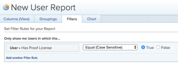

# Adobe Workfront のプルーフライセンスを持つユーザーの一覧

Adobe Workfront のどのユーザーが現在「プルーフユーザー」オプションを有効にしているかは、次のいずれかの方法で表示できます。

## アクセス要件

この記事の手順を実行するには、次のアクセス権が必要です。

<table style="table-layout:auto"> 
 <col> 
 <col> 
 <tbody> 
  <tr> 
   <td role="rowheader">Adobe Workfront プラン*</td> 
   <td> 
従来のプラン：Select または Premium
 
様々なプランでのプルーフ機能へのアクセスについて詳しくは、<a href="/help/quicksilver/administration-and-setup/manage-workfront/configure-proofing/access-to-proofing-functionality.md" class="MCXref xref">Workfront のプルーフ機能へのアクセス</a>を参照してください。
 </td> 
  </tr> 
  <tr> 
   <td role="rowheader">Adobe Workfront ライセンス*</td> 
   <td> 
プラン
 </td> 
  </tr> 
  <tr> 
   <td role="rowheader">オブジェクト権限</td> 
   <td> 
次へのアクセスを編集：
 
    <ul> 
     <li> 
レポート、ダッシュボードおよびカレンダーの作成
 </li> 
     <li> 
フィルター、ビュー、グループ化を作成
 </li> 
    </ul> 
メモ：まだアクセス権がない場合は、アクセスレベルに追加の制限が設定されていないかどうか Workfront 管理者にお問い合わせください。Workfront 管理者がアクセスレベルを変更する方法について詳しくは、<a href="../../../administration-and-setup/add-users/configure-and-grant-access/create-modify-access-levels.md" class="MCXref xref">カスタムアクセスレベルの作成または変更</a>を参照してください。
 </td> 
  </tr> 
 </tbody> 
</table>

&#42;保有しているプラン、役割、またはプルーフ権限プロファイルを確認するには、Workfront または Workfront プルーフの管理者に問い合わせてください。

## ユーザーレポートの作成

ユーザー報告書を作成して、プルーフを生成できるユーザーを表示できます。

1. **レポート**&#x200B;エリアに移動します。
1. **新規レポート**&#x200B;ドロップダウンメニューをクリックして、「**ユーザーレポート**」をクリックします。

1. 「**フィルター**」タブで「**フィルター規則の追加**」をクリックします。

1. 利用可能なフィールドで、**ユーザー**&#x200B;を展開して、「**プルーフのライセンスあり**」をクリックします。

1. **次と等しい**／**True** を選択します。

   

1. 「**保存して閉じる**」をクリックします。

   このレポートには、Workfront でプルーフライセンスが割り当てられているすべてのユーザーが表示されます。

## ユーザービューの更新

ユーザービューに新しい列を追加して、プルーフを生成できるユーザーを表示できます。

1. **ユーザー**&#x200B;エリアに移動します。
1. 「**ユーザー**」タブをクリックします。
1. **ビュー**&#x200B;ドロップダウンメニューで、次のいずれかの操作を行います。

   * この情報を既存のビューに追加するには、カスタマイズするビューを選択し、「**ビューのカスタマイズ**」をクリックします。
   * この情報を新しいビューに追加するには、「**新規ビュー**」をクリックします。

1. 「**列を追加**」をクリックします。
1. 利用可能なフィールドで、**ユーザー**&#x200B;を展開し、「**プルーフのライセンスあり**」をクリックします。

1. 「**完了**」をクリックし、「**ビューの保存**」または「**新規ビューとして保存**」をクリックします。

   ユーザーにプルーフライセンスが割り当てられているかどうかに応じて、ビューに **True** または **False** が表示されます。
