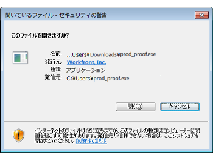

# デスクトップ校正ビューアのインストール

デスクトップ校正ビューアは、インタラクティブコンテンツの校正を主目的として設計されています。これは、ローカルマシンにインストールする必要があるアプリケーションです。

## 必要システム構成

このアプリケーションは、次のオペレーティングシステムでサポートされています。

* Windows 7 以降、32 ビットおよび 64 ビット
* Mac OS X 10.9 以降、64 ビット

## アクセス要件

この記事の手順を実行するには、次のアクセス権が必要です。

<table style="table-layout:auto"> 
 <col> 
 <col> 
 <tbody> 
  <tr> 
   <td role="rowheader">Adobe Workfront plan*</td> 
   <td> 
現在のプラン： Pro 以上
 
または
 
レガシープラン： Select または Premium
 
様々なプランでのアクセスの検証について詳しくは、 <a href="/help/quicksilver/administration-and-setup/manage-workfront/configure-proofing/access-to-proofing-functionality.md" class="MCXref xref">Workfrontの校正機能へのアクセス</a>.
 </td> 
  </tr> 
  <tr> 
   <td role="rowheader">Adobe Workfrontライセンス</td> 
   <td> 
任意
 
レガシープラン：任意（ユーザーの校正が有効になっている必要があります）
 </td> 
  </tr> 
 </tbody> 
</table>

{{latest-version}}

## Macへのデスクトップ校正ビューアのインストール

Adobe Workfrontの管理者またはWorkfrontの配達確認管理者が、アプリをワークステーションにダウンロードし、デスクトップ校正ビューアをインタラクティブ配達確認のデフォルトビューアとして設定した場合は、「ドキュメント」領域からインタラクティブ配達確認を開くだけでインストールを完了できます。

そうでない場合は、次の手順に従います。

1. アプリをダウンロードするには、次のいずれかの操作を行います。

   * 実稼動環境を使用している場合は、 [Mac Production Download for the Desktop Proofing Viewer.](https://assets.proofhq.com/nativeviewer/desktop_viewer/Workfront+Proof-2.1.31.pkg)
   * プレビュー環境を使用している場合は、 [Mac Preview Desktop Proofing Viewer 用のダウンロードです。](https://assets.preview.proofhq.com/nativeviewer/desktop_viewer/Workfront+Proof+Preview-2.1.31.pkg)

1. ダウンロードしたファイルを開いて、インストールを開始します。
1. 表示されるインストールボックスで、 **続行**&#x200B;を選択し、次に **インストール**.

   

1. 「ドキュメント」領域からインタラクティブな配達確認を開きます。

>[!NOTE]
>
>対話式の配達確認を開いたときにデスクトップ校正ビューアが起動しない場合は、WorkfrontまたはWorkfrontの配達確認管理者が、対話式の配達確認用のデフォルトビューアとしてデスクトップ校正ビューアを設定する必要があります ( [デスクトップ校正ビューアで非インタラクティブ校正を開くためのユーザー設定](../../../workfront-proof/wp-work-proofsfiles/review-proofs-dpv/destop-proofing-viewer.md#user-setting-for-launching-non-interactive-proofs).

## Windows へのデスクトップ校正ビューアのインストール

WorkfrontまたはWorkfrontの配達確認管理者がワークステーションにアプリをダウンロードし、デスクトップ校正ビューアをインタラクティブな配達確認のデフォルトビューアとして設定した場合は、「ドキュメント」領域からインタラクティブな配達確認を開くだけでインストールを完了できます。

>[!TIP]
>
>コマンドラインを使用して、次のコマンドを実行してデスクトップ校正ビューアをインストールできます： `Workfront Proof Setup 2.1.31.exe" /S`

1. アプリをダウンロードするには、次のいずれかの操作を行います。

   * 実稼動環境で、 [デスクトップ校正ビューア用の Windows Production ダウンロードです。](https://assets.proofhq.com/nativeviewer/desktop_viewer/Workfront+Proof+Setup+2.1.31.exe)
   * プレビュー環境で、 [デスクトップ校正ビューア用の Windows プレビューのダウンロード](https://assets.preview.proofhq.com/nativeviewer/desktop_viewer/Workfront+Proof+Preview+Setup+2.1.31.exe)

1. ダウンロードしたファイルを開いて、インストールを開始します。
1. 表示されるインストールボックスで、ダウンロードしたファイルを開いてインストールを開始します。

   

1. 表示されるセキュリティ警告ボックスで、 **実行**. デスクトップ校正ビューアは、自動的にインストールおよび実行します。
1. （条件付き）Internet Explorer を使用してアプリケーションをインストールする場合、アプリケーションのインストール後にブラウザーで起動ページを更新します。
1. 「ドキュメント」領域からインタラクティブな配達確認を開きます。

デスクトップ校正ビューアをインストールすると、すべてのインタラクティブ校正がデスクトップ校正ビューアで開きます。 対話式の配達確認を開いたときにデスクトップ校正ビューアが起動しない場合は、WorkfrontまたはWorkfrontの配達確認管理者が、対話式の配達確認用のデフォルトビューアとしてデスクトップ校正ビューアを設定する必要があります ( [デスクトップ校正ビューアで非インタラクティブ校正を開くためのユーザー設定](../../../workfront-proof/wp-work-proofsfiles/review-proofs-dpv/destop-proofing-viewer.md#user-setting-for-launching-non-interactive-proofs).
