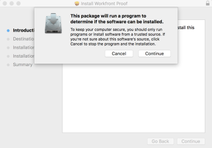

# デスクトッププルーフビューアのインストール

<!--Audited: 12/2023-->

デスクトッププルーフビューアは、主にインタラクティブコンテンツのプルーフを目的に設計されているアプリケーションで、お使いのローカルマシンにインストールする必要があります。

## 必要システム構成

このアプリケーションは、次のオペレーティングシステムでサポートされています。

* Windows 7 以降（32 ビットおよび 64 ビット）
* Mac OS X 10.9 以降（64 ビット）

{{latest-version}}

## アクセス要件

+++ 展開すると、この記事の機能のアクセス要件が表示されます。

<table style="table-layout:auto"> 
 <col> 
 <col> 
 <tbody> 
  <tr> 
   <td role="rowheader">Adobe Workfront パッケージ</td> 
   <td> 
任意
</td> 
  </tr> 
  <tr> 
   <td role="rowheader">Adobe Workfront プラン</td> 
   <td> 
任意
</td> 
  </tr> 
 </tbody> 
</table>

この表の情報について詳しくは、[Workfront ドキュメントのアクセス要件](/help/quicksilver/administration-and-setup/add-users/access-levels-and-object-permissions/access-level-requirements-in-documentation.md)を参照してください。

+++

## Mac へのデスクトッププルーフビューアーのインストール

Adobe Workfront 管理者または Workfront Proof 管理者がワークステーションにアプリをダウンロードし、デスクトッププルーフビューアをインタラクティブプルーフのデフォルトビューアとして設定してある場合は、ドキュメントエリアからインタラクティブプルーフを開くだけでインストールを完了できます。

そうでない場合は、次の手順に従います。

1. アプリをダウンロードするには、次のいずれかを行います。

   * 本番環境を使用している場合は、「[デスクトッププルーフビューアの Mac 本番環境用ダウンロードファイル](https://app.proofhq.com/desktopviewer/mac)」をクリックします。
   * プレビュー環境を使用している場合は、「[デスクトッププルーフビューアの Mac プレビュー環境用ダウンロードファイル](https://assets.preview.proofhq.com/nativeviewer/desktop_viewer/Workfront+Proof+Preview-2.1.44.pkg)」をクリックします。

1. ダウンロードしたファイルを開いて、インストールを開始します。
1. 表示されるインストールボックスで、「**続行**」をクリックし、次に「**インストール**」をクリックします。

   

1. ドキュメントエリアからインタラクティブプルーフを開きます。

>[!NOTE]
>
>インタラクティブプルーフを開いてもデスクトッププルーフビューアが起動しない場合は、おそらく、Workfront または Workfront Proof 管理者がデスクトッププルーフビューアをインタラクティブプルーフのデフォルトビューアとして設定する必要があります。詳しくは、[デスクトッププルーフビューアで非インタラクティブプルーフを開くためのユーザー設定](../../../workfront-proof/wp-work-proofsfiles/review-proofs-dpv/destop-proofing-viewer.md#user-setting-for-opening-non-interactive-proofs-in-the-desktop-proofing-viewer)を参照してください。

## Windows へのデスクトッププルーフビューアのインストール

Workfront または Workfront Proof 管理者がワークステーションにアプリをダウンロードし、デスクトッププルーフビューアをインタラクティブプルーフのデフォルトビューアとして設定してある場合は、ドキュメントエリアからインタラクティブプルーフを開くだけでインストールを完了できます。

>[!TIP]
>
>コマンドラインを使用して `Workfront Proof Setup 2.1.34.exe" /S` を実行すると、デスクトッププルーフビューアをインストールできます。

1. アプリをダウンロードするには、次のいずれかを行います。

   * 本番環境で、「[デスクトッププルーフビューアの Windows 本番環境用ダウンロードファイル](https://app.proofhq.com/desktopviewer/windows)」をクリックします。
   * プレビュー環境で、「[デスクトッププルーフビューアの Windows プレビュー環境用ダウンロードファイル](https://assets.preview.proofhq.com/nativeviewer/desktop_viewer/Workfront+Proof+Preview+Setup+2.1.44.exe)」をクリックします。

1. ダウンロードしたファイルを開いて、インストールを開始します。
1. 表示されるインストールボックスで、ダウンロードしたファイルを開いてインストールを開始します。

   

1. 表示されるセキュリティ警告ボックスで、「**実行**」をクリックします。 デスクトッププルーフビューアが自動的にインストールされ、実行されます。
1. （条件付き）Internet Explorer を使用してアプリケーションをインストールする場合は、アプリケーションのインストール後にブラウザーで起動ページを更新します。
1. ドキュメントエリアからインタラクティブプルーフを開きます。

デスクトッププルーフビューアをインストールすると、すべてのインタラクティブプルーフがデスクトッププルーフビューアで開きます。 インタラクティブプルーフを開いてもデスクトッププルーフビューアが起動しない場合は、おそらく、Workfront または Workfront Proof 管理者がデスクトッププルーフビューアをインタラクティブプルーフのデフォルトビューアとして設定する必要があります。詳しくは、[デスクトッププルーフビューアで非インタラクティブプルーフを開くためのユーザー設定](../../../workfront-proof/wp-work-proofsfiles/review-proofs-dpv/destop-proofing-viewer.md#user-setting-for-launching-non-interactive-proofs)を参照してください。
