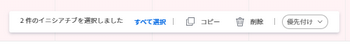

# イニシアチブを [!DNL Scenario Planner]

既存のイニシアチブをコピーして、イニシアチブを作成できます。 自分が作成したプランや、自分と共有するプランに対するイニシアチブをコピーできます。

## アクセス要件

<table style="table-layout:auto"> 
 <col> 
 <col> 
 <tbody> 
  <tr> 
   <td> 
[!DNL Adobe Workfront]<b> 計画*</b> 
 </td> 
   <td>[!UICONTROL Business] 以降</td> 
  </tr> 
  <tr> 
   <td> 
[!DNL Adobe Workfront]<b> ライセンス</b>*
 </td> 
   <td> 
[!UICONTROL Review] 以降
 </td> 
  </tr> 
  <tr> 
   <td><b>製品</b> </td> 
   <td> 
の追加ライセンスを購入する必要があります。 [!DNL Adobe Workfront Scenario Planner] をクリックして、この記事で説明する機能にアクセスします。
 
詳しくは、 [!DNL Workfront Scenario Planner]を参照してください。 <a href="../scenario-planner/access-needed-to-use-sp.md" class="MCXref xref">を使用するために必要なアクセス [!DNL Scenario Planner]</a>. 
 </td> 
  </tr> 
  <tr data-mc-conditions=""> 
   <td><strong>アクセスレベル設定*</strong> </td> 
   <td> 
[!UICONTROL 編集 ] 以降の [!DNL Scenario Planner]
 
注意：まだアクセス権がない場合は、Workfront管理者に、アクセスレベルに追加の制限を設定しているかどうかを問い合わせてください。 を参照してください。 [!DNL Workfront] 管理者は、 <a href="../administration-and-setup/add-users/configure-and-grant-access/create-modify-access-levels.md" class="MCXref xref">カスタムアクセスレベルの作成または変更</a>.
 </td> 
  </tr> 
  <tr data-mc-conditions=""> 
   <td> 
<strong>オブジェクト権限</strong> 
 </td> 
   <td> 
プランに対する [!UICONTROL 管理 ] 権限
 
プランへの追加アクセス権のリクエストについて詳しくは、 <a href="../scenario-planner/request-access-to-plan.md" class="MCXref xref">内のプランへのアクセスをリクエスト [!DNL Scenario Planner]</a>.
 </td> 
  </tr> 
 </tbody> 
</table>

## イニシアチブのコピー

イニシアチブをコピーする際は、次の点に注意してください。

* イニシアチブをコピーすると、コピーは元のイニシアチブと同じプランに配置されます。
* イニシアチブをコピーして、元のイニシアチブから次の情報を新しいイニシアチブに追加します。

   * [!UICONTROL 期間]
   * [!UICONTROL 担当業務]
   * [!UICONTROL 人] および [!UICONTROL 固定コスト]
   * [!UICONTROL 予定便益]

* イニシアチブをコピーすると、元のイニシアチブに情報が存在する場合に、プランの次の情報を変更できます。

   * 必要なジョブロール数
   * [!UICONTROL コスト]
   * [!UICONTROL プランの使用率]
   * ジョブの役割の使用率
   * [!UICONTROL 純価]

* プロジェクトを読み込んで作成されたイニシアチブ、または少なくとも 1 回プロジェクトに公開されたイニシアチブをコピーすると、次のような影響があります。

   * イニシアチブに関連付けられたプロジェクトは複製されません。
   * コピーしたイニシアチブはプロジェクトに接続されません。
   * これによって [!DNL Scenario Planner] 1 回以上公開されたプロジェクトの場合は、プロジェクトに関する節。

   プロジェクトへのイニシアチブの公開については、 [プロジェクトを更新または作成するには、 [!DNL Scenario Planner]](../scenario-planner/publish-scenarios-update-projects.md).

   プロジェクトのインポートによるイニシアチブの作成については、 [内のプランにプロジェクトをインポート [!DNL Scenario Planner]](../scenario-planner/import-projects-to-plans.md) .

## イニシアチブのコピー

1. 次をクリック： **[!UICONTROL メインメニュー]** アイコン を選択し、「 [!UICONTROL シナリオ].

   プランのリストが表示されます。

1. プランの名前をクリックして開き、コピーするイニシアチブを探します。
1. コピーするイニシアチブまたはイニシアチブの左側にあるボックスを選択し、[ ] をクリックします。 **[!UICONTROL コピー]** を選択します。

   

   [!DNL Workfront] イニシアチブが直ちにコピーされ、最後に選択したイニシアチブの下に配置されます。

   コピーしたイニシアチブの名前は次のとおりです *[!UICONTROL のコピー]`<Name of original initiative>`*.

   >[!NOTE]
   >
   >新しいイニシアチブの挿入場所に応じて、既存のイニシアチブの数が変わる場合があります。

1. コピーしたイニシアチブの名前を更新します。

   >[!TIP]
   >
   >イニシアチブを再度コピーする場合に混乱を避けるために、必ずイニシアチブの名前を更新することをお勧めします。

1. （オプション）新しく作成したイニシアチブの優先度を更新します。

   イニシアチブの優先順位については、 [のイニシアチブ優先度を更新 [!DNL Scenario Planner]](../scenario-planner/prioritize-initiatives.md).

1. クリック **[!UICONTROL プランを保存]** 変更を保存します。
