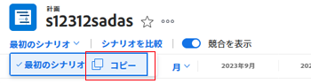
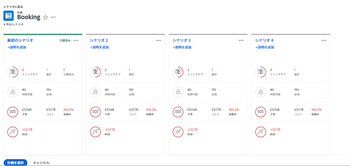
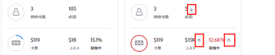
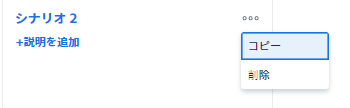

# [!DNL Scenario Planner] でプランシナリオを作成および比較

企業の長期戦略を計画する際、初期段階には持っていない、または考えてもみない情報は多くあります。関係者が受け入れられる最終的な戦略に到達するには、時間と実験が必要です。「what if」分析を実施して計画の複数のシナリオを作成すると、潜在的な状況を正確に予測および評価し、最終的に可能な限り最適な計画を策定するのに役立ちます。

## アクセス要件

以下が必要です。

<table style="table-layout:auto"> 
 <col> 
 <col> 
 <tbody> 
  <tr> 
   <td> 
[!DNL Adobe Workfront]<b> プラン*</b> 
 </td> 
   <td>[!UICONTROL Business] 以降</td> 
  </tr> 
  <tr> 
   <td> 
[!DNL Adobe Workfront]<b>ライセンス*</b> 
 </td> 
   <td> 
[!UICONTROL Review] 以降
 </td> 
  </tr> 
  <tr> 
   <td><b>製品</b> </td> 
   <td> 
この記事で説明する機能にアクセスするためには、[!DNL Adobe Workfront Scenario Planner] 用の追加ライセンスを購入する必要があります。
 
[!DNL Workfront Scenario Planner]の取得については、<a href="../scenario-planner/access-needed-to-use-sp.md" class="MCXref xref">[!DNL Scenario Planner]</a>の使用に必要なアクセス権を参照してください。 
 </td> 
  </tr> 
  <tr data-mc-conditions=""> 
   <td><strong>アクセスレベル設定*</strong> </td> 
   <td> 
編集以上のアクセス権 [!DNL Scenario Planner]
 
メモ：まだアクセス権がない場合は、[!DNL Workfront] 管理者に問い合わせて、アクセスレベルに追加の制限が設定されているかどうかを確認してください。Workfront 管理者がアクセスレベルを変更する方法について詳しくは、<a href="../administration-and-setup/add-users/configure-and-grant-access/create-modify-access-levels.md" class="MCXref xref">カスタムアクセスレベルの作成または変更</a>を参照してください。
 </td> 
  </tr> 
  <tr data-mc-conditions=""> 
   <td> 
<strong>オブジェクトの権限</strong> 
 </td> 
   <td> 
プランに対する[!UICONTROL Manage]権限
 
計画への追加アクセス権のリクエストについて詳しくは、<a href="../scenario-planner/request-access-to-plan.md" class="MCXref xref">[!DNL Scenario Planner]</a> の計画へのアクセスをリクエストを参照してください。
 </td> 
  </tr> 
 </tbody> 
</table>

&#42;ご利用のプラン、ライセンスの種類、アクセス権を確認するには、[!DNL Workfront] 管理者にお問い合わせください。

## シナリオの作成

シナリオは計画のコピーです。シナリオは必要な数だけ作成できます。ただし、簡単に比較できるように、シナリオの数を最小限に抑えることをお勧めします。

1. **[!UICONTROL メインメニュー]**&#x200B;アイコン 、[!UICONTROL シナリオ]の順にクリックします。

1. 計画を作成します。

   計画の作成について詳しくは、[ [!DNL Scenario Planner]](../scenario-planner/create-and-edit-plans.md) で計画を作成および編集を参照してください。

   最初に作成したプランは、「[!UICONTROL 初期シナリオ]」として自動的に保存されます。

1. 既存のシナリオの横にある下向き矢印をクリックし、**[!UICONTROL コピー]**&#x200B;アイコンを選択します。

   

   これにより、コピーされたシナリオと同じ情報を持つ新しいシナリオが作成されます。計画の 2 番目のシナリオの場合は「[!UICONTROL シナリオ 2]」、3 番目のシナリオの場合は「[!UICONTROL シナリオ 3]」という名前が自動的に付けられます。シナリオの名前は変更できません。 作成できるコピー数に制限はありません。

   <!--
   <MadCap:conditionalText data-mc-conditions="QuicksilverOrClassic.Draft mode">
   (NOTE:this might change)
   </MadCap:conditionalText>
   -->

1. 次のいずれかの方法で、新しいシナリオを更新します。

   * イニシアチブを作成、更新、または削除

     >[!TIP]
     >
     >シナリオのイニシアチブを削除すると、すべてのシナリオからではなく、選択したシナリオからのみ削除されます。

     イニシアチブの作成について詳しくは、[ [!DNL Scenario Planner]](../scenario-planner/create-and-edit-initiatives.md) のイニシアチブを作成および編集を参照してください。

   * イニシアチブの優先順位を更新
   * 人材や予算の情報を調整
   * シナリオのイニシアチブの競合を確認して調整

     競合の解決について詳しくは、[イニシアチブの競合を解決 [!DNL Scenario Planner]](../scenario-planner/resolve-conflicts-in-sp.md)を参照してください。

1. 「**[!UICONTROL 計画の保存]**」をクリックして、変更を保存します。

## シナリオを比較する

シナリオを作成した後、それらを比較して組織に最適なシナリオを見つけることができます。

1. シナリオを比較する計画に移動します。
1. 「**[!UICONTROL シナリオを比較]**」をクリックします。シナリオ比較ページが表示されます。

   計画の既存のシナリオはすべて、横に並べたカード形式で表示されます。初期シナリオは常に最初にリストされ、静的です。

   

1. （オプション）右にスクロールして、すべてのシナリオカードを表示します。

   次の情報がシナリオカードに表示されます。

   <table style="table-layout:auto"> 
    <col> 
    <col> 
    <tbody> 
     <tr> 
      <td>シナリオの名前</td> 
      <td> 
Workfront によって自動的に生成される名前であり、編集することはできません。例えば、「[!UICONTROL Initial scenario]」、「[!UICONTROL Scenario 2]」などです。 
 </td> 
     </tr> 
     <tr> 
      <td>シナリオの説明</td> 
      <td>シナリオの詳細を説明できる手動入力。 </td> 
     </tr> 
     <tr> 
      <td>利用可能な担当業務</td> 
      <td>計画の期間中に計画の予算から利用可能な職務の数。 </td> 
     </tr> 
     <tr> 
      <td>必須担当業務</td> 
      <td>イニシアチブに基づく、必要な担当業務の数。 </td> 
     </tr> 
     <tr> 
      <td>予算</td> 
      <td>このシナリオでプランに定義された総予算。プランに関する予算情報については、<a href="../scenario-planner/plans-overview.md" class="MCXref xref">[!DNL Scenario Planner]</a> のプランの概要を参照してください。 </td> 
     </tr> 
     <tr> 
      <td>コスト</td> 
      <td>シナリオのイニシアチブに関連するコスト。コストについて詳しくは、<a href="../scenario-planner/initiatives-overview.md" class="MCXref xref">[!DNL Scenario Planner]</a> のイニシアチブの概要を参照してください。 </td> 
     </tr> 
     <tr> 
      <td>稼働率</td> 
      <td>このシナリオのプランの [!UICONTROL Budget Utilization] の割合。[!UICONTROL Budget Utilization] の割合について詳しくは、<a href="../scenario-planner/plans-overview.md" class="MCXref xref">[!DNL Scenario Planner]</a> のプランの概要を参照してください。 </td> 
     </tr> 
     <tr> 
      <td>純価</td> 
      <td>このシナリオのプランの [!UICONTROL Net Value]。プランの [!UICONTROL Net Value] について詳しくは、<a href="../scenario-planner/plans-overview.md" class="MCXref xref">[!DNL Scenario Planner]</a> のプランの概要を参照してください。 </td> 
     </tr> 
     <tr> 
      <td>イニシアチブ</td> 
      <td>このシナリオのプランのイニシアチブ数。</td> 
     </tr> 
     <tr> 
      <td>競合</td> 
      <td>このシナリオのプラン内の競合の種類を示すイニシアチブの数。イニシアチブの競合について詳しくは、<a href="../scenario-planner/resolve-conflicts-in-sp.md" class="MCXref xref">[!DNL Scenario Planner]</a> でのイニシアチブの競合を解決を参照してください。 </td> 
     </tr> 
    </tbody> 
   </table>

   >[!NOTE]
   >
   >初期シナリオと追加のシナリオで情報が異なる場合は、変更された値の横に上向き矢印または下向き矢印が表示され、初期シナリオと比較して、その値の増減を示します。
   >
   >
   >
   >
   >例えば、予算、担当業務の数、イニシアチブの数がシナリオごとに変わる場合があります。

1. シナリオの名前をクリックしてアクセスし、変更を加えます。

   詳しくは、この記事の[シナリオを作成](#create-scenarios)の節を参照してください。

1. 「**[!UICONTROL 説明を追加]**」をクリックしてシナリオの説明を追加します。

   または

   説明フィールドをクリックして更新し、画面の任意の場所をクリックして変更を保存します。

1. （オプション）**[!UICONTROL その他]**&#x200B;メニュー  をクリックしてシナリオを「**[!UICONTROL コピー]**」または「**[!UICONTROL 削除]**」します。

   

   シナリオをコピーすると、自動的にカードページに表示され、「[!UICONTROL シナリオ] `<next number in order>`」のパターンに従って名前が変更されます。

1. （条件付き）「**[!UICONTROL 削除]**」をクリックした場合は、「**[!UICONTROL はい、削除します]**」をクリックして確定します。

   削除したシナリオは復元できません。

   シナリオの削除について詳しくは、[ [!DNL Scenario Planner]](../scenario-planner/delete-plans.md) のプランを削除を参照してください。

1. 「**[!UICONTROL プランを保存]**」をクリックして、シナリオとプランを保存します。
