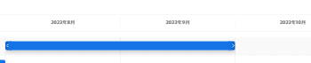

# のイニシアチブを作成および編集します [!DNL Scenario Planner]

を使用する場合、 [!UICONTROL Adobe Workfront Scenario Planner]を使用すると、自分が作成したプランまたは自分と共有したプランにイニシアチブを作成できます。 イニシアチブを作成することで、小さい組織単位が計画の完了にどの程度貢献しているかを確認できます。 たとえば、組織が今後 3 年間、新しい市場に進出する計画を立てている場合、各部門に対してこの計画内で取り組みを作成し、各部門がこの計画を達成するための人や予算に対する必要性を見積もることができます。

## アクセス要件

以下が必要です。

<table style="table-layout:auto"> 
 <col> 
 <col> 
 <tbody> 
  <tr> 
   <td> 
[!DNL Adobe Workfront] 計画*
 </td> 
   <td>[!UICONTROL Business] 以降</td> 
  </tr> 
  <tr> 
   <td> 
[!DNL Adobe Workfront] ライセンス* 
 </td> 
   <td> 
[!UICONTROL Review] 以降
 </td> 
  </tr> 
  <tr> 
   <td>製品 </td> 
   <td> 
の追加ライセンスを購入する必要があります。 [!DNL Adobe Workfront Scenario Planner] をクリックして、この記事で説明する機能にアクセスします。 
 
詳しくは、 [!DNL Workfront Scenario Planner]を参照してください。 <a href="../scenario-planner/access-needed-to-use-sp.md" class="MCXref xref">を使用するために必要なアクセス [!DNL Scenario Planner]</a>. 
 </td> 
  </tr> 
  <tr data-mc-conditions=""> 
   <td>アクセスレベル設定* </td> 
   <td> 
[!UICONTROL 編集 ] 以降の [!DNL Scenario Planner]
 
まだアクセス権がない場合は、 [!DNL Workfront] 管理者（アクセスレベルに追加の制限を設定している場合） を参照してください。 [!DNL Workfront] 管理者は、 <a href="../administration-and-setup/add-users/configure-and-grant-access/create-modify-access-levels.md" class="MCXref xref">カスタムアクセスレベルの作成または変更</a>.
 </td> 
  </tr> 
  <tr data-mc-conditions=""> 
   <td> 
オブジェクト権限 
 </td> 
   <td> 
プランに対する [!UICONTROL 管理 ] 権限
 
プランへの追加アクセス権のリクエストについて詳しくは、 <a href="../scenario-planner/request-access-to-plan.md" class="MCXref xref">内のプランへのアクセスをリクエスト [!DNL Scenario Planner]</a>.
 </td> 
  </tr> 
 </tbody> 
</table>

*お持ちのプラン、ライセンスの種類、アクセス権を調べるには、 [!DNL Workfront] 管理者。

## 前提条件

プラン内にイニシアチブを作成する前に、プランまたは別のユーザーがプランを共有する必要があります。 プランの作成について詳しくは、 [でプランを作成および編集 [!DNL Scenario Planner]](../scenario-planner/create-and-edit-plans.md).

イニシアチブの詳細については、 [以下のイニシアティブの概要 [!DNL Scenario Planner]](../scenario-planner/initiatives-overview.md).

## イニシアチブの作成

イニシアチブは、次の方法で作成できます。

* ゼロから。
* プランにプロジェクトを読み込む

   プロジェクトをプラン内のイニシアチブとしてインポートする方法については、 [内のプランにプロジェクトをインポート [!DNL Scenario Planner]](../scenario-planner/import-projects-to-plans.md).

* 既存のイニシアチブをコピーする。

   イニシアチブのコピーについては、 [イニシアチブを [!DNL Scenario Planner]](../scenario-planner/copy-initiatives.md).

イニシアチブをゼロから作成するには、次の手順に従います。

1. 次をクリック： **[!UICONTROL メインメニュー]** アイコン を選択し、「 [!UICONTROL シナリオ].

1. イニシアチブを作成するプランの名前をクリックします。
1. 次をクリック： **+アイコン** 左に **[!UICONTROL 新しい取り組み]**

   または

   次をクリック： **[!UICONTROL 新しい取り組み]** ドロップダウンメニューで、次のいずれかを選択します。 **[!UICONTROL 新しい取り組み]** または **[!UICONTROL プロジェクトの読み込み].**

1. イニシアチブの名前を **[!UICONTROL 無題のイニシアチブ]** 」フィールドに入力し、 Enter キーを押すか、ページ上の他の場所をクリックします。

   イニシアチブは、プランのタイムラインに青いバーで表示されます。 デフォルトでは、イニシアチブの期間は 1 か月で、常にプランの最初の月から始まります。

1. （オプション）左側のパネルとタイムラインの間にある分離バーをドラッグして、左側のパネルのサイズを変更します。

1. （オプション）イニシアチブバーの末尾をドラッグして、期間を 1 ヶ月以上に延長し、イニシアティブの最後の月を表示する場所にリリースします。
1. （オプションおよび条件付き）イニシアチブの期間がプランの期間より短い場合は、イニシアチブバーをプランのタイムライン上の別の位置にドラッグ&amp;ドロップして、別の期間に移動します。

   

   >[!IMPORTANT]
   >
   >期間は月単位で選択できます。 最初から作成するイニシアチブの期間は、プランの期間を超えることはできません。

1. （オプション） **[!UICONTROL 月]** ドロップダウンメニューで、次のいずれかのオプションを選択して、プランのタイムラインを変更します。

   | ドロップダウンメニューオプション | 説明 |
   |---|---|
   | [!UICONTROL 月] | タイムラインを月別に表示します。 これは、1 年間のプランのデフォルトのオプションです。 |
   | [!UICONTROL 四半期] | 四半期ごとにタイムラインを表示します。 このオプションは、 [!UICONTROL 期間] 計画の中で 3 年か 5 年は これは、3 年間プランのデフォルトのオプションです。 |
   | [!UICONTROL Year] | 年別のタイムラインを表示します。 このオプションは、 [!UICONTROL 期間] 計画の内の 5 年間。 これは、5 年間のプランのデフォルトのオプションです。 |

1. （オプション）イニシアチブの期間全体を表示するには、左から右にスクロールします。
1. （オプション） **[!UICONTROL 今日]** 現在の日付に戻るインジケーター行。

   

   >[!TIP]
   >
   >計画が将来の日付または過去の日付で、現在の日付が含まれていない場合は、「今日」の指標は表示されません。

1. イニシアチブのバーをクリックします。 右側にイニシアチブの詳細パネルが開きます。

   

   次の情報を指定または確認します。

   <table style="table-layout:auto"> 
    <col> 
    <col> 
    <tbody> 
     <tr data-mc-conditions=""> 
      <td role="rowheader">イニシアチブ期間</td> 
      <td>イニシアチブの期間（月単位）。 </td> 
     </tr> 
     <tr data-mc-conditions=""> 
      <td role="rowheader">開始日と終了日</td> 
      <td>イニシアチブの開始日と終了日。</td> 
     </tr> 
     <tr> 
      <td role="rowheader">必要なジョブの役割の節 </td> 
      <td> 
次をクリック： <strong>[!UICONTROL ジョブの役割の入力を開始 ]</strong> フィールドを開き、リストから役割を選択するか、名前を入力します。アクティブな ジョブの役割。 
 
FTE を使用するように計画が設定されているか、時間を使用するかに応じて、 FTE でこのイニシアチブに必要なジョブロール数を追加 または時間 イニシアティブの各月に. イニシアチブの最初の 3 か月がデフォルトで表示されます。
 
イニシアチブのジョブの役割情報を更新すると、プランの必要なジョブの役割情報も更新されます。 
 
FTE または時間を使用するプランの設定については、 <a href="../scenario-planner/create-and-edit-plans.md" class="MCXref xref">でプランを作成および編集 [!DNL Scenario Planner]</a>. 

      
<b>重要</b>
  
      
すべての計算について [!DNL Scenario Planner], [!DNL Workfront] は次の値を使用します。1 日= 8 時間 

   
<b>ヒント</b>

   <ul> 
       <li> 
次の月に移行するには、 [!UICONTROL Tab] キーを使用します。 
 </li> 
      <li> 
 すべて アクティブ システムのジョブの役割は、このフィールドをクリックすると表示されます。 
 </li> 
       <li> 
プランの「使用可能なジョブ」ロールに既に追加されているジョブロールが最初に表示されます。 使用可能なジョブの役割をプランに追加する方法については、 <a href="../scenario-planner/create-and-edit-plans.md" class="MCXref xref">シナリオプランナーでのプランの作成と編集</a>. 
 </li> 
       <li> 
[!DNL Workfront] では、フルタイム同等の時間が 1 か月に 160 時間であると見なされます。 
 
シナリオ・プランナのすべての計算に対して、Workfrontは次の値を使用します。1 日= 8 時間 
</li> 
      </ul> 
 
FTE には、1 より小さい数値または 10 進数を入力できます または 時間. 例えば、0.5 コンサルタントの役割を持つ場合、コンサルタントは FTE の半分（通常 4 時間、8 時間は 1 FTE）をこのイニシアティブに取り組むように割り当てます。 
  </td> 
     </tr> 
     <tr> 
      <td rowspan="3" role="rowheader">コストセクション</td> 
      <td> 
イニシアチブの合計コストは「[!UICONTROL コスト ]」セクションの右側に表示されます。 [!DNL Workfront] 次の式を使用してイニシアチブのコストを計算します。
 
<code>[!UICONTROL Initiative Costs] = [!UICONTROL Fixed Costs] + [!UICONTROL People] Costs</code> 
 </td> 
     </tr> 
     <tr> 
      <td> 
内 <strong>[!UICONTROL 固定コスト ]</strong> 「 」フィールドで、このイニシアチブを完了するのに費やすコストと思われる概算額を手動で入力します。 イニシアチブに対して推定されるジョブの役割に関連するコストを含めないでください。
 
Tab キーを使用して、1 か月から次の月に移動して、イニシアチブの各月の金額を入力します。 
 </td> 
     </tr> 
     <tr> 
      <td> 
       
 
        
FTE を使用するように計画が設定されているか時間を使用するかに応じて、[!UICONTROL Workfront] は次の式を使用して [!UICONTROL People Cost] を計算します。
 
        <ul> 
         <li> 
FTE を使用する場合： 
 
<code>[!UICONTROL People Costs] = SUM(Job role hourly rate * Number of months in the Duration * 160 * Number of FTEs)</code>（ 160 は 1 ヶ月の総勤務時間数） 
 </li> 
         <li> 
時間を使用する場合： 
 
<code>Monthly People Costs = SUM(Job role hourly rate * Number of hours estimated for an initiative)</code> 
 
時間または工数を使用するプランの設定について詳しくは、 <a href="../scenario-planner/create-and-edit-plans.md" class="MCXref xref">シナリオプランナーでのプランの作成と編集</a>.
 </li> 
        </ul> 
        
人物コストは、為替レート環境設定で選択したベース通貨で計算されます。 為替レートの詳細は、 <a href="../administration-and-setup/manage-workfront/exchange-rates/set-up-exchange-rates.md" class="MCXref xref">為替レートの設定</a>.
 
        
イニシアチブのコスト情報を更新すると、プランの [!UICONTROL コスト ] 領域も更新されます。 
 
       
 </td> 
     </tr> 
     <tr> 
      <td colspan="2" role="rowheader"> 
イニシアチブに必要なジョブの役割とコストの値を定義し、イニシアチブの期間を変更すると、次のいずれかのシナリオが発生する場合があります。
 
       <ul> 
        <li> 
イニシアチブを短くする場合は、 [!DNL Workfront] プランから削除された時間に関連する必要なリソースの量とコストを削除します。 ジョブの役割は計画に残りますが、必須の FTE や 時間. プランと予算に使用可能なリソースは変更されません。 プランの更新については、 <a href="../scenario-planner/create-and-edit-plans.md" class="MCXref xref">でプランを作成および編集 [!DNL Scenario Planner]</a>. 
 </li> 
        <li> 
イニシアチブの期間を長くする場合は、新しく追加したイニシアティブの月の役割とコストの金額を指定する必要があります。 
 </li> 
       </ul> </td> 
     </tr> 
     <tr> 
      <td role="rowheader">[!DNL Net Value] セクション</td> 
      <td>内 <strong>[!DNL Net Value]</strong> セクションで、 <strong>[!UICONTROL Planned Benefit]</strong> フィールドに入力します。 このイニシアティブを達成する利点は次の通りです。 </td> 
     </tr> 
    </tbody> 
   </table>

   >[!NOTE]
   >
   >計画の役割数と予算、編集中のイニシアチブの役割数とコスト、およびその上にあるすべてのイニシアチブのコストを定義済みで、計画に指定した金額をすべて超える場合。 [!DNL Workfront] このイニシアチブを完了するのに十分なリソースがない場合があります。 [!DNL Workfront] このイニシアチブを達成しようとすると、これが競合としてマークされ、赤い棒で表示されます。 競合したイニシアチブに続くすべてのイニシアチブが赤い背景で表示されます。 リソースが不十分な最初のイニシアチブから始めて、イニシアチブのニーズの一部を調整する必要が生じる場合があります。 競合するイニシアチブの調整については、 [次の場所でのイニシアチブの競合を解決 [!DNL Scenario Planner]](../scenario-planner/resolve-conflicts-in-sp.md).

1. （オプション）ジョブロールの名前の上にマウスポインターを置いて、 **[!UICONTROL ごみ箱アイコン]**  イニシアチブから削除します。

1. （条件付き）イニシアチブに変更を加えた場合は、 **[!UICONTROL 適用]**.

   <!--
   <MadCap:conditionalText data-mc-conditions="QuicksilverOrClassic.Draft mode">
   (NOTE: Add more steps here as you can do more in the Initiative box over time)
   </MadCap:conditionalText>
   -->

1. （条件付き）何も変更しない場合、 **X** イニシアチブの詳細パネルの右上にあるアイコンをクリックして閉じます。
1. （オプション）イニシアチブの優先度を更新します。

   イニシアチブの優先順位については、 [シナリオプランナーのイニシアチブ優先度を更新](../scenario-planner/prioritize-initiatives.md).

   >[!TIP]
   >
   >リストの最初にリストされたイニシアチブの優先順位が高く、リストの下にリストされたイニシアチブの前にリソースが取得されます。

1. クリック **[!UICONTROL プランを保存]**.

   これで、イニシアチブがプランに含まれます。

   プランからイニシアチブを削除する方法については、 [内のイニシアチブを削除 [!DNL Scenario Planner]](../scenario-planner/delete-initiatives.md).
