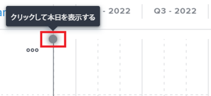
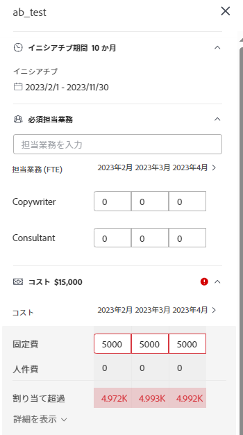

# [!DNL Scenario Planner] でイニシアチブを作成および編集

[!UICONTROL Adobe Workfront Scenario Planner] を使用すると、自分が作成した計画や共有された計画にイニシアチブを作成できます。イニシアチブを作成することで、小さな組織単位が計画の完成にどのように貢献するかを確認することができます。例えば、組織が新しい市場に拡大するための今後 3 年間のプランがある場合、このプラン内で各部門のイニシアチブを作成し、この計画を達成するために各部門で必要な人員と予算を見積もることができます。

## アクセス要件

以下が必要です。

<table style="table-layout:auto"> 
 <col> 
 <col> 
 <tbody> 
  <tr> 
   <td> 
[!DNL Adobe Workfront] プラン*
 </td> 
   <td>[!UICONTROL Business] 以降</td> 
  </tr> 
  <tr> 
   <td> 
[!DNL Adobe Workfront] ライセンス* 
 </td> 
   <td> 
[!UICONTROL Review] 以降
 </td> 
  </tr> 
  <tr> 
   <td>製品 </td> 
   <td> 
この記事で説明する機能にアクセスするには、[!DNL Adobe Workfront Scenario Planner] 用の追加ライセンスを購入する必要があります。 
 
[!DNL Workfront Scenario Planner] の取得について詳しくは、<a href="../scenario-planner/access-needed-to-use-sp.md" class="MCXref xref">[!DNL Scenario Planner]</a> を使用する場合に必要なアクセス権を参照してください。 
 </td> 
  </tr> 
  <tr data-mc-conditions=""> 
   <td>アクセスレベル設定* </td> 
   <td> 
次に対する[!UICONTROL Edit]以上のアクセス権： [!DNL Scenario Planner]
 
まだアクセス権を持っていない場合は、[!DNL Workfront] 管理者に問い合わせて、アクセスレベルに追加の制限事項が設定されているかどうかを確認してください。[!DNL Workfront] 管理者がアクセスレベルを変更する方法について詳しくは、<a href="../administration-and-setup/add-users/configure-and-grant-access/create-modify-access-levels.md" class="MCXref xref">カスタムアクセスレベルを作成または変更</a>を参照してください。
 </td> 
  </tr> 
  <tr data-mc-conditions=""> 
   <td> 
オブジェクト権限 
 </td> 
   <td> 
プランに対する[!UICONTROL Manage]権限
 
プランへの追加アクセス権のリクエストについて詳しくは、<a href="../scenario-planner/request-access-to-plan.md" class="MCXref xref">[!DNL Scenario Planner]</a> でのプランへの利用申請を参照してください。
 </td> 
  </tr> 
 </tbody> 
</table>

*ご利用のプラン、ライセンスタイプまたはアクセス権を確認するには、[!DNL Workfront] 管理者にお問い合わせください。

## 前提条件

計画内にイニシアチブを作成する前に、計画を作成するか、別のユーザーと計画を共有する必要があります。計画の作成について詳しくは、[ [!DNL Scenario Planner]](../scenario-planner/create-and-edit-plans.md) での計画の作成と編集を参照してください。

イニシアチブについて詳しくは、[ [!DNL Scenario Planner]](../scenario-planner/initiatives-overview.md) のイニシアチブの概要を参照してください。

## イニシアチブの作成

イニシアチブは、以下の方法で作成できます。

* 最初から。
* プランにプロジェクトを読み込む

  プロジェクトをプラン内のイニシアチブとして読み込む方法について詳しくは、[ [!DNL Scenario Planner]](../scenario-planner/import-projects-to-plans.md) のプランにプロジェクトを読み込むを参照してください。

* 既存のイニシアチブをコピーする。

  イニシアチブのコピーについて詳しくは、[ [!DNL Scenario Planner]](../scenario-planner/copy-initiatives.md) でイニシアチブをコピーを参照してください。

イニシアチブを最初から作成するには、以下のように行います。

1. **[!UICONTROL メインメニュー]**&#x200B;アイコン 、[!UICONTROL シナリオ]の順にクリックします。

1. イニシアチブを作成するプランの名前をクリックします。
1. **[!UICONTROL 新しいイニシアチブ]**&#x200B;の左にある **+ アイコン**&#x200B;をクリックします。

   または

   **[!UICONTROL 新しいイニシアチブ]**&#x200B;ドロップダウンメニューをクリックして、**[!UICONTROL 新しいイニシアチブ]**&#x200B;と&#x200B;**[!UICONTROL プロジェクトを読み込み]のいずれかを選択します。**

1. イニシアチブの名前を&#x200B;**[!UICONTROL 名称未設定のイニシアチブ]**&#x200B;フィールドに入力し、Enter キーを押すか、ページ上の任意の他の場所をクリックします。

   イニシアチブはプランのタイムラインに、青いバーで表示されます。デフォルトでは、イニシアチブの期間は 1 か月で、常にプランの最初の月から始まります。

1. （オプション）左側のパネルとタイムラインの間にある分離バーをドラッグして、左側のパネルのサイズを変更します。

1. （オプション）イニシアチブバーの端をドラッグして、期間を 1 か月超に延長し、イニシアチブの最後の月を表示する場所にリリースします。
1. （オプションおよび条件付き）イニシアチブの期間がプランの期間より短い場合は、プランのタイムライン上の別の位置にイニシアチブバーをドラッグ＆ドロップして、別の時間枠に移動します。

   

   >[!IMPORTANT]
   >
   >期間は月単位でのみ選択できます。最初から作成するイニシアチブの期間は、プランの期間を超えることはできません。

1. （オプション）「**[!UICONTROL 月]**」ドロップダウンメニューから、次のいずれかのオプションを選択して、プランのタイムラインを変更します。

   | ドロップダウンメニューオプション | 説明 |
   |---|---|
   | [!UICONTROL 月] | 月ごとのタイムラインを表示します。これは、1 年の計画のデフォルトのオプションです。 |
   | [!UICONTROL 四半期] | 四半期ごとのタイムラインを表示します。このオプションは、計画の[!UICONTROL 期間]が 3 年または 5 年の場合にのみ使用できます。3 年計画のデフォルトのオプションです。 |
   | [!UICONTROL 年] | 年ごとのタイムラインを表示します。このオプションは、計画の[!UICONTROL 期間]が 5 年の場合にのみ使用できます。これは 5年計画のデフォルトのオプションです。 |

1. （オプション）左から右にスクロールして、イニシアチブの期間全体を確認します。
1. （オプション）現在の日付に戻るには、「**[!UICONTROL 今日]**」のインジケーターラインをクリックします。

   

   >[!TIP]
   >
   >計画が将来の日付または過去の日付で、現在の日付が含まれていない場合は、「今日」のインジケーターは表示されません。

1. イニシアチブのバーをクリックします。イニシアチブの詳細パネルが右側に開きます。

   

   次の情報を指定または確認します。

   <table style="table-layout:auto"> 
    <col> 
    <col> 
    <tbody> 
     <tr data-mc-conditions=""> 
      <td role="rowheader">イニシアチブ期間</td> 
      <td>イニシアチブの期間（月単位）。 </td> 
     </tr> 
     <tr data-mc-conditions=""> 
      <td role="rowheader">開始日と終了日</td> 
      <td>イニシアチブの開始日と終了日。</td> 
     </tr> 
     <tr> 
      <td role="rowheader">「必須担当業務」セクション </td> 
      <td> 
「<strong>[!UICONTROL Start typing job role]</strong>」フィールドをクリックし、リストから役割を選択するか、アクティブな担当業務の名前の入力を開始します。 
 
FTE と時間数のどちらを使用するように計画が設定されているかに応じて、このイニシアチブに必要な担当業務の数をイニシアチブの各月に FTE の数または時間数で追加します。イニシアチブの最初の 3 か月がデフォルトで表示されます。
 
イニシアチブの担当業務の情報を更新すると、計画の必須担当業務の情報も更新されます。 
 
FTE または時間数を使用するように計画を設定する方法について詳しくは、<a href="../scenario-planner/create-and-edit-plans.md" class="MCXref xref">[!DNL Scenario Planner]</a> での計画の作成および編集を参照してください。 

      
<b>重要</b>
  
      
[!DNL Scenario Planner] のすべての計算について、[!DNL Workfront] では、1 FTE = 8 時間の値を使用します。 

   
<b>ヒント</b>

   <ul> 
       <li> 
[!UICONTROL Tab] キーを使用すると、次の月に移動します。 
 </li> 
      <li> 
 このフィールドをクリックすると、システム内のすべてのアクティブな担当業務が一覧表示されます。 
 </li> 
       <li> 
計画の利用可能な担当業務に既に追加されている担当業務が最初に表示されます。利用可能な担当業務を計画に追加する方法について詳しくは、<a href="../scenario-planner/create-and-edit-plans.md" class="MCXref xref">シナリオプランナーでのプランの作成と編集</a>を参照してください。 
 </li> 
       <li> 
[!DNL Workfront] では、1 か月に 160 時間がフルタイムと同等であると考えます。 
 
シナリオプランナーのすべての計算で、Workfront は次の値を使用します：1 FTE = 8 時間。 
</li> 
      </ul> 
 
FTE や時間数には、1 FTE 未満の数値や少数を入力できます。例えば、コンサルタントの担当業務が 0.5 の場合、コンサルタントが FTE の半分（通常は 4 時間、1 FTE が 8 時間の場合）をこのイニシアチブの作業に費やすことを意味します。 
  </td> 
     </tr> 
     <tr> 
      <td rowspan="3" role="rowheader">「コスト」セクション</td> 
      <td> 
イニシアチブの合計コストは「[!UICONTROL Costs]」セクションの右側に表示されます。[!DNL Workfront] では、次の式を使用してイニシアチブのコストを計算します。
 
<code>[!UICONTROL Initiative Costs] = [!UICONTROL Fixed Costs] + [!UICONTROL People] Costs</code> 
 </td> 
     </tr> 
     <tr> 
      <td> 
「<strong>[!UICONTROL Fixed Costs]</strong>」フィールドに、このイニシアチブを完了するのに費やすと思われるコストのおおよその見積もり額を手動で入力します。イニシアチブに対して見積もられた担当業務に関連付けられたコストを含めないようにします。
 
Tab キーを使用して、ある月から次の月に移動しながら、イニシアチブの各月の金額を入力します。 
 </td> 
     </tr> 
     <tr> 
      <td> 
       
 
        
FTE と時間数のどちらを使用するように計画が設定されているかに応じて、[!UICONTROL Workfront] は次の式を使用して [!UICONTROL People Cost] を計算します。
 
        <ul> 
         <li> 
FTE を使用する場合： 
 
<code>[!UICONTROL People Costs] = SUM(Job role hourly rate * Number of months in the Duration * 160 * Number of FTEs)</code>（160 は 1 か月の労働時間数の合計です）。 
 </li> 
         <li> 
時間を使用する場合 
 
<code>Monthly People Costs = SUM(Job role hourly rate * Number of hours estimated for an initiative)</code> 
 
時間数または FTE を使用するプランの設定について詳しくは、<a href="../scenario-planner/create-and-edit-plans.md" class="MCXref xref">シナリオプランナーでのプランの作成と編集</a>を参照してください。
 </li> 
        </ul> 
        
人件費は、為替レート環境設定で選択した基準通貨で計算されます。為替レートについて詳しくは、<a href="../administration-and-setup/manage-workfront/exchange-rates/set-up-exchange-rates.md" class="MCXref xref">為替レートの設定</a>を参照してください。
 
        
イニシアチブのコスト情報を更新すると、プランの [!UICONTROL Costs] エリアも更新されます。 
 
       
 </td> 
     </tr> 
     <tr> 
      <td colspan="2" role="rowheader"> 
イニシアチブに必要な担当業務とコストの値を定義し、イニシアチブの期間を変更すると、次のいずれかのシナリオが発生する場合があります。
 
       <ul> 
        <li> 
イニシアチブを短くする場合は、[!DNL Workfront] は、計画から削除された時間に関連する必要なリソースの量とコストを削除します。担当業務は計画に残りますが、必要な FTE または時間がありません。計画と予算に使用可能なリソースは変更されません。 計画に関する情報の更新について詳しくは、<a href="../scenario-planner/create-and-edit-plans.md" class="MCXref xref">[!DNL Scenario Planner]</a> での計画の作成と編集を参照してください。 
 </li> 
        <li> 
イニシアチブの期間を長くする場合は、新しく追加したイニシアティブの月の担当業務の量とコストを指定する必要があります。 
 </li> 
       </ul> </td> 
     </tr> 
     <tr> 
      <td role="rowheader">[!DNL Net Value] セクション</td> 
      <td><strong>[!DNL Net Value]</strong> セクションで、「<strong>[!UICONTROL Planned Benefit]</strong>」フィールドにおおよその見積もり額を手動で入力します。この額は、イニシアチブ達成のメリットであるとあなたが考えるものです。 </td> 
     </tr> 
    </tbody> 
   </table>

   >[!NOTE]
   >
   >プランの担当業務の数と予算、編集中のイニシアチブの担当業務の数とコスト、およびその上にあるすべてのイニシアチブのコストを定義済みで、それらすべてがプランに指定した金額を超える場合、[!DNL Workfront] はそのイニシアチブを完了するのに十分なリソースがないと判断する場合があります。[!DNL Workfront] がこのイニシアチブを達成しようとすると、これが競合としてマークされ、赤いバーで表示されます。競合したイニシアチブに続くすべてのイニシアチブが赤い背景で表示されます。リソースが不十分な最初のイニシアチブから始めて、イニシアチブのニーズの一部を調整する必要が生じる場合があります。競合するイニシアチブの調整について詳しくは、[ [!DNL Scenario Planner]](../scenario-planner/resolve-conflicts-in-sp.md) でのイニシアチブの競合を解決を参照してください。

1. （オプション）担当業務の名前の上にポインタを合わせて、****&#x200B;ごみ箱アイコン  をクリックして、イニシアチブから削除します。

1. （条件付き）イニシアチブに変更を加えた場合は、「**[!UICONTROL 適用]**」をクリックします。

   <!--
   <MadCap:conditionalText data-mc-conditions="QuicksilverOrClassic.Draft mode">
   (NOTE: Add more steps here as you can do more in the Initiative box over time)
   </MadCap:conditionalText>
   -->

1. （条件付き）何も変更しない場合、イニシアチブの詳細パネルの右上隅にある&#x200B;**X**&#x200B;アイコンをクリックして閉じます。
1. （オプション）イニシアチブの優先度を更新します。

   イニシアチブの優先順位について詳しくは、[シナリオプランナーでのイニシアチブの優先順位を更新](../scenario-planner/prioritize-initiatives.md)を参照してください。

   >[!TIP]
   >
   >リストの最初に表示されたイニシアチブの優先度が高く、リストの下の方に表示されたイニシアチブの前にリソースが取得されます。

1. 「**[!UICONTROL 計画の保存]**」をクリックします。

   これで、イニシアチブが計画に含まれるようになりました。

   計画からイニシアチブを削除する方法について詳しくは、[ [!DNL Scenario Planner]](../scenario-planner/delete-initiatives.md) 内のイニシアチブを削除を参照してください。
