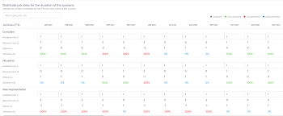

# でプランを作成および編集 [!DNL Scenario Planner]

を使用する際に、 [!DNL Workfront Scenario Planner]：会社の高レベル戦略を優先する場合に使用します。 プランの詳細については、 [「プランの概要」( [!DNL Scenario Planner]](../scenario-planner/plans-overview.md).

<!--

(NOTE: talk about:

- Show people conflicts >> this impacts the conflicts calculation for initiatives>> link to the conflicts article

- explain what hovering over the green upward-pointing arrow does, with screen shot)

-->

## アクセス要件

以下が必要です。

<table style="table-layout:auto"> 
 <col> 
 <col> 
 <tbody> 
  <tr> 
   <td> 
[!DNL Adobe Workfront] 計画*
 </td> 
   <td>[!UICONTROL Business] 以降</td> 
  </tr> 
  <tr> 
   <td> 
[!DNL Adobe Workfront] ライセンス*
 </td> 
   <td> 
[!UICONTROL Review] 以降
 </td> 
  </tr> 
  <tr> 
   <td>製品</td> 
   <td> 
の追加ライセンスを購入する必要があります。 [!DNL Adobe Workfront Scenario Planner] をクリックして、この記事で説明する機能にアクセスします。
 
[!UICONTROL Workfront Scenario Planner] の取得について詳しくは、 <a href="../scenario-planner/access-needed-to-use-sp.md" class="MCXref xref">[!UICONTROL シナリオプランナー ] を使用するために必要なアクセス</a>. 
 </td> 
  </tr> 
  <tr data-mc-conditions=""> 
   <td>アクセスレベル設定* </td> 
   <td> 
[!UICONTROL 編集 ] 以降の [!DNL Scenario Planner]
 
注意：まだアクセス権がない場合は、Workfront管理者に、アクセスレベルに追加の制限を設定しているかどうかを問い合わせてください。 を参照してください。 [!DNL Workfront] 管理者は、 <a href="../administration-and-setup/add-users/configure-and-grant-access/create-modify-access-levels.md" class="MCXref xref">カスタムアクセスレベルの作成または変更</a>.
 </td> 
  </tr> 
  <tr data-mc-conditions=""> 
   <td> 
オブジェクト権限 
 </td> 
   <td> 
[!DNL Manage] プランに対する権限
 
プランへの追加アクセス権のリクエストについて詳しくは、 <a href="../scenario-planner/request-access-to-plan.md" class="MCXref xref">内のプランへのアクセスをリクエスト [!DNL Scenario Planner]</a>.
 </td> 
  </tr> 
 </tbody> 
</table>

&#42;ご利用のプラン、ライセンスの種類、アクセス権を確認するには、 [!DNL Workfront] 管理者。

## プランの作成または編集

プランを一から作成することも、自分と共有していた既存のプランを編集することもできます。

>[!NOTE]
>
>プランを作成すると、プランの作成者および所有者と見なされます。 ユーザーが非アクティブ化されると、プランには所有者がなく、以前にリンクと共有されていない限り、誰にも表示されません。

この記事では、一からプランを作成する方法と、既存のプランを編集する方法について説明します。

プランに関する情報を含む、プランに関するすべての考慮事項については、 [「プランの概要」( [!DNL Scenario Planner]](../scenario-planner/plans-overview.md).

プランの削除の詳細は、 [のプランを削除 [!DNL Scenario Planner]](../scenario-planner/delete-plans.md).

計画を作成または編集する手順は、次のとおりです。

1. 次をクリック： **[!UICONTROL メインメニュー]** アイコン を選択し、「 [!UICONTROL シナリオ].

   作成した既存のプランのリストが [!DNL Workfront Scenario Planner].

1. （オプション） **[!UICONTROL フィルター]** アイコン プランリストの右上隅で、次のいずれかを選択します。

   | フィルター | 説明 |
   |---|---|
   | [!UICONTROL すべて] | 自分が作成したプランまたは自分と共有しているプランがすべて表示されます。 |
   | [!UICONTROL 自分の計画] | 作成したプランを表示します。 |
   | [!UICONTROL 自分と共有] | 自分と共有しているプランを表示します。 |

   

1. （オプション） **[!UICONTROL 検索]** アイコン  キーワードを入力し、リスト内のプランをすばやく見つけるには、次の手順に従います。

1. 既存のプランの名前をクリックして編集し、手順 7 に進みます。

   <!--
   
(NOTE: is the step still accurate) 

   -->

   または

   クリック **[!UICONTROL 新規プラン]** 左上隅でプランを作成し、手順 5 に進みます。

   <!--
   
(NOTE: is the step still accurate)

   -->

   

   この [!UICONTROL 新規プラン] ボックスが表示されます。

   

1. （条件付き）新しいプランを作成する場合は、次の情報を指定します。

   <table style="table-layout:auto"> 
    <col> 
    <col> 
    <tbody> 
     <tr> 
      <td role="rowheader">[!UICONTROL 名前 ]</td> 
      <td>プランの名前を入力します。 必須フィールドです。</td> 
     </tr> 
     <tr> 
      <td role="rowheader" colspan="2"> 
重要： プランを作成して保存した後は、次の選択内容を変更できません。 
 </td> 
     </tr> 
     <tr data-mc-conditions=""> 
      <td role="rowheader">FTE（[!UICONTROL フルタイム相当 ]）または [!UICONTROL 時間 ] </td> 
      <td> 
次のオプションの 1 つを選択して、この計画のジョブ・ロール情報を見積もる方法を指定します。 
 
       <ul> 
        <li> 
<strong>FTE</strong>. これはデフォルトの設定です  
 <!--
          
(NOTE: snippet below: this is per Ani; it does NOT look at the system FTE.) 

         --> 
すべての計算について [!DNL Scenario Planner], [!DNL Workfront] は次の値を使用します。1 日= 8 時間 
 </li> 
        <li> 
<strong>[!UICONTROL 時間 ]</strong> 
 </li> 
       </ul> 
重要： ここで選択するオプションは、プラン、プランのシナリオ、およびイニシアチブに関する役職情報の表示方法を決定します。 
 </td> 
     </tr> 
     <tr> 
      <td role="rowheader">[!UICONTROL 開始日 ]</td> 
      <td> 
プランを開始する月と年を選択します。 このフィールドで選択できるのは月のみです。 [!DNL Workfront] は、プランの開始日が選択した月の最初の日で、終了日がその期間の月末の最後の日であると仮定します。 
 </td> 
     </tr> 
     <tr> 
      <td role="rowheader">[!UICONTROL 期間 ]</td> 
      <td> 
ドロップダウンメニューから、次の期間を選択します。
 
       <ul> 
        <li>1 年. これはデフォルトの期間です。 </li> 
        <li>3 年</li> 
        <li> 
5 年
 </li> 
       </ul> </td> 
     </tr> 
    </tbody> 
   </table>

1. （条件付き）クリック **[!UICONTROL 次へ]**.

   プランのタイムラインは、 **[!UICONTROL 初期シナリオ]**.

   追加のシナリオの作成について詳しくは、 [でのプランシナリオの作成と比較 [!DNL Scenario Planner]](../scenario-planner/create-and-compare-scenarios-for-a-plan.md).

1. （オプション）次の表のオプションの 1 つを「タイムライン」ドロップダウンメニューから選択して、プランのタイムラインの表示方法を変更します。

   

   | ドロップダウンメニューオプション | 説明 |
   |---|---|
   | [!UICONTROL 月] | タイムラインを月別に表示します。 これは、1 年間プランのデフォルトで唯一のオプションです。 |
   | [!UICONTROL 四半期] | 四半期ごとにタイムラインを表示します。 このオプションは、 [!UICONTROL 期間] 計画の中で 3 年か 5 年は これは、3 年間プランのデフォルトのオプションです。 |
   | [!UICONTROL Year] | 年別のタイムラインを表示します。 このオプションは、 [!UICONTROL 期間] 計画の内の 5 年間。 これは、5 年間のプランのデフォルトのオプションです。 |

1. （オプション）プランの期間全体を表示するには、左から右にスクロールします。
1. （オプション） **[!UICONTROL 今日]** 現在の日に戻る指標行

   

1. 次をクリック： **[!UICONTROL ジョブの役割]** 」ボックスを選択し、プランの実行に使用できるジョブロールを追加します。

   詳細 [!UICONTROL ジョブの役割] ボックスが表示されます。

   >[!TIP]
   >
   >次の役割割り当て単位（FTE または時間）: [!DNL Workfront] このプランの用途は、ボックスのタイトルの括弧内に表示されます。

   

1. 次をクリック： **[!UICONTROL ジョブの役割の入力を開始]** 「 」フィールドを開き、リストからロールを選択するか、アクティブなジョブロールの名前を入力します。

   このフィールドをクリックすると、システム内のすべてのアクティブなジョブの役割が表示されます。

   これにより、ジョブの役割が「ジョブの役割」列に追加されます。

1. ジョブの役割に関する次の情報を更新または確認します。

   <table style="table-layout:auto"> 
    <col> 
    <col> 
    <tbody> 
     <tr> 
      <td role="rowheader"> 
[!UICONTROL 最大使用可能 ] （FTE 用） 
 
または 
 
[!UICONTROL 合計使用可能時間 ] （時間） 
 </td> 
      <td> 
プランに時間を使用するか、FTE を使用するかに応じて、次のように入力します。 職務の役割の工数の数 または時間 これらは、次のフィールドで、プランの作業を実行するために使用できます。 
 
       <ul> 
        <li> 
<strong>[!UICONTROL 使用可能な合計 ]</strong> （時間）:シナリオ期間中の全月の合計時間数を示します。 デフォルトでは、 [!DNL Workfront] は、シナリオの期間中に、使用可能な合計数をすべての月に均等に配分します。 
 
Example: </b>"><b>例： </b>デザイナーに 1200 時間を入力した場合、プラン [!UICONTROL Duration] が 1 年の場合、プラン期間中は Designer が各月に 100 時間利用可能です。 
 </li> 
        <li> 
<b>[!UICONTROL 最大使用可能 ]</b> （FTE の場合）:プラン期間中にジョブの役割が各月に使用可能になる工数を示します。 デフォルトでは、 <strong>Workfront</strong> は、シナリオ期間中の各月に [!UICONTROL 最大使用可能数 ] を割り当てます。
 
Example: </b>"><b>例： </b>コンサルタントに 1 回の FTE を入力した場合、コンサルタントは、プランの期間中、毎月 1 回の FTE で利用できます。 
 
FTE 1 未満の数値を入力できます。 
 
Example: </b>"><b>例： </b>0.5 コンサルタントの役割は、コンサルタントが FTE の半分（通常 4 時間、8 時間は 1 FTE）をこの計画の作業に使用することを意味します。 シナリオ・プランナのすべての計算に対して、Workfrontは次の値を使用します。1 日= 8 時間 
 </li> 
       </ul> </td> 
     </tr> 
     <tr> 
      <td role="rowheader"> 
[!UICONTROL 最大必要 ] （FTE 用）
 
または 
 
[!UICONTROL 必要な合計 ] （時間） 
 </td> 
      <td> 
プランで時間を使用するか、FTE を使用するかに応じて、次の項目を確認します。 職務の役割の工数の数 または時間 このシナリオのイニシアチブを完了するために必要な情報です。 次のフィールドを確認します。
 
       <ul> 
        <li> 
<strong>[!UICONTROL 必要な合計 ]</strong> （時間）:プランの期間中のすべての月に必要な合計時間数。
 </li> 
        <li> 
<strong>[!UICONTROL 最大必要 ]</strong> （FTE の場合）:プランの期間中の任意の月に必要な最大工数。 
 </li> 
       </ul> 
ヒント：この 最大 工数 または合計時間数 このジョブロールに必須は、イニシアチブの追加を開始すると表示されます。 プランへのイニシアチブの追加については、 <a href="../scenario-planner/create-and-edit-initiatives.md" class="MCXref xref">のイニシアチブを作成および編集します [!DNL Scenario Planner]</a>.
 </td> 
     </tr> <!--
      <tr data-mc-conditions="QuicksilverOrClassic.Draft mode"> 
       <td role="rowheader">[!UICONTROL Avg utilization]</td> 
       <td> 
(NOTE: this field was removed in 21.2 - May 2021) 
 
[!DNL Workfront] calculates the average utilization for each job role using the job role FTEs associated with initiatives (required) and the job role FTEs associated with the plan (available). 
 
 [!DNL Workfront] calculates the job role utilization percentage for a plan using the following formula: 
 
<code>Job role utilization percentage = Sum [(Required job roles for each month of the plan *100)/ (Available job roles for each month of the plan)] / Number of months in the Duration of the plan</code> 
 
        
Example: </b>"> <b>Example: </b> 
         
For example, if you have a plan with a duration of 12 months and an initiative with the duration of 2 months, where you use 1 Designer for your initiative (required job role) and there are 2 Designers available on the plan (available), the Utilization percentage for the Designer job role is calculated as follows:
 
         
<code>Designer utilization percentage = [(1/2 + 1/2) * 100] / 12 = 100 / 12 = 8.3%</code> 
 
        
 
As you add job roles to the plan and indicate the Available amount for each one, the [!UICONTROL Utilization] value for each role also updates and [!DNL Workfront] calculates a utilization percentage for the plan. For information about how [!DNL Workfront] calculates the Job Role Utilization for a plan, see <a href="../scenario-planner/plans-overview.md" class="MCXref xref">Plans overview in the [!DNL Scenario Planner]</a>. 
 
Tip: The Utilization percentage is rounded and has one decimal. 
 </td> 
      </tr>
     --> 
     <tr> 
      <td role="rowheader">[!UICONTROL 時間単価 ]</td> 
      <td> 
これは、ジョブの役割の [!UICONTROL Cost Hour] 率です。 時間単価はシステムの通貨で表示されます。 お使いのシステムの為替レートの設定については、 <a href="../administration-and-setup/manage-workfront/exchange-rates/set-up-exchange-rates.md" class="MCXref xref">為替レートの設定</a>.
 </td> 
     </tr> 
    </tbody> 
   </table>

1. （オプション）ジョブロールの名前の上にマウスポインターを置くか、ロール情報を更新した後に「 」タブをクリックし、 **[!UICONTROL ごみ箱アイコン]**  プランから削除します。
1. クリック **[!UICONTROL ジョブロールの配布]**.

   ジョブの役割の配分パネルは、シナリオの期間中のすべての月に対して表示されます。

   

1. ジョブロールの名前を入力して、 **[!UICONTROL ジョブの役割フィールドの入力を開始]**&#x200B;をクリックし、リストに表示されたら「 Enter 」をクリックします。 これにより、ジョブの役割が [!UICONTROL ジョブの役割] 列。
1. シナリオの各月について、次の情報を更新または確認します。

   <table style="table-layout:auto"> 
    <col> 
    <col> 
    <tbody> 
     <tr> 
      <td role="rowheader">[!UICONTROL ジョブロール ] （FTE または時間）</td> 
      <td>シナリオで使用可能なジョブの役割と、シナリオでのイニシアチブに必要なジョブの役割の両方が、ジョブの役割配布パネルに表示されます。 ジョブの役割見積もりが FTE か時間かを列ヘッダーで示します。 </td> 
     </tr> 
     <tr> 
      <td role="rowheader"> 
[!UICONTROL 使用可能 ] ( 最大 &lt;number of="" ftes=""&gt;) 
 
       
 
        
または
 
        
[!UICONTROL 使用可能 ] （合計） &lt;number of="" hours=""&gt;) 
 
       
 </td> 
      <td> 
プランで時間を使用するか、FTE を使用するかに応じて、レビューまたは更新を行います 職務ロール FTE の月数 または時間 次のフィールドのシナリオで使用できます。
 
       <ul> 
        <li> 
<strong>[!UICONTROL 使用可能 ] ( 最大 &lt;number of="" ftes=""&gt;)</strong>:括弧内の数は、シナリオに対する任意の月で使用可能なロールの最大数を表示します。 シナリオの各月の工数を確認または更新します。 月別配分を変更すると、括弧内の FTE の数が更新される場合があります。 
 </li> 
        <li> 
<strong>[!UICONTROL 使用可能 ] （合計） &lt;number of="" hours=""&gt;)</strong>:括弧内の数は、シナリオのすべての月で使用できる合計時間数を表示します。 シナリオの各月の時間数を確認または更新します。 月次配分を変更すると、括弧内の時間数が更新されます。 
 </li> 
       </ul> 
月次ジョブの役割割り当てを手動で更新することは、シナリオ上のイニシアチブ間でのジョブの役割の競合を解決するもう 1 つの方法です。 
 
ヒント：   
月別の役割の可用性を数か月間更新するには、任意の月の [!UICONTROL 利用可能 ] フィールドに時間数または FTE を入力し、隣の月にフィールドの隅をドラッグして、各月の同じ値をコピーします。 ドロップしてすべての月を更新します。 
 
  
 
 </td> 
     </tr> 
     <tr> 
      <td role="rowheader"> 
[!UICONTROL 必須 ] ( 最大 &lt;number&gt;)
 
       
 
        
または
 
        
[!UICONTROL 必須 ] （合計） &lt;number&gt;)
 
       
 </td> 
      <td> 
プランで時間を使用するか、FTE を使用するかに応じて、次の項目を確認します。 次のフィールドのシナリオに必要な月数のジョブロール工数または時間数。 
 
       <ul> 
        <li> 
<strong>[!UICONTROL 必須 ] ( 最大 &lt;number of="" ftes=""&gt;)</strong>:括弧内の数は、シナリオに対する任意の月に必要なロールの最大数を表示します。 
 </li> 
        <li> 
<strong>[!UICONTROL 必須 ] （合計） &lt;number of="" hours=""&gt;)</strong>:括弧内の数は、シナリオのすべての月に必要な合計時間数を表示します。 
 </li> 
       </ul> 
ヒント：必要な工数は変更できません または時間 ジョブの役割用。 この数は、イニシアチブおよびそのジョブの役割要件の追加を開始した後に、シナリオに対して入力されます。 
 </td> 
     </tr> 
     <tr> 
      <td role="rowheader">[!UICONTROL の差異 ]</td> 
      <td> 
       
 
        
シナリオで必要なジョブの役割と使用可能なジョブの役割の金額の月別差。 [!DNL Workfront] 次の式を使用して、各月の各職務ロールの差異を計算します。
 
        
<code>Monthly role difference = Monthly required roles - Monthly available roles</code> （工数または時間単位） 
 
        
ヒント：差異に負の数が表示される場合、シナリオでは、計画で使用可能な数より多くの役割が必要です。 リソースの割り当てが超過しています。 
 
       
 </td> 
     </tr> 
     <tr> 
      <td role="rowheader">[!UICONTROL 使用率 ] %</td> 
      <td> 
       
 
        
使用率の割合は、シナリオのイニシアチブで実際に使用（または必須）された役割の数を表示します。 
 
        
[!DNL Workfront] 次の式を使用して、1 か月あたりのジョブロールあたりの使用率を計算します。 
 
        
<code>Monthly role utilization % = Monthly required roles / Monthly available roles * 100</code> 
 
        
使用率は、リソースの割り当てに応じて、次の色で表示される場合があります。
 
        <ul> 
         <li> 
<b>緑</b>:使用可能な数と必要な数のジョブロールが一致します。 リソースは完全に割り当てられ、使用率は 100%です。 
 </li> 
         <li> 
<b>赤</b>:プランで使用可能な数より多くの必要なジョブの役割があります。 リソースが割り当て超過になり、使用率が 100%を超えています。
 </li> 
         <li> 
<b>青</b>:使用可能なジョブの役割は必要以上にあります。 リソースは割り当てられず、使用率の割合が 100%未満です。 
 </li> 
        </ul> 
       
 
  
 </td> 
     </tr> 
    </tbody> 
   </table>

1. クリック **[!UICONTROL 適用]** 月次職種配分を保存する

   または

   クリック **[!UICONTROL キャンセル]** ：ジョブの役割配布リストを閉じて、シナリオに戻ります。

1. 次をクリック： **[!UICONTROL 金融]** ボックスを使用して、このプランの予算を追加します。

   詳細 [!UICONTROL 金融] ボックスが表示されます。

   >[!TIP]
   >
   >通貨 [!DNL Workfront] このプランの用途は、ボックスのタイトルの括弧内に表示されます。

1. 次を指定： **[!UICONTROL 年間予算]**.

   >[!NOTE]
   >
   >プランが複数年にわたる場合は、各年の予算金額を指定する必要があります。

1. Enter キーを押して年次予算を保存し、次に [!UICONTROL タブ] 翌年に移る。

   年次予算は、選択した年の各月に対して自動的に均等配分されます。

1. クリック **[!UICONTROL 詳細]** 月次予算配分を表示します。 年予算と月予算は、常に数値で四捨五入されます。 1 年以内に予算金額をすべての月に均等に配分できない場合 ( 小数点以下： a **[!UICONTROL 残り]** 指標が年間予算配分の下に表示されます。

   

1. 月次予算を手動で調整し、超過額を排除します。

   すべての月次予算額の合計が年次予算より大きい場合、 **[!UICONTROL 超過]** 警告インジケーターは、年別予算配分の下に表示されます。 月次予算金額を、計画に使用可能な予算と等しいか低くなるまで手動で調整します。

   

1. を無効にします。 **[!UICONTROL 顧客原価を含める]** ジョブロールに関連するコストを、プランの全体的なコストに対してカウントするのを除外する設定 固定コストは、常にプランの全体的なコストに計上されます。 この設定はデフォルトで有効になっており、プランのすべてのシナリオに影響します。
1. クリック [!UICONTROL 金融] ボックスを使用して閉じます。 入力した情報は自動的に保存されます。

   これで、計画に関するイニシアチブの作成を開始し、シナリオを追加できます。

1. （推奨）クリック **[!UICONTROL 新しい取り組み]** 新しいイニシアチブを追加するには、次の手順に従います。

   <!--
   
(NOTE: Should this include information on how to create scenarios - see also information about scenarios in Manage Plans?)

   -->

   イニシアチブの追加については、「 [のイニシアチブを作成および編集します [!DNL Scenario Planner]](../scenario-planner/create-and-edit-initiatives.md).

1. （オプション）既存のシナリオのコピーを作成して、同じプランの新しいシナリオを作成します。 複数のシナリオの作成と操作について詳しくは、 [でのプランシナリオの作成と比較 [!DNL Scenario Planner]](../scenario-planner/create-and-compare-scenarios-for-a-plan.md).
1. クリック **[!UICONTROL プランを保存]**.

   プランが作成または更新されました。

1. （オプション） **[!UICONTROL お気に入りアイコン]**  プラン名の右側に移動して、お気に入りのリストにプランを追加します。

1. （オプション）プランの URL をコピーし、確認または更新が必要な他のユーザーに送信します。 少なくとも [!UICONTROL 表示] プランを表示するには、アクセスレベルでアクセスします。 必ず [!UICONTROL 編集] 編集するアクセス権。 予算、コスト、役職レート情報など、計画に関する財務情報を検討する必要がある場合は、次の項目にもアクセスできる必要があります： [!UICONTROL 財務データ] 」と入力します。 の [!DNL Scenario Planner]を参照してください。 [を使用するために必要なアクセス [!DNL Scenario Planner]](../scenario-planner/access-needed-to-use-sp.md).
