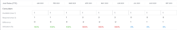

# [!DNL Scenario Planner] での計画の作成と編集

会社の上位レベルの戦略に優先順位を付ける場合、[!DNL Workfront Scenario Planner] の使用の一環として計画を作成できます。計画に関して詳しくは、[ [!DNL Scenario Planner]](../scenario-planner/plans-overview.md) の計画の概要を参照してください。

<!--

(NOTE: talk about:

- Show people conflicts >> this impacts the conflicts calculation for initiatives>> link to the conflicts article

- explain what hovering over the green upward-pointing arrow does, with screen shot)

-->

## アクセス要件

以下が必要です。

<table style="table-layout:auto"> 
 <col> 
 <col> 
 <tbody> 
  <tr> 
   <td> 
[!DNL Adobe Workfront] プラン*
 </td> 
   <td>[!UICONTROL Business] 以降</td> 
  </tr> 
  <tr> 
   <td> 
[!DNL Adobe Workfront] ライセンス*
 </td> 
   <td> 
[!UICONTROL Review] 以降
 </td> 
  </tr> 
  <tr> 
   <td>製品</td> 
   <td> 
この記事で説明する機能にアクセスするには、[!DNL Adobe Workfront Scenario Planner] 用の追加ライセンスを購入する必要があります。
 
[!UICONTROL Workfront Scenario Planner] の取得について詳しくは、<a href="../scenario-planner/access-needed-to-use-sp.md" class="MCXref xref">[!UICONTROL Scenario Planner]を使用するために必要なアクセス権</a>を参照してください。 
 </td> 
  </tr> 
  <tr data-mc-conditions=""> 
   <td>アクセスレベル設定* </td> 
   <td> 
次に対する[!UICONTROL Edit]以上のアクセス権： [!DNL Scenario Planner]
 
メモ：まだアクセス権がない場合は、アクセスレベルに追加の制限が設定されていないかどうか Workfront 管理者にお問い合わせください。[!DNL Workfront] 管理者がアクセスレベルを変更方法について詳しくは、<a href="../administration-and-setup/add-users/configure-and-grant-access/create-modify-access-levels.md" class="MCXref xref">カスタムアクセスレベルを作成または変更</a>を参照してください。
 </td> 
  </tr> 
  <tr data-mc-conditions=""> 
   <td> 
オブジェクト権限 
 </td> 
   <td> 
[!DNL Manage] 計画に対する権限
 
プランへの追加アクセス権のリクエストについて詳しくは、<a href="../scenario-planner/request-access-to-plan.md" class="MCXref xref">[!DNL Scenario Planner]</a> でのプランへの利用申請を参照してください。
 </td> 
  </tr> 
 </tbody> 
</table>

&#42;ご利用のプラン、ライセンスタイプまたはアクセス権を確認するには、[!DNL Workfront] 管理者にお問い合わせください。

## 計画の作成または編集

計画を最初から作成することも、ご自身と共有されている既存の計画を編集することも可能です。

>[!NOTE]
>
>計画を作成すると、計画の作成者および所有者と見なされます。ユーザーが非アクティブ化されると、プランには所有者がなく、以前にリンクと共有されていない限り、誰にも表示されません。

この記事では、最初から計画を作成する方法と、既存の計画を編集する方法について説明します。

計画で利用可能な情報を含む計画に関するすべての考慮事項について詳しくは、[ [!DNL Scenario Planner]](../scenario-planner/plans-overview.md) の計画の概要を参照してください。

計画の削除について詳しくは、[ [!DNL Scenario Planner]](../scenario-planner/delete-plans.md) での計画の削除を参照してください。

計画を作成または編集する手順は、以下のとおりです。

1. **[!UICONTROL メインメニュー]**&#x200B;アイコン  をクリックし、さらに「[!UICONTROL シナリオ]」をクリックします。

   作成した既存の計画のリストが、[!DNL Workfront Scenario Planner] に表示されます。

1. （オプション）プランリストの右上隅にある&#x200B;**[!UICONTROL フィルター]**&#x200B;アイコン  をクリックし、次から選択します。

   | フィルター | 説明 |
   |---|---|
   | [!UICONTROL すべて] | 自分が作成した計画または自分と共有している計画のすべてを表示する。 |
   | [!UICONTROL 自分の計画] | 自分で作成したプランを表示します。 |
   | [!UICONTROL 自分と共有] | 自分と共有している計画を表示する。 |

   

1. （オプション）**[!UICONTROL 検索]**&#x200B;アイコン  をクリックしてキーワードを入力して、リスト内の計画をすばやく確認します。

1. 既存の計画の名前をクリックして編集し、手順 7 に進みます。

   <!--
   
(NOTE: is the step still accurate) 

   -->

   または

   左上隅にある「**[!UICONTROL 新規計画]**」をクリックして計画を作成し、手順 5 に進みます。

   <!--
   
(NOTE: is the step still accurate)

   -->

   

   [!UICONTROL 新規計画]ボックスが表示されます。

   

1. （条件付き）新規計画を作成する場合は、以下の情報を指定します。

   <table style="table-layout:auto"> 
    <col> 
    <col> 
    <tbody> 
     <tr> 
      <td role="rowheader">[!UICONTROL Name]</td> 
      <td>計画の名前を入力します。必須フィールドです。</td> 
     </tr> 
     <tr> 
      <td role="rowheader" colspan="2"> 
重要：計画を作成して保存した後は、以下の選択内容を変更できません。 
 </td> 
     </tr> 
     <tr data-mc-conditions=""> 
      <td role="rowheader">FTE（[!UICONTROL Full Time Equivalent]）または [!UICONTROL Hours] </td> 
      <td> 
以下のオプションから 1 つを選択して、この計画の担当業務情報の見積もり方法を指定します。 
 
       <ul> 
      <li> 
<strong>FTE</strong>。これはデフォルトの  です 
 
      
<b>重要</b>
  
      
[!DNL Scenario Planner] のすべての計算について、[!DNL Workfront] では、値 1 FTE = 8 時間を使用します。 
 </li> 
      <li> 
<strong>[!UICONTROL Hours]</strong> 
 </li> 
       </ul> 
<b>重要</b>

   ここで選択したオプションにより、計画、計画のシナリオ、およびイニシアチブの担当業務情報がどのように表示されるかが決まります。
 </td>
   </tr> 
     <tr> 
      <td role="rowheader">[!UICONTROL Start date]</td> 
      <td> 
計画を開始する月と年を選択します。このフィールドでは月のみを選択できます。[!DNL Workfront] は、計画の開始日が選択した月の初日、終了日が期間中の月末の最終日であると想定します。 
 </td> 
     </tr> 
     <tr> 
      <td role="rowheader">[!UICONTROL Duration]</td> 
      <td> 
ドロップダウンメニューから次の期間を選択します。
 
       <ul> 
        <li>1 年：デフォルトの期間です。 </li> 
        <li>3年</li> 
        <li> 
5年
 </li> 
       </ul> </td> 
     </tr> 
    </tbody> 
   </table>

<!--for table above - how FTE is calcualted: NOTE: snippet below: this is per Ani; it does NOT look at the system FTE.) 
-->

1. （条件付き）「**[!UICONTROL 次へ]**」をクリックします。

   計画のタイムラインは&#x200B;**[!UICONTROL 初期シナリオ]**&#x200B;として表示されます。

   追加のシナリオの作成については、[ [!DNL Scenario Planner]](../scenario-planner/create-and-compare-scenarios-for-a-plan.md) の計画シナリオの作成と比較を参照してください。

1. （オプション）タイムラインドロップダウンメニューから、次の表のオプションの 1 つを選択して、計画のタイムラインの表示方法を変更します。

   

   | ドロップダウンメニューオプション | 説明 |
   |---|---|
   | [!UICONTROL 月] | 月ごとのタイムラインを表示します。これはデフォルトであり、1 年計画の唯一のオプションです。 |
   | [!UICONTROL 四半期] | 四半期ごとのタイムラインを表示します。このオプションは、計画の[!UICONTROL 期間]が 3 年または 5 年の場合にのみ使用できます。3 年計画のデフォルトのオプションです。 |
   | [!UICONTROL 年] | 年ごとのタイムラインを表示します。このオプションは、計画の[!UICONTROL 期間]が 5 年の場合にのみ使用できます。これは 5年計画のデフォルトのオプションです。 |

1. （オプション）左から右にスクロールして、計画の期間全体を表示します。
1. （オプション）現在の日に戻るには、「**[!UICONTROL 今日]**」のインジケーターラインをクリックします。

   

1. 計画のヘッダーにある「**[!UICONTROL 担当業務]**」ボックスをクリックして、計画の実行に使用できる担当業務を追加します。

   「[!UICONTROL 担当業務]」ボックスの詳細が表示されます。

   >[!TIP]
   >
   >[!DNL Workfront] がこの計画に使用する役割割り当て単位（FTE または時間数）が、ボックスのタイトルのかっこ内に表示されます。

   

1. 「**[!UICONTROL 担当業務の入力を開始]**」フィールドをクリックし、リストから役割を選択するか、アクティブな担当業務の名前の入力を開始します。

   このフィールドをクリックすると、システム内のすべてのアクティブな担当業務がリストされます。

   これにより、担当業務が「担当業務」列に追加されます。

1. 担当業務に関する次の情報を更新または確認します。

   <table style="table-layout:auto"> 
    <col> 
    <col> 
    <tbody> 
     <tr> 
      <td role="rowheader"> 
[!UICONTROL Max available]（FTE の場合） 
 
または 
 
[!UICONTROL Total available]（時間数の場合） 
 </td> 
      <td> 
計画に時間数と FTE のどちらを使用するかを選択したことに応じて、次のフィールドに、計画の作業を実行するために利用できる担当業務の FTE 数または時間数を入力します。 
 
       <ul> 
        <li> 
<strong>[!UICONTROL Total available]</strong>（時間数の場合）：シナリオの期間中のすべての月の合計時間数を示します。デフォルトで、[!DNL Workfront] は、シナリオ期間中のすべての月にわたって利用可能な合計数を均等に分割します。 
 
Example: </b>"><b>例：</b>設計者に「1200 時間」と入力すると、計画の[!UICONTROL Duration]が 1 年の場合、設計者は計画期間中、毎月 100 時間対応可能であることを意味します。 
 </li> 
        <li> 
<b>[!UICONTROL Max available]</b>（FTE の場合）：計画の期間中、その担当業務が毎月利用できる FTE の数を示します。デフォルトでは、<strong>Workfront</strong> は、シナリオ期間中の各月に [!UICONTROL Max available] の数値を割り当てます。
 
Example: </b>"><b>例：</b>コンサルタントに「1 FTE」と入力した場合、プラン期間中、コンサルタントは毎月 1 FTE 対応できることを意味します。 
 
1 FTE 未満の数値を入力できます。 
 
Example: </b>"><b>例：</b>コンサルタントの担当業務が 0.5 の場合、コンサルタントが FTE の半分（通常は 4 時間、1 FTE は 8 時間）をこの計画の作業に費やすことを意味します。シナリオプランナーのすべての計算で、Workfront は次の値を使用します：1 FTE = 8 時間。 
 </li> 
       </ul> </td> 
     </tr> 
     <tr> 
      <td role="rowheader"> 
[!UICONTROL Max required]（FTE の場合）
 
または 
 
[!UICONTROL Total required]（時間数の場合） 
 </td> 
      <td> 
プランに時間数と FTE のどちらを使用することを選択したかに応じて、シナリオ内のイニシアチブを完了するために必要な担当業務の FTE または時間数を確認します。次のフィールドを確認します。
 
       <ul> 
        <li> 
<strong>[!UICONTROL Total required]</strong>（時間数の場合）：計画の期間中のすべての月に必要な合計時間数。
 </li> 
        <li> 
<strong>[!UICONTROL Max required]</strong>（FTE の場合）：計画期間中のいずれかの月に必要な FTE の最大数。 
 </li> 
       </ul> 
ヒント：その担当業務に必須である FTE の最大工数、または合計時間数は、イニシアチブの追加を開始した後に表示されます。計画へのイニシアチブの追加について詳しくは、<a href="../scenario-planner/create-and-edit-initiatives.md" class="MCXref xref">[!DNL Scenario Planner]</a> のイニシアチブを作成および編集を参照してください。
 </td> 
     </tr> <!--
      <tr data-mc-conditions="QuicksilverOrClassic.Draft mode"> 
       <td role="rowheader">[!UICONTROL Avg utilization]</td> 
       <td> 
(NOTE: this field was removed in 21.2 - May 2021) 
 
[!DNL Workfront] calculates the average utilization for each job role using the job role FTEs associated with initiatives (required) and the job role FTEs associated with the plan (available). 
 
 [!DNL Workfront] calculates the job role utilization percentage for a plan using the following formula: 
 
<code>Job role utilization percentage = Sum [(Required job roles for each month of the plan *100)/ (Available job roles for each month of the plan)] / Number of months in the Duration of the plan</code> 
 
        
Example: </b>"> <b>Example: </b> 
         
For example, if you have a plan with a duration of 12 months and an initiative with the duration of 2 months, where you use 1 Designer for your initiative (required job role) and there are 2 Designers available on the plan (available), the Utilization percentage for the Designer job role is calculated as follows:
 
         
<code>Designer utilization percentage = [(1/2 + 1/2) * 100] / 12 = 100 / 12 = 8.3%</code> 
 
        
 
As you add job roles to the plan and indicate the Available amount for each one, the [!UICONTROL Utilization] value for each role also updates and [!DNL Workfront] calculates a utilization percentage for the plan. For information about how [!DNL Workfront] calculates the Job Role Utilization for a plan, see <a href="../scenario-planner/plans-overview.md" class="MCXref xref">Plans overview in the [!DNL Scenario Planner]</a>. 
 
Tip: The Utilization percentage is rounded and has one decimal. 
 </td> 
      </tr>
     --> 
     <tr> 
      <td role="rowheader">[!UICONTROL Hourly rate]</td> 
      <td> 
これは、担当業務の [!UICONTROL Cost Hour] 率です。時間別の料金は、ご使用のシステムの通貨で表示されます。ご使用のシステムの為替レートの設定について詳しくは、<a href="../administration-and-setup/manage-workfront/exchange-rates/set-up-exchange-rates.md" class="MCXref xref">為替レートを設定</a>を参照してください。
 </td> 
     </tr> 
    </tbody> 
   </table>

1. （オプション）担当業務の名前の上にポインタを合わせるか、担当業務情報を更新した後に&#x200B;**[!UICONTROL ごみ箱アイコン]**  をクリックして、計画から削除します。
1. 「**[!UICONTROL 担当業務の分散]**」をクリックします。

   担当業務の分散パネルは、シナリオの期間中のすべての月を表示します。

   

1. 担当業務の名前を入力して、「**[!UICONTROL 担当業務フィールドに入力]**」に担当業務を追加し、リストに表示されたら Enter をクリックします。これにより、担当業務が[!UICONTROL 担当業務]列に追加されます。
1. シナリオの各月について、以下の情報を更新または確認します。

   <table style="table-layout:auto"> 
    <col> 
    <col> 
    <tbody> 
     <tr> 
      <td role="rowheader">[!UICONTROL Job Roles]（FTE または時間）</td> 
      <td>シナリオで使用可能な担当業務と、シナリオでのイニシアチブに必要な担当業務の両方が、担当業務分配パネルに表示されます。担当業務見積もり単位が FTE か時間かが、列ヘッダーに表示されます。 </td> 
     </tr> 
     <tr> 
      <td role="rowheader"> 
[!UICONTROL Available]（最大 &lt;number of FTEs&gt;） 
 
       
 
        
または
 
        
[!UICONTROL Available]（合計）&lt;number of hours&gt;） 
 
       
 </td> 
      <td> 
計画に時間数を使用するか、FTE を選択するかに応じて、以下のフィールドのシナリオに使用できる月間の担当業務の FTE の数または時間数の、レビューまたはアップデートを行います。
 
       <ul> 
        <li> 
<strong>[!UICONTROL Available]（最大 &lt;number of FTEs&gt;）</strong>：括弧内の数は、任意の月でシナリオに使用可能な役割の最大数を表します。シナリオの各月の FTE の数を確認または更新します。月別配分を変更すると、括弧内の FTE の数が更新される場合があります。 
 </li> 
        <li> 
<strong>[!UICONTROL Available]（合計 &lt;number of hours&gt;）</strong>：括弧内の数は、シナリオのすべての月で使用できる合計時間数を表します。シナリオの各月の時間数を確認または更新します。月別配分を変更すると、かっこ内の時間数が更新されます。 
 </li> 
       </ul> 
月次の担当業務の割り当ての手動更新は、シナリオ上のイニシアチブ間での担当業務の競合を解決するもう 1 つの方法です。 
 
ヒント：   
月別の役割の空き時間を数か月間アップデートするには、先ず任意の月の [!UICONTROL Available] フィールドに時間数または FTE の数を入力し、続いて隣の月にフィールドの隅をドラッグして、各月に同じ値をコピーします。ドロップしてすべての月を更新します。 
 
  
 
 </td> 
     </tr> 
     <tr> 
      <td role="rowheader"> 
[!UICONTROL Required]（最大 &lt;number&gt;）
 
       
 
        
または
 
        
[!UICONTROL Required]（合計 &lt;number&gt;）
 
       
 </td> 
      <td> 
計画に時間数を使用するか、FTE を選択するかに応じて、以下のフィールドのシナリオに使用できる月間の担当業務の FTE の数または時間数の、レビューまたは更新を行います。 
 
       <ul> 
        <li> 
<strong>[!UICONTROL Required]（最大 &lt;number of FTEs&gt;）</strong>：括弧内の数は、任意の月でシナリオに必要な役割の最大数を表します。 
 </li> 
        <li> 
<strong>[!UICONTROL Required]（合計 &lt;number of hours&gt;）</strong>：括弧内の数は、シナリオのすべての月に必要な合計時間数を表します。 
 </li> 
       </ul> 
ヒント：担当業務に必須である、FET に必要な数や時間数は変更できません。この数は、イニシアチブおよびその担当業務要件の追加を開始した後に、シナリオに対して入力されます。 
 </td> 
     </tr> 
     <tr> 
      <td role="rowheader">[!UICONTROL Difference]</td> 
      <td> 
       
 
        
シナリオで必要な担当業務と利用可能な担当業務の量の月別差。[!DNL Workfront] は次の式を使用して、毎月のそれぞれの担当業務の差異を計算します。
 
        
<code>Monthly role difference = Monthly required roles - Monthly available roles</code> （FTE の工数または時間数） 
 
        
ヒント：差異に負の数が表示される場合は、シナリオには計画で利用可能な数より多くの担当業務が必要です。リソースの割り当てが超過しています。 
 
       
 </td> 
     </tr> 
     <tr> 
      <td role="rowheader">[!UICONTROL Utilization] ％</td> 
      <td> 
       
 
        
稼働率の割合は、シナリオのイニシアチブで実際に使用（または必要と）された、利用可能な担当業務の数を表します。 
 
        
[!DNL Workfront] 次の式を使用して、1 か月ごとの担当業務あたりの稼働率を計算します。 
 
        
<code>Monthly role utilization % = Monthly required roles / Monthly available roles * 100</code> 
 
        
稼働率の割合は、リソースの割り当てに応じて、以下の色で表示される場合があります。
 
        <ul> 
         <li> 
<b>緑</b>：一致する担当業務の利用可能な数と必要な数。リソースは完全に割り当てられ、稼働率は 100％です。 
 </li> 
         <li> 
<b>赤</b>：計画で利用可能な数より多くの必要な担当業務があります。リソースが割り当て超過になり、稼働率が 100％を超えています。
 </li> 
         <li> 
<b>青</b>：利用可能な担当業務が必要以上にあります。リソースの割り当てが不十分で、稼働率が 100％未満です。 
 </li> 
        </ul> 
       
 
  
 </td> 
     </tr> 
    </tbody> 
   </table>

1. 「**[!UICONTROL 適用]**」をクリックして、月次の担当業務の配分を保存します。

   または

   「**[!UICONTROL キャンセル]**」をクリックして担当業務の配布リストを閉じ、シナリオに戻ります。

1. 計画のヘッダーにある「**[!UICONTROL 財務]**」ボックスをクリックして、この計画の予算を追加します。

   「[!UICONTROL 財務]」ボックスの詳細が表示されます。

   >[!TIP]
   >
   >[!DNL Workfront] がこの計画に使用する通貨は、ボックスのタイトルの括弧内に表示されます。

1. **[!UICONTROL 年間予算]**&#x200B;を指定します。

   >[!NOTE]
   >
   >計画が複数年にわたる場合は、各年の予算額を指定する必要があります。

1. Enter キーを押して年間予算を保存し、[!UICONTROL Tab] を押し次の年に移動します。

   年間予算は、選択した年の各月に自動的に均等に配分されます。

1. 「**[!UICONTROL 詳細]**」をクリックして、月ごとの予算配分を確認します。年間予算と月間予算は常に四捨五入された数値です。小数点が原因で予算金額を 1 年のすべての月に均等に配分できない場合は、年間予算配分の下に&#x200B;**[!UICONTROL 残り]**&#x200B;インジケーターが表示されます。

   

1. 毎月の予算を手動で調整して、超過額を排除します。

   すべての月次予算の合計が年間予算より大きい場合、年間予算配分の下に「**[!UICONTROL 超過]**」警告インジケーターが表示されます。計画で利用可能な予算以下になるまで、毎月の予算金額を手動で調整します。

   

1. 「**[!UICONTROL 人件費を含める]**」設定を無効にすると、担当業務に関連するコストが計画全体コストにカウントされなくなります。固定費は常に計画の全体コストにカウントされます。この設定はデフォルトで有効になっており、計画のすべてのシナリオに影響します。
1. [!UICONTROL 財務]ボックスの外側をクリックして閉じます。入力した情報は自動的に保存されます。

   これで、計画上のイニシアチブの作成とシナリオの追加を開始できるようになります。

1. （推奨）「**[!UICONTROL 新規イニシアチブ]**」をクリックして、新しいイニシアチブを追加します。

   <!--
   
(NOTE: Should this include information on how to create scenarios - see also information about scenarios in Manage Plans?)

   -->

   イニシアチブの追加については、[ [!DNL Scenario Planner]](../scenario-planner/create-and-edit-initiatives.md) でイニシアチブを作成および編集の記事を参照してください。

1. （オプション）既存のシナリオのコピーを作成して、同じ計画の新しいシナリオを作成します。複数のシナリオの作成と操作について詳しくは、[ [!DNL Scenario Planner]](../scenario-planner/create-and-compare-scenarios-for-a-plan.md)の計画シナリオの作成と比較を参照してください。
1. 「**[!UICONTROL 計画を保存]**」をクリックします。

   計画が作成または更新されます。

1. （オプション）計画名の右側にある&#x200B;**[!UICONTROL お気に入りアイコン]** をクリックして、計画をお気に入りリストに追加します。

1. （オプション）計画の URL をコピーし、計画を確認または更新する必要がある他のユーザーに送信します。プランを表示するには、少なくとも[!UICONTROL 表示]アクセス権がアクセスレベルに必要です。編集するには、[!UICONTROL 編集]アクセス権が必要です。予算、コスト、担当業務の料率など、プランの財務情報をレビューする必要がある場合は、[!UICONTROL 財務データ]へのアクセス権もアクセスレベルに必要です。[!DNL Scenario Planner]に必要なアクセス権については、[使用するために必要なアクセス権： [!DNL Scenario Planner]](../scenario-planner/access-needed-to-use-sp.md)を参照してください。
