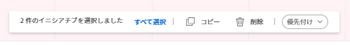

# 内のイニシアチブを削除 [!DNL Scenario Planner]

自分が作成したプランまたは自分と共有したプランのイニシアチブを削除できます。 削除したイニシアチブを復元することはできません。

## アクセス要件

<table style="table-layout:auto"> 
 <col> 
 <col> 
 <tbody> 
  <tr> 
   <td> 
[!DNL Adobe Workfront]<b> 計画*</b> 
 </td> 
   <td>[!UICONTROL Business] 以降</td> 
  </tr> 
  <tr> 
   <td> 
[!DNL Adobe Workfront]<b> ライセンス*</b> 
 </td> 
   <td> 
[!UICONTROL Review] 以降
 </td> 
  </tr> 
  <tr> 
   <td><b>製品</b> </td> 
   <td> 
の追加ライセンスを購入する必要があります。 [!DNL Adobe Workfront Scenario Planner] をクリックして、この記事で説明する機能にアクセスします。 
 
詳しくは、 [!DNL Workfront Scenario Planner]を参照してください。 <a href="../scenario-planner/access-needed-to-use-sp.md" class="MCXref xref">[!UICONTROL シナリオプランナー ] を使用するために必要なアクセス</a>. 
 </td> 
  </tr> 
  <tr data-mc-conditions=""> 
   <td><strong>アクセスレベル設定*</strong> </td> 
   <td> 
[!UICONTROL 編集 ] 以降の [!DNL Scenario Planner]
 
注意：まだアクセス権がない場合は、 [!DNL Workfront] 管理者（アクセスレベルに追加の制限を設定している場合） を参照してください。 [!DNL Workfront] 管理者は、 <a href="../administration-and-setup/add-users/configure-and-grant-access/create-modify-access-levels.md" class="MCXref xref">カスタムアクセスレベルの作成または変更</a>.
 </td> 
  </tr> 
  <tr data-mc-conditions=""> 
   <td> 
<strong>オブジェクト権限</strong> 
 </td> 
   <td> 
プランに対する [!UICONTROL 管理 ] 権限
 
プランへの追加アクセス権のリクエストについて詳しくは、 <a href="../scenario-planner/request-access-to-plan.md" class="MCXref xref">内のプランへのアクセスをリクエスト [!DNL Scenario Planner]</a>.
 </td> 
  </tr> 
 </tbody> 
</table>

## イニシアチブを削除

イニシアチブを削除する際は、次の点を考慮してください。

* イニシアチブを削除すると、そのイニシアチブに関連付けられている必要な役割数と原価情報がプランから削除されます。
* プロジェクトをインポートして作成したイニシアチブを削除しても、イニシアチブに関連付けられたプロジェクトは削除されません。
* 少なくとも 1 回プロジェクトに公開されたイニシアチブを削除すると、次の結果になります。

   * イニシアチブはシナリオから削除されますが、 [!DNL Scenario Planner] 領域が [!UICONTROL プロジェクトの詳細] 」セクションに入力します。
   * 削除したイニシアチブがシナリオで唯一の公開イニシアチブである場合は、プランが公開されたことを示す指標も削除されます。

      プロジェクトへのイニシアチブの公開については、 [プロジェクトを更新または作成するには、 [!DNL Scenario Planner]](../scenario-planner/publish-scenarios-update-projects.md).

      プロジェクトのインポートによるイニシアチブの作成については、 [内のプランにプロジェクトをインポート [!DNL Scenario Planner]](../scenario-planner/import-projects-to-plans.md) .

1 度に 1 つのイニシアチブを削除することも、複数のイニシアチブを一括で削除することもできます。

* [イニシアチブを 1 つ削除](#delete-one-initiative)
* [イニシアチブを一括で削除](#delete-initiatives-in-bulk)

### イニシアチブを 1 つ削除 {#delete-one-initiative}

1. 次をクリック： **[!UICONTROL メインメニュー]** アイコン を選択し、「 [!UICONTROL シナリオ].

   プランのリストが表示されます。

1. プランの名前をクリックして開き、削除するイニシアチブを探します。
1. 次のいずれかの操作を行います。

   * 次をクリック： **[!UICONTROL その他のメニュー]**  イニシアチブ名の右に移動し、「 **[!UICONTROL 削除]** > **[!UICONTROL はい、削除します]**.

   * イニシアチブの左側にあるボックスを選択し、「 **[!UICONTROL 削除]** プランの下部に表示されるフローティングメニューで、 **[!UICONTROL はい、削除します]**.

   イニシアチブとそのジョブの役割とコスト情報がプランから削除されます。

1. クリック **[!UICONTROL プランを保存]** 変更を保存します。

### イニシアチブを一括で削除 {#delete-initiatives-in-bulk}

1. 次をクリック： **[!UICONTROL メインメニュー]** アイコン を選択し、「 [!UICONTROL シナリオ].

   プランのリストが表示されます。

1. プランの名前をクリックして開き、削除するイニシアチブを探します。
1. 削除するイニシアチブの左側にあるボックスを選択し、[ ] をクリックします。 **[!UICONTROL 削除]** プランの下部に表示されるメニューから、をクリックします。 **[!UICONTROL はい、削除します]**.

   

   イニシアチブとそのジョブの役割およびコスト情報がプランから削除されます。

1. クリック **[!UICONTROL プランを保存]** 変更を保存します。
