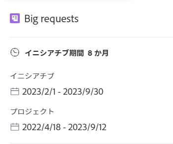

# 内のプランにプロジェクトをインポート [!DNL Scenario Planner]

既存のプロジェクトをプランにインポートできます。 インポートしたプロジェクトはイニシアチブに変換され、新しいイニシアチブの管理と同じように、プラン内で管理できます。 元のプロジェクトは、新しいイニシアチブにリンクされたままです。

<!--

(NOTE: add information about what happens when you import projects and where the info from projects show up;

- the hours/ FTE come from WorkPerDay

- if a task has a Duration of 0, the FTE should be 0 for that asignee but it should still come across) 

-->

## アクセス要件

以下が必要です。

<table style="table-layout:auto"> 
 <col> 
 <col> 
 <tbody> 
  <tr> 
   <td> 
[!DNL Adobe Workfront]<b> 計画*</b> 
 </td> 
   <td>[!UICONTROL Business] 以降</td> 
  </tr> 
  <tr> 
   <td> 
[!DNL Adobe Workfront]<b> ライセンス*</b> 
 </td> 
   <td> 
[!UICONTROL Review] 以降
 </td> 
  </tr> 
  <tr> 
   <td><b>製品</b> </td> 
   <td> 
の追加ライセンスを購入する必要があります。 [!DNL Adobe Workfront Scenario Planner] をクリックして、この記事で説明する機能にアクセスします。
 
詳しくは、 [!DNL Workfront Scenario Planner]を参照してください。 <a href="../scenario-planner/access-needed-to-use-sp.md" class="MCXref xref">を使用するために必要なアクセス [!DNL Scenario Planner]</a>. 
 </td> 
  </tr> 
  <tr data-mc-conditions=""> 
   <td><strong>アクセスレベル設定*</strong> </td> 
   <td> 
[!UICONTROL 編集 ] 以降の [!DNL Scenario Planner]
 
注意：まだアクセス権がない場合は、 [!DNL Workfront] 管理者（アクセスレベルに追加の制限を設定している場合） を参照してください。 [!DNL Workfront] 管理者は、 <a href="../administration-and-setup/add-users/configure-and-grant-access/create-modify-access-levels.md" class="MCXref xref">カスタムアクセスレベルの作成または変更</a>.
 </td> 
  </tr> 
  <tr data-mc-conditions=""> 
   <td> 
<strong>オブジェクト権限</strong> 
 </td> 
   <td> 
プランに対する [!UICONTROL 管理 ] 権限
 
プランへの追加アクセス権のリクエストについて詳しくは、 <a href="../scenario-planner/request-access-to-plan.md" class="MCXref xref">シナリオ・プランナのプランへのアクセスを要求</a>.
 </td> 
  </tr> 
 </tbody> 
</table>

&#42;ご利用のプラン、ライセンスの種類、アクセス権を確認するには、 [!DNL Workfront] 管理者。

## 新規イニシアチブとしてのプランへのプロジェクトのインポートに関する考慮事項

* プロジェクトを新しいイニシアチブとしてプランにインポートする前に、プロジェクトを作成する必要があります。

   <!--
  
(NOTE: no caveats for project statuses yet, mentioned in the import steps as a tip) 

  -->

* 少なくとも [!UICONTROL 表示] プロジェクトに対する権限を、新しいイニシアチブとしてプランにインポートできるようにします。
* 同じプロジェクトを複数のプランにインポートできます。
* 読み込むプロジェクトには、プランの期間に日付が含まれている必要があります。 を使用してプロジェクトを読み込むことはできません。 [!UICONTROL 計画完了日] 計画の開始または [!UICONTROL 計画開始日] 計画の終わりより後に
* 一度に 100 個を超えるプロジェクトを読み込むことはできません。
* 一部のプロジェクト情報もプランにインポートされ、イニシアチブ情報になります。 プランに読み込まれてイニシアチブ情報になるプロジェクト情報の詳細については、 [プランにインポートされたプロジェクト情報](#project-information-imported-into-the-plan) 」の節を参照してください。
* リンクされたプロジェクトで行われた変更は、プランのイニシアチブには影響しません。
* プランのイニシアチブに対して行われた変更は、リンクされたプロジェクトには自動的に影響しません。イニシアチブの変更は、プランからイニシアチブを公開する場合にのみ、リンクされたプロジェクトに影響を与えます。 公開イニシアチブがリンクされたプロジェクトに与える影響について詳しくは、 [プロジェクトを更新または作成するには、 [!DNL Scenario Planner]](../scenario-planner/publish-scenarios-update-projects.md).
* プロジェクトのインポートによって作成されたイニシアチブを削除しても、プロジェクトは削除されません。
* イニシアチブにリンクされたプロジェクトを削除しても、イニシアチブは削除されません。

## プランにインポートされたプロジェクト情報 {#project-information-imported-into-the-plan}

プロジェクトをプランにインポートすると、一部のプロジェクト情報もプランにインポートされ、イニシアチブ情報になります。 次の表に、プロジェクトを計画に読み込むと、どのプロジェクト情報がイニシアチブ情報になるかを示します。

<!--

(NOTE: add what happens if you import a 5 year project to a 1 year plan - how does this display?) 

-->

<table style="table-layout:auto"> 
 <col> 
 <col> 
 <tbody> 
  <tr> 
   <td>プロジェクト情報</td> 
   <td>イニシアチブ情報 </td> 
  </tr> 
  <tr> 
   <td>プロジェクト名</td> 
   <td>イニシアチブ名</td> 
  </tr> 
  <tr> 
   <td>プロジェクト予定日</td> 
   <td> 
イニシアチブの開始月と終了月。
 
プロジェクトが 1 ヶ月の中間に開始または終了する場合、インポートされた日付は、プランの 1 ヶ月をカバーするように延長されます。 たとえば、プロジェクト計画日が 2020 年 3 月 20 日～5 月 5 日の場合、インポートされたイニシアチブの日付は 2020 年 3 月～5 月になります。
 
計画開始日または完了日が計画の期間を超える場合、インポートされたイニシアチブが計画の前または後に開始したことを視覚的に示します。 
 </td> 
  </tr> 
  <tr> 
   <td>タスクと問題に割り当てられたジョブの役割</td> 
   <td> 
イニシアティブの担当業務. 
 
メモ:   
プロジェクトの期間中にユーザーがロールを変更した場合、インポートされるロールは、プロジェクトのインポート時に割り当ての状態に応じて異なります。 次のシナリオが存在します。
 
     <ul> 
      <li> 
タスクまたはイシューに割り当てられたユーザーが、割り当てを「完了」とマークした後に役割が変更された場合、 [!DNL Workfront] ユーザーが割り当てを [!UICONTROL 完了 ] とマークする前に果たした役割をイニシアチブにインポートします。
 </li> 
      <li> 
タスクまたはイシューに割り当てられたユーザーがプロジェクトの期間中に役割を変更したが、タスクまたはイシューに対する割り当てがプロジェクトのインポート時に [!UICONTROL 完了 ] とマークされない場合、 [!DNL Workfront] は、割り当てられたユーザーの現在の役割のみをインポートします。 
 </li> 
     </ul> 
割り当てのステータスの詳細は、 <a href="../workfront-basics/navigate-workfront/workfront-navigation/workfront-terminology-glossary.md" class="MCXref xref">用語集のAdobe [!DNL Workfront] 用語</a>. 
 
 </td> 
  </tr> 
  <tr> 
   <td>タスクまたは問題に割り当てられたジョブの役割に関連するプロジェクト [!UICONTROL 予定時間 ]</td> 
   <td> 
FTE を使用するようにプランが設定されているか、時間を使用するかに応じて、プロジェクトのタスクから [!UICONTROL 予定時間 ] が [!UICONTROL 必須 FTE] またはプラン上の [!UICONTROL 必須時間 ]. 
 
FTE または時間を使用するプランの設定について詳しくは、 <a href="../scenario-planner/create-and-edit-plans.md" class="MCXref xref">でプランを作成および編集 [!DNL Scenario Planner]</a>. 
 
次の点に注意してください。
 
    <ul> 
     <li> 
[!DNL Workfront] タスクとタスクに割り当てられたジョブの役割、またはタスクまたはタスクに割り当てられたユーザーが関連付けられたジョブの役割をプロジェクトで使用し、必要なジョブの役割として新しいイニシアチブに転送します。 
 </li> 
     <li> 
FTE を使用するように計画を設定すると、プロジェクトのタスクおよび問題に関するジョブの役割に関連する計画時間が、最初に FTE に変換されます。 この FTE は、イニシアチブのジョブの役割に割り当てられます。 計画時間は [!DNL Workfront]. タスクまたは問題が複数の月にわたる場合、イニシアチブ期間中の各月の計画時間数が月次工数で換算され、イニシアチブの各月に転送されます。
 
Example: </b>"><b>例： </b>たとえば、9 月に 80 時間の予定時間のジョブロールにタスクが割り当てられた場合、インポートされたジョブロールには、9 月にイニシアチブの FTE が 0.5 と表示されます。 
 </li> 
     <li> 
[!DNL Workfront] 次の式を使用して、イニシアチブに関連付けられている必須ジョブ・ロールの FTE を計算します。
 
<code>Required Job Role FTE (initiative) = Job Role assignment Planned Hours (</code><code>from tasks and issues on the project)/ 160</code> 
 
ヒント：この [!DNL Scenario Planner] は、1 ヶ月に 160 時間の労働時間があると仮定しています。
 
たとえば、プロジェクトの期間が 1200 分で、プロジェクトのジョブの役割が計画時間の 600 分に関連付けられている場合、その FTE は 0.5 です。新しく作成されたイニシアチブの必須ジョブの役割の FTE は、イニシアチブの月ごとに 0.5 です。 
 </li> 
     <li>計画時間がゼロのプロジェクトのタスクにジョブ・ロールが割り当てられる場合、イニシアチブのジョブ・ロールに対する必須 FTE はデフォルトではゼロになります。 <!--
       <MadCap:conditionalText data-mc-conditions="QuicksilverOrClassic.Draft mode">
         (NOTE: this used to be 1, not zero in Production) 
       </MadCap:conditionalText>
      --></li> 
     <li>[!UICONTROL 期間 ] がゼロのプロジェクトのタスクにジョブの役割が割り当てられた場合、必須の FTE または時間 イニシアチブの役割は、タスクに「計画時間」が設定されている場合でも、デフォルトではゼロになっています。 </li> 
    </ul> </td> 
  </tr> 
 </tbody> 
</table>

## プランにプロジェクトをインポート

>[!IMPORTANT]
>
>プロジェクトをプランにインポートした後は、プランに対する取り組みとなります。 2 つの項目はリンクされていますが、それらは独立したエンティティとして存在し、更新時に互いに自動的に影響を与えることはありません。
>
>以下が発生します。
>
>* プロジェクトの変更は、プロジェクトをプランにインポートした後は、イニシアチブに影響を与えません。これらの変更には、ジョブロールの割り当ての変更が含まれます。
>
>  <!--
>  
(NOTE: this might change if projects will ever affect initiatives automatically) 
>
>  -->
>
>* イニシアチブの変更は、 [!DNL Scenario Planner] 領域は、イニシアチブを対応するプロジェクトに公開する場合にのみ表示されます。 それ以外の場合は、 [!UICONTROL 予定時間] プロジェクトのタスクと問題に関する情報です。
>
>  公開イニシアチブがリンクされたプロジェクトに与える影響について詳しくは、  [シナリオプランナーでイニシアチブを公開して、プロジェクトを更新または作成します](../scenario-planner/publish-scenarios-update-projects.md).

1. 次をクリック： **[!UICONTROL メインメニュー]**  右上隅に [!DNL Workfront]を選択し、「 [!DNL Scenarios] にアクセスするには [!DNL Scenario Planner].

1. プロジェクトを読み込むプランの名前をクリックします。
1. クリック **[!UICONTROL 新規イニシアチブ]**&#x200B;を選択し、「 **[!UICONTROL プロジェクトの読み込み]**.

   この [!UICONTROL プロジェクトの読み込み] ボックスが表示されます。 プランの期間に日付が含まれるプロジェクトは、リストに表示されます。

   

   >[!TIP]
   >
   >任意のステータスのプロジェクトがリストに表示されます。

   <!--
   
(NOTE: the status of the projects in the import projects UI might change; right now it's ALL statuses)

   -->

1. （オプション） **[!UICONTROL フィルターアイコン]** リストから使用可能なフィルターを選択して、リスト上のプロジェクトの量を減らします。 デフォルトでは、プロジェクトのリストは、プロジェクトのリストでユーザーが現在選択しているプロジェクトフィルターでフィルタリングされます。

1. （オプション） **[!UICONTROL 検索アイコン]**  画面上の任意のフィールドに表示されるキーワードを追加します。 検索語を含む項目がリストに自動的に表示され、すべての項目が非表示になります。

1. （条件付き） **[!UICONTROL X アイコン]** 検索を削除して、すべてのプロジェクトを表示します。
1. 最大 100 個のプロジェクトを選択し、「 **[!UICONTROL インポート]**.

   プロジェクトは、新しいイニシアチブとしてインポートされます。

   次の点に注意してください。

   * プロジェクトアイコン  イニシアチブ名の右側に表示されます。
   * プロジェクト・タイムラインが計画期間を超える場合、イニシアチブのバーは、左側の余白（開始日が計画の日付より前の場合）または右側（終了日が計画の日付より後の場合）で終了します。

      

   * 月数とジョブの役割が、プロジェクトの役割に合わせて更新されました。
   >[!TIP]
   >
   >ジョブの役割に関連付けられたコストは、イニシアチブレベルで更新され、プロジェクトからインポートされません。

1. 新しいイニシアチブを表すバーをクリックして、右側のイニシアチブの詳細パネルを開きます。

   

   内 **[!UICONTROL イニシアチブ期間]** 領域で、次の情報を確認します。

   <table style="table-layout:auto"> 
    <col> 
    <col> 
    <tbody> 
     <tr> 
      <td role="rowheader">[!UICONTROL イニシアチブの期間 ]</td> 
      <td>これは、イニシアチブの期間（月単位）です。 </td> 
     </tr> 
     <tr> 
      <td role="rowheader">[!UICONTROL Initiative]</td> 
      <td>イニシアチブの開始日と終了日。 </td> 
     </tr> 
     <tr> 
      <td role="rowheader">[!UICONTROL プロジェクト ]</td> 
      <td> 
リンクされたプロジェクトの [!UICONTROL 予定開始 ] および [!UICONTROL 完了日 ]。
 
ヒント：[!UICONTROL Project] の情報が見つからない場合、プロジェクトは削除されました。
 </td> 
     </tr> 
    </tbody> 
   </table>

1. イニシアチブの名前を編集します。 デフォルトでは、プロジェクトの名前と一致します。
1. （オプション）次のいずれかの操作をおこないます。

   * のジョブの役割を更新 **[!UICONTROL 必要なジョブの役割]** セクション
   * を更新します。 **[!UICONTROL 固定コスト]** 内 **[!UICONTROL コスト]** セクション

   * クリック **[!UICONTROL 使用可能なジョブの役割を更新]** または **[!UICONTROL 使用可能な予算を更新]** 新イニシアティブと計画上の他のイニシアティブとの間の紛争を解決する。

1. （条件付き）クリック **[!UICONTROL 適用]** をクリックして、イニシアチブに対する変更を保存します。
1. クリック **[!UICONTROL プランを保存]** 変更をプランに保存します。
1. （オプション）イニシアチブに加えた変更を、インポート元のプロジェクトに更新するには、プランからプロジェクトを公開します。 プランの公開について詳しくは、 [プロジェクトを更新または作成するには、 [!DNL Scenario Planner]](../scenario-planner/publish-scenarios-update-projects.md).
1. （オプション）プロジェクトアイコンをクリックして、リンクされたプロジェクトにアクセスします。

   
