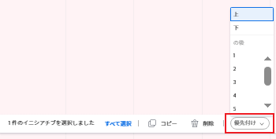

# のイニシアチブ優先度を更新 [!DNL Scenario Planner]

イニシアチブの優先順位付けは重要です。イニシアチブは、計画に記載されている順序で、計画からジョブの役割と予算リソースを受け取るからです。

自分が作成したプランまたは自分と共有したプランに対するイニシアチブを優先させることができます。

プランの作成について詳しくは、 [でプランを作成および編集 [!DNL Scenario Planner]](../scenario-planner/create-and-edit-plans.md).

イニシアチブの作成については、 [のイニシアチブを作成および編集します [!DNL Scenario Planner]](../scenario-planner/create-and-edit-initiatives.md).

## アクセス要件

<table style="table-layout:auto"> 
 <col> 
 <col> 
 <tbody> 
  <tr> 
   <td> 
[!DNL Adobe Workfront]<b> 計画*</b> 
 </td> 
   <td>[!UICONTROL Business] 以降</td> 
  </tr> 
  <tr> 
   <td> 
[!DNL Adobe Workfront]<b> ライセンス*</b> 
 </td> 
   <td> 
[!UICONTROL Review] 以降
 </td> 
  </tr> 
  <tr> 
   <td><b>製品</b> </td> 
   <td> 
の追加ライセンスを購入する必要があります。 [!DNL Adobe Workfront Scenario Planner] をクリックして、この記事で説明する機能にアクセスします。
 
詳しくは、 [!DNL Workfront Scenario Planner]を参照してください。 <a href="../scenario-planner/access-needed-to-use-sp.md" class="MCXref xref">を使用するために必要なアクセス [!DNL Scenario Planner]</a>. 
 </td> 
  </tr> 
  <tr data-mc-conditions=""> 
   <td><strong>アクセスレベル設定*</strong> </td> 
   <td> 
[!UICONTROL 編集 ] 以降の [!DNL Scenario Planner]
 
注意：まだアクセス権がない場合は、 [!DNL Workfront] 管理者（アクセスレベルに追加の制限を設定している場合） を参照してください。 [!DNL Workfront] 管理者は、 <a href="../administration-and-setup/add-users/configure-and-grant-access/create-modify-access-levels.md" class="MCXref xref">カスタムアクセスレベルの作成または変更</a>.
 </td> 
  </tr> 
  <tr data-mc-conditions=""> 
   <td> 
<strong>オブジェクト権限</strong> 
 </td> 
   <td> 
プランに対する [!UICONTROL 管理 ] 権限
 
プランへの追加アクセス権のリクエストについて詳しくは、 <a href="../scenario-planner/request-access-to-plan.md" class="MCXref xref">内のプランへのアクセスをリクエスト [!DNL Scenario Planner]</a>.
 </td> 
  </tr> 
 </tbody> 
</table>

## イニシアチブ優先度の更新

イニシアチブの優先順位を変更すると、プラン上のイニシアチブのリスト順序を変更します。

プランの最上部に、より緊急な取り組みを配置し、より流動的な取り組みを行うことをお勧めします。これは、リソースが利用可能な場合にのみ、プランの最下部に配置できます。

>[!NOTE]
>
>[!DNL Workfront] 計画リソースを、計画に表示される順序でイニシアチブに割り当てます。
>
>例えば、計画に 3 人のエンジニア、イニシアチブ 1、イニシアティブ 2 があり、それぞれ 2 人のエンジニアが完了する必要があり、両方とも同じ期間に予定されている場合、Workfrontは 2 人のエンジニアをイニシアティブ 1、残りのエンジニアをイニシアティブ 2 に関連付けます。 この場合、Initiative 2 は、1 人の Engineer が欠落しているため、競合を示しています。 計画上の競合を避ける唯一の方法は、イニシアチブの優先順位を変更することです。

イニシアチブの優先度を更新する手順は、次のとおりです。

1. 次をクリック： **[!UICONTROL メインメニュー]** アイコン を選択し、「 [!UICONTROL シナリオ].

   プランのリストが表示されます。

1. プランの名前をクリックして開き、優先順位を付けるイニシアチブを探します。
1. 1 つ以上のイニシアチブの名前の左側にあるボックスをクリックし、次のいずれかの操作を行います。

   * 選択したイニシアチブ名の 1 つの左側にあるハンドルをクリックし、リスト内で上下にドラッグして、イニシアチブの優先順位を変更します。

      Workfrontには、選択したイニシアチブの数が表示されます。

      

   * 次をクリック： **[!UICONTROL 優先順位]** 」ボックスを選択し、次のオプションから選択します。

      * **[!UICONTROL 上]**:選択したイニシアチブをイニシアチブリストの先頭に移動します。 選択したイニシアチブがプランの最初に表示されます。
      * **[!UICONTROL 下]**:選択したイニシアチブをイニシアチブ・リストの一番下に移動します。 選択したイニシアチブは、プランの最後に表示されます。
      * **[!UICONTROL 数値を選択]**:ここで指定したイニシアチブの後に、選択したイニシアチブを移動します。

         
      [!DNL Workfront] 選択したイニシアチブを指定した場所に即座に配置し、すべてのイニシアチブの数をそれに応じて更新します。

1. クリック **[!UICONTROL プランを保存]** 変更を保存します。
