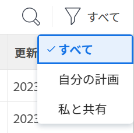
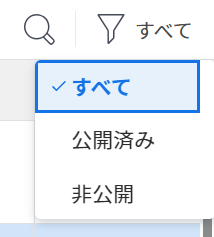
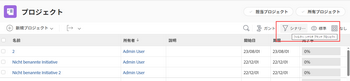
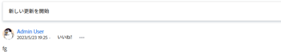
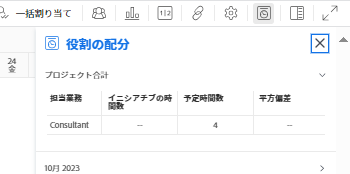
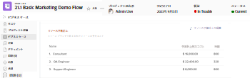
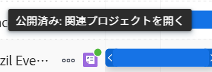
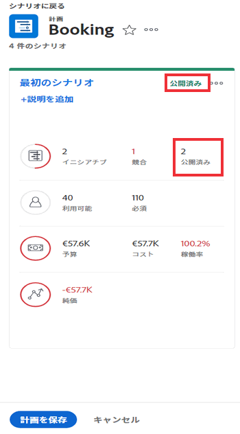

# プロジェクトを更新または作成するには、 [!DNL Scenario Planner]

からのシナリオの公開 [!DNL Adobe Workfront Scenario Planner] は、次のことを実行します。

* シナリオのイニシアチブからプロジェクトを作成し、それらをリンクします。
* リンクされたイニシアチブの情報を使用して、既にシナリオのイニシアチブにリンクされているプロジェクトを更新します。 プロジェクトをプランにインポートする際に、プロジェクトをイニシアチブにリンクすることもできます。 詳しくは、 [内のプランにプロジェクトをインポート [!DNL Scenario Planner]](../scenario-planner/import-projects-to-plans.md)

## アクセス要件

以下が必要です。

<table style="table-layout:auto"> 
 <col> 
 <col> 
 <tbody> 
  <tr> 
   <td> 
[!DNL Adobe Workfront] 計画*
 </td> 
   <td>[!UICONTROL Business] 以降</td> 
  </tr> 
  <tr> 
   <td> 
[!DNL Adobe Workfront] ライセンス*
 </td> 
   <td> 
[!UICONTROL Review] 以降
 </td> 
  </tr> 
  <tr> 
   <td>製品 </td> 
   <td> 
の追加ライセンスを購入する必要があります。 [!DNL Adobe Workfront Scenario Planner] をクリックして、この記事で説明する機能にアクセスします。
 
詳しくは、 [!DNL Workfront Scenario Planner]を参照してください。 <a href="../scenario-planner/access-needed-to-use-sp.md" class="MCXref xref">を使用するために必要なアクセス [!DNL Scenario Planner]</a>. 
 </td> 
  </tr> 
  <tr data-mc-conditions=""> 
   <td> 

 
アクセスレベル*
 </td> 
   <td> 
    <ul> 
    <li>[!UICONTROL 編集 ] アクセス対象 [!DNL Scenario Planner] およびプロジェクト</li></ul>

<b>メモ</b>

まだアクセス権がない場合は、 [!DNL Workfront] 管理者（アクセスレベルに追加の制限を設定している場合） を参照してください。 [!DNL Workfront] 管理者は、 <a href="../administration-and-setup/add-users/configure-and-grant-access/create-modify-access-levels.md" class="MCXref xref">カスタムアクセスレベルの作成または変更</a>.
 </td>
</tr> 
  <tr data-mc-conditions=""> 
   <td> 
オブジェクト権限
 </td> 
   <td> 
    <ul> 
     <li>プランの [!UICONTROL 管理 ] 権限 </li> 
     <li>[!UICONTROL 公開済みプロジェクトの管理 ] 権限</li> 
    </ul> 
プロジェクトへの追加アクセス権のリクエストについては、 <a href="../workfront-basics/grant-and-request-access-to-objects/request-access.md" class="MCXref xref">オブジェクトへのアクセスのリクエスト </a>.
 
プランへの追加アクセス権のリクエストについて詳しくは、 <a href="../scenario-planner/request-access-to-plan.md" class="MCXref xref">内のプランへのアクセスをリクエスト [!DNL Scenario Planner]</a>.
 </td> 
  </tr> 
 </tbody> 
</table>

&#42;ご利用のプラン、ライセンスの種類、アクセス権を確認するには、 [!DNL Workfront] 管理者。

の [!DNL Workfront Scenario Planner]を参照してください。 [を使用するために必要なアクセス [!DNL Scenario Planner]](../scenario-planner/access-needed-to-use-sp.md).

## 前提条件

始める前に：

* プランからイニシアチブを公開する前に、プランを作成して保存する必要があります。

## プロジェクトへのイニシアチブの公開に関する考慮事項

* 1 つのプランから公開できるシナリオは 1 つだけです。
* 1 つのイニシアチブは 1 つのプロジェクトにのみリンクできます。
* イニシアチブが異なるプランに属している場合、1 つのプロジェクトを複数のイニシアチブにリンクできます。

   >[!TIP]
   >
   >プロジェクトが複数のプランに存在し、すべてのプランからプロジェクトに情報を公開する場合、最新の公開によって既存の [!DNL Scenario Planner] プロジェクトに関する情報。

* 計画にプロジェクトをインポートして計画にイニシアチブが作成された場合は、イニシアチブを公開すると、リンクされたプロジェクトもイニシアチブ情報で更新されます。

   >[!TIP]
   >
   >同じプロジェクトを複数のプランにインポートできます。 公開すると、複数のイニシアチブにリンクされているプロジェクトのイニシアチブ情報が上書きされる場合があります。

   プロジェクトのインポートによるイニシアチブの作成については、 [内のプランにプロジェクトをインポート [!DNL Scenario Planner]](../scenario-planner/import-projects-to-plans.md).

* プロジェクトに対して行った変更は、リンクされたイニシアチブには転送されません。

## イニシアチブを公開

>[!IMPORTANT]
>
>プランのイニシアチブに変更（解決上の競合を含む）を加えた場合、新しい情報をプロジェクトに表示するには、イニシアチブを再公開する必要があります。 この情報は、対応するイニシアチブを公開する場合にのみ、イニシアチブにリンクされたプロジェクトに表示されます。 イニシアチブ間の競合の解決方法については、 [次の場所でのイニシアチブの競合を解決 [!DNL Scenario Planner]](../scenario-planner/resolve-conflicts-in-sp.md)

1. 次をクリック： **[!UICONTROL メインメニュー]** アイコン  Workfrontの右上隅で、 **[!UICONTROL シナリオ]**
1. （オプションおよび条件付き）既存のプランから公開する場合は、 **[!UICONTROL フィルター]** アイコン  プランの右上隅で、次のいずれかのオプションを選択します。

   <table style="table-layout:auto"> 
    <col> 
    <col> 
    <tbody> 
     <tr> 
      <td role="rowheader">[!UICONTROL すべて ]</td> 
      <td>自分が所有しているプランまたは自分が共有しているプランがすべて表示されます。 これがデフォルトです。 </td> 
     </tr> 
     <tr> 
      <td role="rowheader">[!UICONTROL マイプラン ]</td> 
      <td>作成したプランを表示します。</td> 
     </tr> 
     <tr> 
      <td role="rowheader">[!UICONTROL 自分と共有</td> 
      <td> 
自分が作成しなかったが、自分と共有されているプランが表示されます。
 
重要：プランを公開するには、プランの共有に対する [!UICONTROL 管理 ] 権限が必要です。 
 </td> 
     </tr> 
    </tbody> 
   </table>

   

1. （オプション） **[!UICONTROL 検索]** アイコン  リスト内のプランをすばやく見つけるには、プランの名前を入力します。
1. （条件付き）新しいプランから公開するには、プランを作成します。

   プランの作成について詳しくは、 [でプランを作成および編集 [!DNL Scenario Planner]](../scenario-planner/create-and-edit-plans.md) .

1. （オプション）既存のプランの名前をクリックし、プランの新しいシナリオを作成します。

   プランのシナリオの作成について詳しくは、 [でのプランシナリオの作成と比較 [!DNL Scenario Planner]](../scenario-planner/create-and-compare-scenarios-for-a-plan.md).

1. （オプション）既存または新しいプランのイニシアチブを更新したり、新しいプランを作成したりします。

   イニシアチブの作成については、 [のイニシアチブを作成および編集します [!DNL Scenario Planner]](../scenario-planner/create-and-edit-initiatives.md).

1. クリック **[!UICONTROL プランを保存]**.
1. から公開するシナリオを選択します。 **[!UICONTROL 初期シナリオ]** ドロップダウンメニューで、 **[!UICONTROL 公開に移動]**  をクリックします。

   または

   クリック **[!UICONTROL シナリオの比較]**&#x200B;をクリックし、公開元のシナリオカードの上にマウスポインターを置いて、 **[!UICONTROL 公開に移動]** .

   この [!UICONTROL イニシアチブの公開] ページが表示され、シナリオ内のすべてのイニシアチブのリストが表示されます。 イニシアチブが以前に公開されている場合は、プロジェクトアイコン  名前と **[!UICONTROL 最終公開日]** 日付がリストに入力されます。

   >[!TIP]
   >
   >プロジェクトのインポートによって作成されたイニシアチブには、プロジェクトアイコンも表示されます  彼らの名前の右に

   

1. （オプションおよび条件付き）既存のプランから公開する場合は、 **[!UICONTROL フィルター]** アイコン  プランの右上隅で、次のいずれかのオプションを選択します。

   <table style="table-layout:auto"> 
    <col> 
    <col> 
    <tbody> 
     <tr> 
      <td role="rowheader">[!UICONTROL すべて ]</td> 
      <td>選択したシナリオのすべてのイニシアチブが表示されます。 </td> 
     </tr> 
     <tr> 
      <td role="rowheader">[!UICONTROL 公開済み ]</td> 
      <td>自分または他のユーザーが以前に発行したイニシアチブが表示されます。 </td> 
     </tr> 
     <tr> 
      <td role="rowheader">[!UICONTROL 非公開 ]</td> 
      <td> 
非公開のイニシアチブが表示されます。 
 </td> 
     </tr> 
    </tbody> 
   </table>

   

1. （オプション） **[!UICONTROL 検索]** アイコン  リスト内のイニシアチブをすばやく見つけるには、イニシアチブの名前を入力します。
1. 1 つ以上のイニシアチブを選択し、それらからプロジェクトを公開、作成または更新してから、 **[!UICONTROL イニシアチブの公開]**.

   公開済みのイニシアチブが既にプロジェクトにリンクされている場合は、選択した各イニシアチブから新しいプロジェクトを作成したり、既存の接続済みプロジェクトを更新したりします。

   >[!TIP]
   >
   >新規プロジェクトは、公開済みのイニシアチブと同じ名前を持ちます。

1. （条件付き）次のいずれかの操作を行います。

   * イニシアチブを 1 つ公開した場合は、「 **[!UICONTROL 関連プロジェクトを見る]** ：イニシアチブから作成または更新されたプロジェクトを開きます。
   * 複数のイニシアチブを公開した場合は、「 **[!UICONTROL 関連プロジェクトを見る]** イニシアチブから公開されたプロジェクトのリストを開く。 [!DNL Workfront] が適用されます [!DNL Scenario Planner] プロジェクトは、デフォルトでプロジェクトのリストにフィルターされます。 最近公開されたプロジェクトがリストの上部に表示されます。

      

1. 次の領域に移動して、プロジェクトのイニシアチブ情報を表示します。

   * **この [!UICONTROL 更新] セクション**:プロジェクトがイニシアチブから作成または更新されたことを示す更新が公開されます。 更新には、プロジェクトを作成または更新したイニシアチブの名前と、イニシアチブを含むプランのリンクされた名前が含まれます。 更新でプランの名前をクリックすると、 [!DNL Scenario Planner].

      

   * **この [!UICONTROL 概要] 領域 [!UICONTROL プロジェクトの詳細] セクション**:新しい [!DNL Scenario Planner] セクションは、リンクされたイニシアチブの情報を含むこの領域に作成されます。

      

      次のイニシアチブ情報は、 [!DNL Scenario Planner] 領域 [!UICONTROL プロジェクトの詳細] セクション：

      <table style="table-layout:auto"> 
      <col> 
      <col> 
      <tbody> 
       <tr> 
        <td role="rowheader">[!UICONTROL イニシアチブの期間 ] </td> 
        <td>プロジェクトがイニシアチブにリンクされている場合の、対応するイニシアチブの期間。 このフィールドは編集できません。 </td> 
       </tr> 
       <tr> 
        <td role="rowheader">[!UICONTROL 最終公開日 ] </td> 
        <td>対応するイニシアチブからプロジェクトが最後に公開された日付。 </td> 
       </tr> 
       <tr> 
        <td role="rowheader">[!UICONTROL イニシアチブの開始日 ] </td> 
        <td>プロジェクトがイニシアチブにリンクされるイニシアチブの開始月の最初の日。 </td> 
       </tr> 
       <tr> 
        <td role="rowheader">[!UICONTROL Initiative End Date] </td> 
        <td>プロジェクトがイニシアチブにリンクされるイニシアチブの終了月の最終日。  </td> 
       </tr> 
       <tr> 
        <td role="rowheader">[!UICONTROL イニシアチブ・ジョブの役割（FTE および時間単位）] </td> 
        <td> 
関連するジョブの役割とイニシアチブの時間割り当てに関する情報。 これには以下が含まれます。
 
         <ul> 
          <li>ジョブの役割名</li> 
          <li>工数</li> 
          <li> 
すべての FTE の時間数
 
時間または工数を使用して、計画またはイニシアチブに必要な役割の量を見積もることができます。
 
詳しくは、 <a href="../scenario-planner/create-and-edit-plans.md" class="MCXref xref">シナリオプランナーでのプランの作成と編集</a>. 
 </li> 
         </ul> 
      
<b>ヒント</b>

      イニシアチブ内の月ごとにジョブの役割の数が異なる場合、このフィールドには、イニシアチブに必要な役割の最大数が表示されます。 例えば、1 月に 1 名のコンサルタントが、2 月に 2 名のコンサルタントが必要な場合、この列にはすべての月に対して、2FTE に 2 時間と、対応する 2FTE に時間が表示されます。
 </td>
      </tr> 
      </tbody> 
     </table>

      >[!NOTE]
      >
      >次の条件を満たすすべてのユーザー [!UICONTROL 表示] プロジェクトにアクセスすると、 [!DNL Scenario Planner] セクション [!UICONTROL 概要] 領域 この領域を [!UICONTROL 詳細] セクションを作成します。 ユーザーにレイアウトテンプレートが関連付けられていない場合、この領域はデフォルトで表示されます。
      >
      >   
      >   
      >   * の [!UICONTROL 詳細] レイアウトテンプレートを使用する節は、 [のカスタマイズ [!UICONTROL 詳細] レイアウトテンプレートを使用して表示](../administration-and-setup/customize-workfront/use-layout-templates/customize-details-view-layout-template.md).
      >   * 詳しくは、 [!UICONTROL 概要] 領域 [!UICONTROL プロジェクトの詳細]を参照してください。 [[!UICONTROL 管理] プロジェクト内の情報 [!UICONTROL 概要] 領域](../manage-work/projects/manage-projects/understand-project-overview-area.md).

   * **この [!UICONTROL ロールの配分] パネル [!UICONTROL ワークロードバランサー] またはプロジェクトのタスクリスト**:プロジェクトの役割割り当てに加えて、この領域にイニシアチブの役割割り当てに関する情報が入力されます。

      詳しくは、 [プロジェクトとイニシアチブ間でのリソース割り当て調整の概要](../scenario-planner/overview-reconcile-allocations-between-projects-initiatives.md).

      

      プロジェクトの日付やリソースを変更しても、対応するイニシアチブや、イニシアチブ情報を含むプロジェクトの領域には影響しません。

   * **この [!UICONTROL リソース予算設定] 領域 [!UICONTROL ビジネス事例] プロジェクトの**:を使用してプロジェクトリソースを管理する新しいオプションが追加されました。 [!DNL Scenario Planner] 情報が [!UICONTROL リソース予算設定] 領域 [!UICONTROL ビジネス事例] プロジェクトの

      詳しくは、 [予算リソース [!UICONTROL ビジネス事例] の使用 [!DNL Scenario Planner]](../manage-work/projects/define-a-business-case/budget-resources-in-business-case-use-scenario-planner.md).

      

1. （オプション） [!DNL Scenario Planner] シナリオを公開した後：

   * 公開されたシナリオは、イニシアチブを公開した後の最初のシナリオになります。
   * シナリオを少なくとも 1 回公開した後は、他のシナリオからは公開できません。
   * この [!UICONTROL 公開に移動] 1 つ以上のイニシアチブがシナリオから公開された後に、他のすべてのシナリオからオプションが削除されます。
   * プラン内の公開済みイニシアチブのプロジェクトアイコンの横に、緑色のインジケータが表示されます。

      

   * 緑色の「発行済み」インジケータがシナリオの上部に表示され、シナリオカードと「発行済み」フィールドがシナリオカードに入力され、発行されたシナリオ内のイニシアチブの数を示します。

      

      >[!TIP]
      >
      >シナリオのイニシアチブから公開されたすべてのプロジェクトが削除された場合、シナリオが公開されたことを示す表示は削除されます。 詳しくは、 [プロジェクトを削除](../manage-work/projects/manage-projects/delete-projects.md).

1. （オプション）イニシアチブに関する情報を更新し、前述の手順を繰り返して、イニシアチブを再公開し、リンクされたプロジェクトに関するイニシアチブ情報を更新します。

   イニシアチブの編集について詳しくは、 [のイニシアチブを作成および編集します [!DNL Scenario Planner]](../scenario-planner/create-and-edit-initiatives.md).

